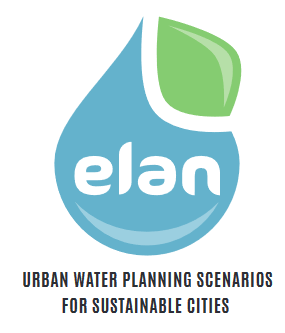

    

## Elan QGIS plugin

Elan is a QGIS decision-support plugin that aims to facilitate integrated urban water management by nature-based solutions.

It is currently under active development.

Using Elan, the user can create and compare different urban water management scenarios (wastewater and stormwater) to support informed decision making.

## Features

The plugin includes several modules:

- `Roads and buildings`, `Population` and `Snap on roads` to prepare the geographical data
- `Sewer network` and `Processes` to investigate and pre-size scenarios
- `Longitudinal sewer profile` to better visualize sewer pre-sizing
- `Create a scenario` to create a scenario item that can be further compared to others

And customized plots to better compare pre-sized treatment train options.

## For whom?

Urban water professionals and stakeholders with a GIS skill.

## For what?

* To connect an area with no sanitation network (wastewater)
* To reduce existing stormwater overflows (stormwater)
* Find the optimum degree of decentralization

**Disclaimer**

At this stage of development, only the wastewater issue can be addressed by Elan.

## When to use it?

At an early stage in urban water management projects to explore multiple scenarios based on nature-based solutions and pre-select the ones to consider in the preliminary design phase. It can be part of a participatory process.

## Where to find it?

Elan is available on the [official QGIS repository](https://plugins.qgis.org/plugins/ELAN). It can also be installed directly from the QGIS plugin manager.

## How to use it?

**See the [online documentation available in English and French](https://elan-gis.org).**

## License

The project is developed under the terms of the [GPLv2+ license](https://gitlab.com/elan7835313/elan/-/blob/main/LICENSE?ref_type=heads).

## Development and contribution

Development currently involves:

 and 

**It is an open project! See [contribution guidelines](CONTRIBUTING.md).**

## Citation

If you use Elan, please cite the following ressource:

> Gabrielle Favreau, Pascal Molle, Jacky Volpes, Sophie Aubier, Nicolas Forquet. Elan: urban water planning scenarios for sustainable cities. 2025, [⟨swh:1:dir:030cd3725e459e734780e346165112efd75fbbdd⟩](https://archive.softwareheritage.org/browse/directory/030cd3725e459e734780e346165112efd75fbbdd/). [⟨doi:10.17180/94zw-ef97⟩](https://doi.org/10.17180/94ZW-EF97)

## Acknowledgments

### Open source research projects integrated to Elan

* **pysewer**, Python library developed by UFZ: https://git.ufz.de/despot/pysewer

> Sanne et al., (2024). Pysewer: A Python Library for Sewer Network Generation in Data Scarce Regions. Journal of Open Source Software, 9(104), 6430, https://doi.org/10.21105/joss.06430

* **wetlandoptimizer**, Python package developed by REVERSAAL (INRAE): https://forgemia.inra.fr/reversaal/nature-based-solutions/caribsan/wetlandoptimizer

> Legeai et al. (2025). Regression-Based Design Optimization of French Treatment Wetlands. Water Science and Technology, wst2025071, https://doi.org/10.2166/wst.2025.071.

* **pysheds**, Python Library developed by UT Austin: https://github.com/mdbartos/pysheds

> Bartos et al. (2020). Pysheds: simple and fast watershed delineation in Python. Zenodo repository, 10.5281/zenodo.3822494.

### Third-party QGIS plugins required for Elan

* **DataPlotly**: https://github.com/ghtmtt/DataPlotly

### Funding

This project is made possible through funding from:

  <a href="https://ofb.gouv.fr/">
    
  </a>

  <a href="https://www.caribsan.eu/">
    
  </a>

  <a href="https://www.afd.fr/fr">
    
  </a>

