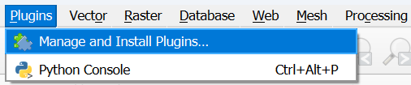
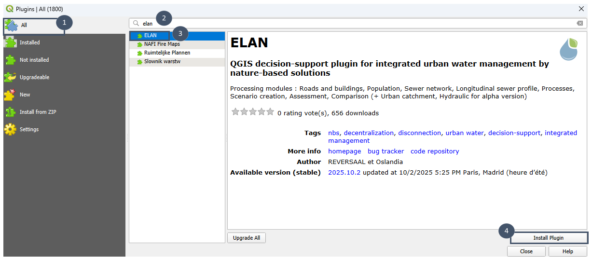
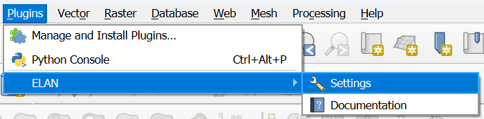
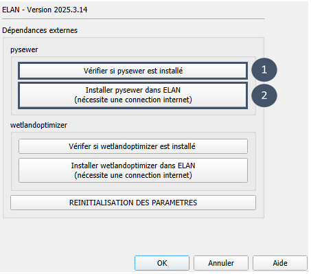
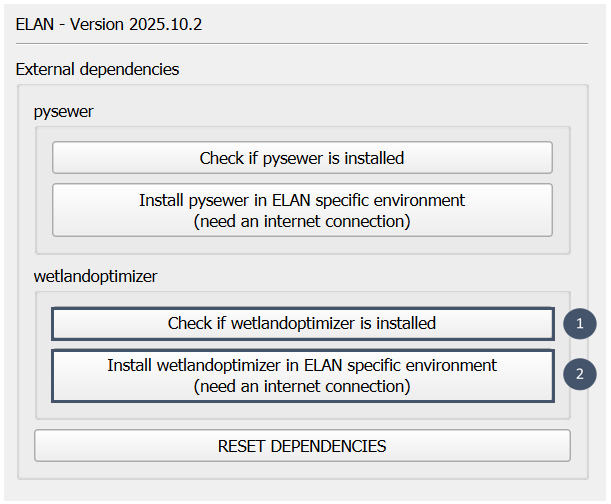

Installation
============

Préalable
---------

Sur Windows
^^^^^^^^^^^
* Avoir téléchargé QGIS depuis le `site officiel <https://qgis.org/download/>`_ et l'avoir installé en suivant le `guide d'installation <https://qgis.org/resources/installation-guide/>`_.

* Ouvrir QGIS.

Sur Linux
^^^^^^^^^
* Avoir téléchargé QGIS depuis le `site officiel <https://qgis.org/download/>`_ et l'avoir installé en suivant le `guide d'installation <https://qgis.org/resources/installation-guide/>`_.

* Avoir téléchargé le fichier contenant la liste des dépendances : https://gitlab.com/elan7835313/elan/-/blob/main/requirements/development.txt.

**Pour utiliser Elan sur Linux, il vous faut un environnement virtuel contenant les dépendances requises.** 

**La démarche expliquée ici est à faire une seule fois.**

**1.** Créer un environnement virtuel Python.

.. code-block:: bash

  $ python3 -m venv --system-site-packages ~/.venvs/elan

**2.** L'activer.

.. code-block:: bash

    $ source elan-test/bin/activate

**3.** Installer les dépendances grâce au fichier contenant la liste des dépendances.

.. code-block:: bash

    $ pip install -r /path/development.txt

.. attention::
    Remplacer *path* dans la ligne de code par le chemin vers le fichier des dépendances que vous avez téléchargé précédemment.

**4.** Ouvrir QGIS via le terminal, dans l'environnement virtuel Python.

.. code-block:: bash

    $ qgis

**Pour utiliser Elan, il faudra toujours lancer QGIS depuis l'environnement virtuel**. Ainsi, pour toute utilisation future vous devrez :

    * Activer l'environnement virtuel.
    * Ouvrir QGIS via le terminal.

.. code-block:: bash

    $ source elan-test/bin/activate
    $ qgis

Sur Mac
^^^^^^^

Le plugin Elan n'est pas compatible avec Mac actuellement.

.. _extension:

Installation de l'extension
---------------------------

**1.** Ouvrir le gestionnaire d'extensions.

**2.** Dans `Toutes` (bulle 1), chercher "elan" (bulle 2). Sélectionner le plugin (bulle 3) puis cliquer sur ``Installer l'extension`` en bas du descriptif de l'extension (bulle 4).

**3.** La mention ``Extension installée avec succès`` apparaît au sommet de la fenêtre. Fermer le gestionnaire d'extensions.

.. note::
    L'extension est en cours de développement. Lorsqu'une nouvelle version est disponible, suivre la même démarche mais cliquer sur ``Tout mettre à jour`` en bas du descriptif.

.. attention::
    Après avoir mis à jour l'extension, vous devez réinstaller les dépendances externes comme expliqué dans la rubrique suivante.

.. _dependances:

Installation des dépendances
----------------------------

Elan utilise des codes développés dans le cadre de différents projets de recherche (voir :ref:`introduction <projets-recherche>`). 
Cette section explique comment procéder à leur installation. 
Selon le code, son installation se fait soit via les paramètres de l'extension, soit directement en ligne de commande.

Question du centralisé/décentralisé : pysewer et wetlandoptimizer
^^^^^^^^^^^^^^^^^^^^^^^^^^^^^^^^^^^^^^^^^^^^^^^^^^^^^^^^^^^^^^^^^

.. _pysewer:

* **pysewer** est une bibliothèque Python développée par `l'UFZ <https://www.ufz.de/>`_, un centre de recherche allemand axé sur la recherche environnementale.

Elle permet d'effectuer le tracé et le pré-dimensionnement d'un réseau d'assainissement strict. Pour plus d'informations : 

    *Sanne et al., (2024). Pysewer: A Python Library for Sewer Network Generation in Data Scarce Regions. Journal of Open Source Software, 9(104), 6430, https://doi.org/10.21105/joss.06430*
    
    Lien GitLab : https://git.ufz.de/despot/pysewer

Son installation se fait via l'extension. 

.. important::
    **pysewer est nécessaire pour pouvoir utiliser le module** ``Réseau``.

**1.** Aller dans les paramètres de l'extension Elan.

**2.** Vérifier si pysewer est déjà installé ou non en cliquant sur ``Vérifier si pysewer est installé``.

**3.** Si non, procéder à l'installation grâce au bouton ``Installer pysewer dans Elan`` (nécessite une connexion internet).

.. _wetlandoptimizer:

* **wetlandoptimizer** est un package Python développé par `REVERSAAL (INRAE) <https://reversaal.lyon-grenoble.hub.inrae.fr/>`_ dans le cadre du projet `CARIBSAN <https://caribsan.eu/>`_.

Il permet un pré-dimensionnement optimisé pour des filières de type filtres plantés de végétaux. Ces filières peuvent être mono ou multi-étages et composées de différents procédés.
Pour plus d'informations : 

    Lien GitLab : https://forgemia.inra.fr/reversaal/nature-based-solutions/caribsan/wetlandoptimizer 

Son installation se fait via Elan. 

.. important::
    **wetlandoptimizer est nécessaire au fonctionnement du module** ``Procédés``.

**1.** Aller dans les paramètres de l'extension Elan.

**2.** Vérifier si pysewer est déjà installé ou non en cliquant sur ``Vérifier si wetlandoptimizer est installé``.

**3.** Si non, procéder à l'installation grâce au bouton ``Installer wetlandoptimizer dans Elan`` (nécessite une connexion internet).

.. note::
    L'installation d'une dépendance via l'extension peut prendre jusqu'à plusieurs minutes, c'est normal. Aucune fenêtre de progression n'apparait, mais le processus est bien en
    cours en arrière-plan. Une fois l'installation terminée, une fenêtre s'affiche avec la mention *Succès de l'installation*.

.. note::
    Les dépendances peuvent être concernées par des montées en version. Dans ce cas, faire ``REINITIALISATION DES PARAMETRES`` puis réinstaller les dépendances comme expliqué juste avant.

Question des déversements par temps de pluie : pysheds
^^^^^^^^^^^^^^^^^^^^^^^^^^^^^^^^^^^^^^^^^^^^^^^^^^^^^^

* **pysheds** est une bibliothèque open-source Python développée par `l'UT Austin <https://www.utexas.edu/>`_, une université américaine (Texas).

Elle permet de délimiter rapidement des bassins versants topographiques par analyse du modèle numérique de terrain (MNT). 
Son installation se fait directement en ligne de commande. 

.. important::
    **pysheds doit avoir été installé pour pouvoir utiliser le module** ``Bassins versants urbains``.

**1.** Ouvrir un terminal. Par exemple, sur Windows ouvrir l'application `OSGeo4W Shell`.

**2.** Exécuter la commande suivante :

.. code-block:: python

  pip install pysheds

**3.** Fermer le terminal.