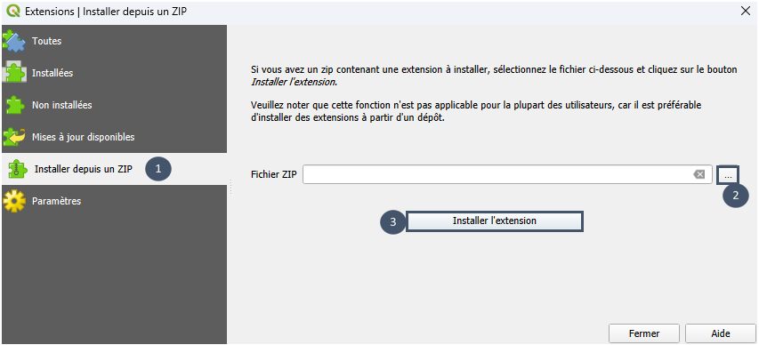

Installation
============

Préalable
----------

* Avoir téléchargé et installé `QGIS <https://qgis.org/download/>`_.

* Ouvrir QGIS.

.. _extension:

Installation de l'extension
---------------------------

1. Télécharger le .zip de la dernière version sur `cette page <https://gitlab.com/elan7835313/elan/-/packages>`_
   de la forme ``ELAN.2025.4.2.zip`` par exemple, pour la version 2025.4.2.

2. Ouvrir le gestionnaire d'extensions.

.. image:: _static/extensions-gestionnaire.png
     :width: 314

3. Dans ``Installer depuis un ZIP``, charger le fichier .zip et cliquer sur ``Installer l'extension``.

.. _dependances:

Installation des dépendances
----------------------------

ELAN utilise des codes développés dans le cadre de différents projets de recherche (voir :ref:`introduction <projets-recherche>`). 
Cette section explique comment procéder à leur installation. 
Selon le code, son installation se fait soit via les paramètres de l'extension, soit directement en ligne de commande.

Question du centralisé/décentralisé : pysewer et wetlandoptimizer
^^^^^^^^^^^^^^^^^^^^^^^^^^^^^^^^^^^^^^^^^^^^^^^^^^^^^^^^^^^^^^^^^^

* **pysewer** est une bibliothèque Python développée par `l'UFZ <https://www.ufz.de/>`_, un centre de recherche allemand axé sur la recherche environnementale.

Elle permet d'effectuer le tracé et le pré-dimensionnement d'un réseau d'assainissement strict.

    Sanne et al., (2024). Pysewer: A Python Library for Sewer Network Generation in Data Scarce Regions. Journal of Open Source Software, 9(104), 6430, https://doi.org/10.21105/joss.06430

Son installation se fait via l'extension. 

.. important::
    **pysewer est nécessaire pour pouvoir utiliser le module** ``Réseau``.

1. Aller dans les paramètres de l'extension ELAN.

.. image:: _static/parametres_elan.png
      :width: 463

2. Vérifier si pysewer est déjà installé ou non en cliquant sur ``Vérifier si pysewer est installé``.

3. Si non, procéder à l'installation grâce au bouton ``Installer pysewer dans ELAN`` (nécessite une connection internet).

.. image:: _static/pysewer.png
      :width: 453

* **wetlandoptimizer** est un package Python développé par `REVERSAAL (INRAE) <https://reversaal.lyon-grenoble.hub.inrae.fr/>`_ dans le cadre du projet `CARIBSAN <https://caribsan.eu/>`_.

Il permet un pré-dimensionnement optimisé pour des filières de type filtres plantés de végétaux. Ces filières peuvent être mono ou multi-étages et composées de différents procédés.
Son installation se fait via ELAN. 

.. important::
    **wetlandoptimizer est nécessaire au fonctionnement du module** ``Procédés``.

1. Aller dans les paramètres de l'extension ELAN.

.. image:: _static/parametres_elan.png
    :width: 463

2. Vérifier si pysewer est déjà installé ou non en cliquant sur ``Vérifier si wetlandoptimizer est installé``.

3. Si non, procéder à l'installation grâce au bouton ``Installer wetlandoptimizer dans ELAN`` (nécessite une connection internet).

.. image:: _static/wetlandoptimizer.png
    :width: 449

.. note::
    L'installation d'une dépendance via l'extension peut prendre jusqu'à plusieurs minutes, c'est normal.

.. note::
    Les dépendances peuvent être concernées par des montées en version. Dans ce cas, faire ``REINITIALISATION DES PARAMETRES`` puis réinstaller les dépendances comme expliqué juste avant.

Question des déversements par temps de pluie : pysheds
^^^^^^^^^^^^^^^^^^^^^^^^^^^^^^^^^^^^^^^^^^^^^^^^^^^^^^^^^^^^^^

* **pysheds** est une bibliothèque open-source Python développée par `l'UT Austin <https://www.utexas.edu/>`_, une université américaine (Texas).

Elle permet de délimiter rapidement des bassins versants topographiques par analyse du modèle numérique de terrain (MNT). 
Son installation se fait directement en ligne de commande. 

.. important::
    **pysheds doit avoir été installé pour pouvoir utiliser le module** ``Bassins versants urbains``.

1. Ouvrir un terminal. Par exemple, sur Windows ouvrir l'application `OSGeo4W Shell`.

2. Exécuter la commande suivante :

.. code-block:: python

  pip install pysheds

3. Fermer le terminal.
