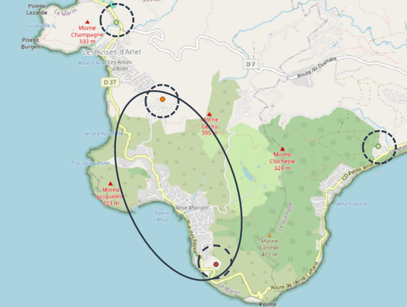
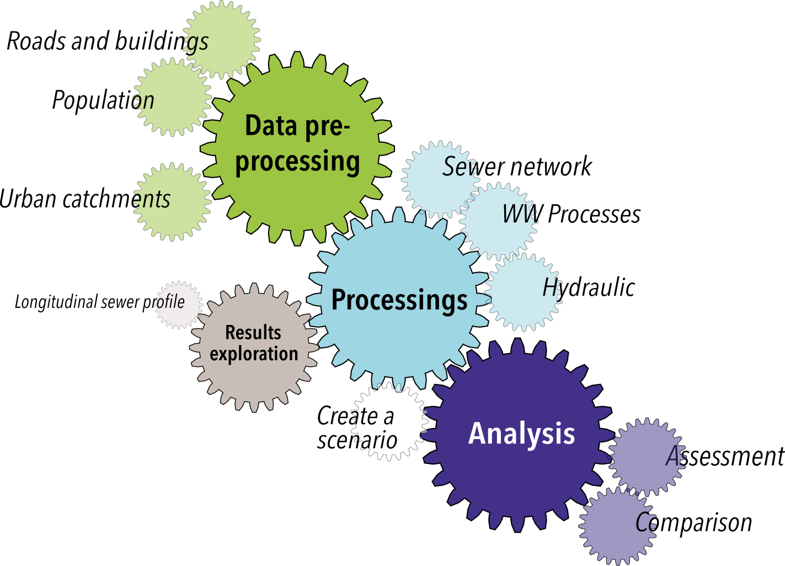
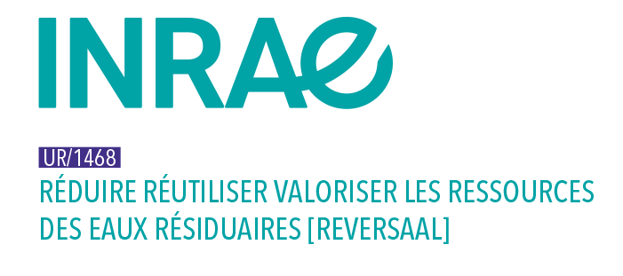

Introduction
============

L'appellation Elan a été choisie pour **"urban watEr pLanning scenArios for sustaiNable cities"**.
Il s'agit d'un **outil d'aide à la décision pour une gestion intégrée des eaux urbaines (usées et pluviales) par des solutions fondées sur la nature**.
Elan s'inscrit dans un objectif global de transformer la ville de demain pour la rendre résiliente au changement global. 
Cette transformation constitue un véritable défi territorial, ce qui rend particulièrement pertinent le recours au système d'information géographique (SIG).

Un outil, deux problématiques
-----------------------------
Elan permet d'aider à la décision face à **deux problématiques** : l'une mettant en jeu spécifiquement les eaux usées (**"question du centralisé/décentralisé"**), 
l'autre impliquant les eaux urbaines dans leur ensemble (**"question des déversements par temps de pluie"**).

Pour la problématique du centralisé/décentralisé, la question qui se pose est : 
**comment connecter une zone dépourvue de réseau d'assainissement (nouveau quartier, zone historiquement en assainissement non collectif) ?**

Dans le cas de déversements d'un réseau unitaire par temps de pluie, l'utilisateur est confronté à la question :
**comment limiter les déversements d'eaux non traitées au niveau des déversoirs d'orage ?**

Illustration par des exemples
-----------------------------

.. _petite-anse:

Question du centralisé/décentralisé : Petite Anse (Martinique)
^^^^^^^^^^^^^^^^^^^^^^^^^^^^^^^^^^^^^^^^^^^^^^^^^^^^^^^^^^^^^^
Petite Anse est un **quartier sans réseau d'assainissement** : historiquement le choix de l'assainissement non collectif 
s'est en effet imposé, notamment au regard des contraintes géographiques (relief marqué).

L'image ci-dessous permet d'expliquer la problématique. Le quartier de Petite Anse se trouve dans l'ellipse. Il est constitué de deux zones (une basse et une sur les hauteurs)
interconnectées entre elles par une route. La collectivité en charge de ce quartier souhaite **étudier la possibilité d'implémenter un réseau d'assainissement collectif**.

**Plusieurs exutoires** sont envisageables :

* l'une des deux stations existantes (points verts encerclés de pointillés) ; 

* une nouvelle station dans le quartier à l'un des deux emplacements identifiés : sur les hauteurs (point orange encerclé de pointillés) ou sur le littoral (point bordeau encerclé de pointillés) ; 

* une combinaison de ces exutoires possibles (1 nouvelle et 1 station existante, 2 nouvelles).

Si toutes les eaux usées générées par ce quartier sont évacuées et traitées en **un point**, la gestion sera **centralisée**. Si **deux exutoires (ou plus)** sont retenus, la gestion sera **décentralisée**.

Elan permet d'aider à la prise de décision en permettant à l'utilisateur **d'explorer de multiples scénarios et de les évaluer**.

Petite Anse nous servira de cas d'exemple pour la question du centralisé/décentralisé : un :ref:`tutoriel <tutorial1>` lui est consacré.

Question des déversements par temps de pluie : Écully (Rhône)
^^^^^^^^^^^^^^^^^^^^^^^^^^^^^^^^^^^^^^^^^^^^^^^^^^^^^^^^^^^^^

.. hint::
   Cette section est en cours de construction.

Structure de l'outil 
--------------------
Elan est structuré en **plusieurs groupement de modules**. 

* **Préparation des données** 
    * ``Routes et bâtiments`` qui permet **d'extraire les données** `OpenStreetMap <https://www.openstreetmap.org>`_ de la zone d'intérêt définie par l'utilisateur.
    * ``Population`` qui est utilisable pour **répartir un nombre connu d'habitants** au sein d'un ensemble de bâtiments.
    * ``Bassins versants urbains`` pour **identifier les différents bassins versants urbains** drainés par un réseau unitaire connu. 

.. note::
    L'utilisation de ces modules est facultative. Elle permet, si l'utilisateur en a besoin, de préparer les données SIG requises en entrées des modules de type "Processus" : 
    ``Routes et bâtiments`` et ``Population`` pour le module ``Réseau``, ``Bassins versants urbains`` pour le module ``Hydraulique``.

* **Processus**
    * ``Réseau`` pour **tracer un réseau d'assainissement** strict (réseau séparatif, eaux usées uniquement) dans une zone sans réseau à l'aide de :ref:`pysewer <pysewer>`.
    * ``Procédés`` qui permet de **pré-dimensionner des filières de traitement** des eaux usées de type filtres plantés de végétaux à l'aide de :ref:`wetlandoptimizer <wetlandoptimizer>`.
    * ``Hydraulique`` qui intervient dans **l'estimation des volumes produits** par les différents bassins versants urbains d'une zone.

.. note::

    Le module ``Réseau`` est utilisé pour la question du centralisé/décentralisé. 

    Le module ``Hydraulique`` pour celle des déversements par temps de pluie.

    Le module ``Procédés`` peut être sollicité pour les deux problématiques.

* ``Créer un scénario`` qui est à l'interface des modules de types *Processus* et *Analyse* et permet de créer des objets scénarios qui pourront ensuite être évalués et comparés.

* **Exploration des résultats**
    * ``Profils de canalisations`` qui permet de **visualiser le profil souterrain des canalisations (vue longitudinale)**.

.. note::
    L'utilisation de ce module est facultative. Elle permet, si l'utilisateur le souhaite, d'approfondir les résultats obtenus en sortie de module ``Réseau``.

* **Analyse**
    * ``Évaluation`` qui permet **d'évaluer un scénario sur plusieurs paramètres** (économique, technicité, robustesse).
    * ``Comparaison`` pour **mener une analyse multicritère sur un ensemble de scénarios** et les comparer selon différents critères priorisés par l'utilisateur.

.. _projets-recherche:

Un outil qui mutualise différents travaux de recherche
------------------------------------------------------

Elan vise à **rendre plus largement accessible les résultats de travaux de recherche** menés indépendamment sur un aspect spécifique des problématiques adressées
et de **les combiner entre eux pour envisager ces problématiques dans leur globalité et leur complexité**.

Les travaux de recherche identifiés et intégrés à la version actuelle de l'outil ont été développés par :

Parmi les futures intégrations à Elan, ont été identifiés les travaux d'hydrologie urbaine menés conjointement par :

 .. image:: _static/insa.jpg
    :width: 200
    :target: https://deep.insa-lyon.fr/  

 .. image:: _static/uga.png
    :width: 100
    :target: https://www.univ-grenoble-alpes.fr/recherche/recherche-712368.kjsp  

Le développement de l'outil en lui-même mobilise deux acteurs : 

 .. image:: _static/reversaal.png
    :width: 200 
    :target: https://reversaal.lyon-grenoble.hub.inrae.fr/ 

 .. image:: _static/oslandia.png
    :width: 200  
    :target: https://oslandia.com/

Ce projet est développé grâce aux financements de : 

 .. image:: _static/ofb.png
    :width: 125 
    :target: https://www.ofb.gouv.fr/

 .. image:: _static/caribsan.png
    :width: 250 
    :target: https://www.caribsan.eu/

