.. _tutorial1:

Exemple de Petite Anse
========================

Ce tutoriel se base sur le cas de :ref:`Petite Anse <petite-anse>` et détaille les étapes à mettre en oeuvre pour créer un scénario pour la question du centralisé / décentralisé,
depuis l'obtention et la préparation des données géographiques jusqu'à la création d'un objet scénario.

Il peut être suivi pas à pas pour prendre en main ELAN avant de l'appliquer à son propre cas d'étude. Un :ref:`exercice <exercice>` pour créer un autre scénario sur la zone de Petite Anse est 
proposé à la fin de ce tutoriel.

Obtention et préparation des données géographiques
---------------------------------------------------

Préalable : Afficher un fond de carte (ici OpenStreetMap)
^^^^^^^^^^^^^^^^^^^^^^^^^^^^^^^^^^^^^^^^^^^^^^^^^^^^^^^^^^^^^^

Pour identifier la zone, afficher le fond de carte `OpenStreetMap <https://www.openstreetmap.org>`_ : 

* Aller dans le panneau *Explorateur*.

.. tip::
     Si *Explorateur* n'est pas visible : activez-le via *Vue - Panneaux - Explorateur*.

          .. image:: _static/afficher-explorateur.png
               :width: 700

* Chercher la catégorie **Tuiles XYZ** (bulle 1).

* Dérouler et double-cliquer sur **OpenStreetMap** (bulle 2).

.. image:: _static/tuiles-xyz.png
      :width: 435

* Localiser la zone sur le fond OpenStreetMap qui s'est affiché dans votre vue cartographique.

.. image:: _static/localiser-zone.png
      :width: 700

.. note::
     Pour aller plus loin sur le sujet des fonds de carte dans QGIS, nous vous conseillons ce :download:`tutoriel <_static/fr/tutoqgis_03_recherche_donnees.pdf>` réalisé par `UMR 6554 LETG <https://letg.cnrs.fr/>`_ / `UMR 5319 Passages <https://www.passages.cnrs.fr/>`_ (CNRS). 
     Il s'agit d'un export PDF du chapitre 3 du tutoriel QGIS 3.22 'Białowieża' disponible à cette adresse : https://tutoqgis.cnrs.fr/.

Étape 1 : Se procurer le Modèle Numérique de Terrain (MNT)
^^^^^^^^^^^^^^^^^^^^^^^^^^^^^^^^^^^^^^^^^^^^^^^^^^^^^^^^^^^^

**1.** Télécharger le `MNT à 5 m de la Martinique <https://data.geopf.fr/telechargement/download/RGEALTI/RGEALTI_2-0_1M_ASC_WGS84UTM20-MART87_D972_2015-10-21/RGEALTI_2-0_1M_ASC_WGS84UTM20-MART87_D972_2015-10-21.7z>`_ sur RGE ALTI®.

.. image:: _static/mnt972.png
      :width: 700

**2.** Identifier les dalles de MNT qui coïncident avec notre zone d'intérêt. Cette étape passe par le chargement des différentes dalles dans votre projet QGIS (via le panneau *Explorateur*). 

.. tip::
     Ici la grille associée aux dalles de MNT est disponible (dalles.shp dans 3_SUPPLEMENTS_LIVRAISON), chargez-la dans QGIS via le panneau *Explorateur* (bulle 1). Elle vous permettra une identification plus rapide des
     dalles concernées.

     Il vous suffit en effet de sélectionner les dalles coïncidant avec votre zone (bulles 2 et 3) puis de faire ``Ouvrir la table attributaire (entités sélectionnées uniquement)`` (bulle 4) pour accéder directement aux
     noms des dalles d'intérêt (attribut NOM DALLE).

          .. image:: _static/grille_mnt.png
               :width: 700

          .. image:: _static/4dalles_table.png
               :width: 455

Ici quatre dalles recouvrent la zone : RGEALTI_MTQ_0705_1600_MNT_WGS84UTM20_MART87, RGEALTI_MTQ_0710_1600_MNT_WGS84UTM20_MART87, RGEALTI_MTQ_0705_1605_MNT_WGS84UTM20_MART87 et RGEALTI_MTQ_0710_1605_MNT_WGS84UTM20_MART87.

.. image:: _static/4dalles.png
     :width: 700

**3.** Identifier le SCR (système de coordonnées de référence) associé. Il est indiqué dans l'appellation des fichiers : ici WGS184UTM20, soit EPSG:32620- WGS 84/UTM zone 20N dans QGIS.

.. _set-SCR:

**4.** Géoréférencer les 4 dalles dans ce SCR (pas de détection automatique).

.. image:: _static/set_SCR.png
      :width: 700

.. _SCR_projet:

.. tip::
    Faire du SCR du MNT le SCR de votre projet : opter pour ce SCR lorsque vous créez de nouvelles couches, et reprojeter les couches vecteur que vous importez dans ce SCR avec l'outil natif de QGIS ``Reprojeter une couche``.

.. image:: _static/SCR_projet.png
      :width: 700

.. _ fusion:

**5.** Pour fusionner les 4 dalles, utiliser l'outil ``Fusion`` de GDAL. 

.. image:: _static/fusion.png
      :width: 357

.. tip::
    Pour afficher le panneau ``Boîte à outils de traitements`` s'il n'apparaît pas dans votre espace de travail : *Vue - Panneaux - Boîte à outils de traitements*. 
    Ou plus simplement : cliquez sur l'icône engrenage à côté de l'icône sigma (en haut à droite *a priori*).

.. image:: _static/boite-outils.png
     :width: 700

.. image:: _static/boite-outils-icone.png
     :width: 193
     
**6.** Renseigner les entrées (bulle 1) et enregistrer la sortie dans un fichier de type .tif (bulle 2) avant d'exécuter (bulle 3).

.. image:: _static/fusion2.png
      :width: 620

**7.** Ce processing vous permet d'obtenir une seule dalle de MNT en sortie.

.. image:: _static/dalle_fusionnee.png
     :width: 700

**8.** Cette dalle n'est pas géoréférencée. Pour lui assigner un SCR de manière durable :

* Chercher l'outil ``Assigner une projection`` de GDAL dans la boite à outils de traitements (bulles 1 et 2).

.. image:: _static/assigner-projection.png
     :width: 397

* Renseigner la couche (bulle 1) et le SCR de destination (bulle 2), puis Exécuter (bulle 3).

.. image:: _static/use-assigner-scr.png
     :width: 506

* Votre couche initiale est désormais géoréférencée (pas de nouvelle couche créée).

.. tip::
    Pour que l'échelle du MNT s'ajuste automatiquement lorsque vous zommez sur la carte :

    - Double cliquer sur votre couche raster dans le panneau *Couches*.

    - Choisir *Symbologie* dans la fenêtre qui s'ouvre (bulle 1).

    - Dans *Paramètres de valeurs Min/Max* (bulle 2), changer le paramètre *Statistiques de l'emprise* à *Emprise actualisée* au lieu de *Raster entier* par défaut (bulle 3).

.. image:: _static/symbologie-mnt.png
      :width: 700

.. image:: _static/zoom-mnt.png
     :width: 620

Étape 2 : Formaliser les exutoires possibles (STEU)
^^^^^^^^^^^^^^^^^^^^^^^^^^^^^^^^^^^^^^^^^^^^^^^^^^^^^^

.. _set_exutoires:

**1.** Créer une nouvelle couche (.shp ou .gpkg).

.. image:: _static/nouvelle-couche.png
     :width: 700

**2.** Choisir un emplacement de sauvegarde et un nom pour cette couche (bulle 1), puis renseigner son type : *Point* (bulle 2).

**3.** Pour le SCR, choisir le SCR du projet (ici EPSG:32620- WGS 84/UTM zone 20N) puis exécuter (bulles 3 et 4).

.. image:: _static/couche-steu.png
      :width: 467

**4.** Ajouter les 4 emplacements possibles tour à tour en suivant les bulles 1 à 5 indiquées sur la capture.

.. image:: _static/add-steu.png
      :width: 700

.. image:: _static/4steu.png
     :width: 550

**5.** Bien enregistrer et désactiver le mode édition une fois les 4 emplacements ajoutés.

.. image:: _static/save.png
      :width: 196

Étape 3 : Récupérer les routes et bâtiments - obtention avec le plugin de l'IGN (option 1)
^^^^^^^^^^^^^^^^^^^^^^^^^^^^^^^^^^^^^^^^^^^^^^^^^^^^^^^^^^^^^^^^^^^^^^^^^^^^^^^^^^^^^^^^^^^^

**Préalable :** Installer l'extension `BD TOPO® Extractor <https://plugins.qgis.org/plugins/bd_topo_extractor/>`_ via le gestionnaire d'extensions QGIS.

.. note:: 
     Vous pouvez également télécharger manuellement les données sur le site Géoservices de l'IGN `BD TOPO® <https://geoservices.ign.fr/bdtopo>`_, mais vous devrez vraisemblablement les
     post-traiter pour les réduire à votre zone d'étude (données mises à disposition à l'échelle du département).

.. image:: _static/extensions.png
     :width: 507

.. image:: _static/bd_topo.png
     :width: 700

Pour les **bâtiments**, il nous faut **uniquement ceux de la zone à connecter**. Pour les **routes empruntables**, nous avons besoin de **celles de la zone**, mais également de **celles
qui permettent d'accéder aux deux stations existantes** (voir :ref:`introduction <petite-anse>`).

**Récupération des bâtiments**

**1.** Créer une nouvelle couche de type *polygone* dans le SCR du projet.

.. _creer_zone:

.. image:: _static/nouvelle-couche.png
     :width: 700

.. image:: _static/couche-zone.png
     :width: 470

.. _zone:

**2.** L'éditer et délimiter la zone d'intérêt.

.. image:: _static/edit-zone.png
     :width: 700

**3.** Enregistrer et sortir du mode édition.

.. image:: _static/save.png
     :width: 196

**4.** Lancer le plugin.

.. image:: _static/start_bd_topo.png
     :width: 700

**5.** Indiquer la couche d'intérêt (bulle 1), cocher ``Batiment`` (bulle 2) et indiquer le dossier d'enregistrement (bulles 3 et 4) avant de cliquer sur ``OK`` (bulle 5).

.. image:: _static/extraction-batiments.png
     :width: 483

Vous obtenez une sortie de ce type : 

.. image:: _static/sortie-batiments.png
     :width: 400

**6.** Editer la couche (icône crayon), sélectionner (bulles 1 puis 2) puis supprimer les quelques entités situées hors de la zone (bulle 3). Enregistrer avant de sortir du mode édition.

.. image:: _static/suppr-batiments.png
     :width: 683

**7.** Pour obtenir des points à partir des polygones obtenus (contrainte liée module ``Réseau`` ), utiliser l'outil ``Centroïdes`` de QGIS.

.. image:: _static/centroides.png
     :width: 700

Vous obtenez une sortie de ce type : 

.. image:: _static/sortie-centroides.png
     :width: 400

**Récupération des routes**

**1.** Lancer le plugin BD TOPO® Extractor.

.. image:: _static/start_bd_topo.png
      :width: 700

**2.** Délimiter la zone à extraire sur la carte (bulles 1 et 2), cocher ``Tronçon de route`` (bulle 3) et indiquer le dossier d'enregistrement (bulles 4 et 5) avant de cliquer sur ``OK`` (bulle 6).

.. image:: _static/extraction_routes.png
      :width: 700

La sortie obtenue est de ce type :

.. image:: _static/sortie-routes.png
     :width: 700

.. _edition_manuelle:

**Post-traitement des couches**

Les couches peuvent ensuite être éditées au besoin. Par exemple ici, restreindre les routes empruntables en supprimant les sentiers.

**L'édition permet à l'utilisateur de retranscrire sa connaissance du terrain** (routes non empruntables ou au contraire, ajout de chemins envisageables, 
sélection fine des bâtiments à raccorder ou non) et **contribue donc à obtenir des résultats plus pertinents**.

Étape 3 : Récupérer les routes et bâtiments - obtention avec ELAN (option 2)
^^^^^^^^^^^^^^^^^^^^^^^^^^^^^^^^^^^^^^^^^^^^^^^^^^^^^^^^^^^^^^^^^^^^^^^^^^^^^^

**Récupération des bâtiments**

En appliquant ``Routes et bâtiments`` à la zone définie :ref:`plus haut <zone>`, voici les sorties obtenues pour les bâtiments :

.. image:: _static/sorties-b.png
     :width: 700
.. image:: _static/sorties-c.png
     :width: 700

**Récupération des routes**

En appliquant le module à une zone élargie pour inclure les possibles connexions aux stations existantes, vous obtiendrez une sortie de type : 

.. image:: _static/sortie-r.png
     :width: 700

**Post-traitement des couches**

Les couches peuvent ensuite être éditées ce qui vous permet de retranscrire votre connaissance du terrain (routes non empruntables ou au contraire, ajout de chemins envisageables,
sélection fine des bâtiments à raccorder ou non). Cette étape contribue à améliorer la pertinence des résultats obtenus en sortie de module ``Réseau``.

Étape 4 : Répartir la population au sein des bâtiments (facultatif)
^^^^^^^^^^^^^^^^^^^^^^^^^^^^^^^^^^^^^^^^^^^^^^^^^^^^^^^^^^^^^^^^^^^^^

La population de Petite Anse est estimée à 1100 individus dont 150 sur la partie haute et 950 sur la partie basse.

**Préalable** : Une couche de type *polygone* avec les bâtiments à raccorder obtenue avec le module ``Routes et bâtiments``
et post-traitée (suppression/ajout de certains bâtiments selon la connaissance terrain de la zone).

* **Répartition de la population sur la zone haute**

**1.** Sélectionner les bâtiments de la zone haute (bulles 1 à 3).

**2.** Lancer le module ``Population`` comme expliqué :ref:`plus haut <start-pop>`.

**3.** Indiquer *150* pour le *Total d'habitants* de la zone (bulle 4), cocher *Entités sélectionnées* une fois la couche de bâtiments sélectionnée (bulle 5) puis *Exécuter* (bulle 6).

.. image:: _static/pop-haut.png
    :width: 700

**4.** Vous obtenez la couche suivante.

.. image:: _static/sortie-haut.png
     :width: 300

* **Répartition de la population sur la zone basse**

**1.** Répéter la même procédure en sélectionnant cette fois la zone basse et en indiquant *950* pour le *Total d'habitants* de la zone.

.. image:: _static/pop-bas.png
    :width: 700

**2.** Vous obtenez la couche suivante.

.. image:: _static/sortie-bas.png
     :width: 300

* **Fusion des deux couches obtenues**

**1.** Pour fusionner les 2 couches obtenues, chercher l'outil *Fusionner des couches vecteur* dans la boîte à outils de traitements QGIS.

.. image:: _static/start-fusion-vecteurs.png
      :width: 296

**2.** Sélectionner les deux couches (bulle 1), choisir pour SCR le SCR du projet (bulle 2) puis enregistrer le fichier (bulle 3) avant d'exécuter (bulle 4).

.. image:: _static/use-fusion-vecteurs.png
    :width: 682

**Pour visualiser les attributs de la couche obtenue :**

Sélectionner la couche (bulle 1) et ouvrir la table attributaire (bulle 2). 

.. image:: _static/table-sortie-population-fusion.png
    :width: 700

La couche obtenue contient bien les centroides des bâtiments de la zone haute et de la zone basse et pour chaque centroïde, l'attribut *population* est renseigné.
Cette couche peut être utilisée en entrée de module ``Réseau``.

.. _couches_prb1: 

.. note::
    Au sein de la couche *entrees_reseau.gpkg* mise à disposition dans la rubrique suivante, vous trouverez plusieurs couches :
    
     - *buildings_osm_population* a été générée en suivant le processus suivant : module ``Routes et bâtiments``, post-traitement manuel (sélection plus fine des bâtiments à raccorder), module ``Population``;
     - *buildings_ign_population* a été obtenue en utilisant le plugin BD TOPO® Extractor suivi d'un post-traitement manuel puis d'une utilisation du module ``Population``;

     Les deux couches peuvent être utilisées en entrées du module ``Réseau``. La couche se basant sur les données IGN contient plus de 
     bâtiments (meilleure qualité de données) et fournira donc des résultats a priori plus pertinents.

     - *roads_reduced_area* a été générée à l'aide du module ``Routes et bâtiments`` appliqué à la couche *zone _reduite* (dans *zones.gpkg*) suivi d'un post-traitement manuel (suppression de routes impraticables);
     - *roads_enlarged_area* a été obtenue à l'aide du module ``Routes et bâtiments`` appliqué à la couche *zone _elargie* (dans *zones.gpkg*) suivi d'un post-traitement manuel (suppression de routes non empruntables);
     - *wwtp* qui contient les 4 emplacements de envisageables pour des stations de traitement des eaux usées.

     Le geopackage *intermediate_layers.gpkg* contient les couches intermédiaires qui ont été nécessaires à l'obtention de ces couches.

Création d'un scénario
-----------------------

Étape 1 : Tracer le réseau d'assainissement (module ``Réseau``)
^^^^^^^^^^^^^^^^^^^^^^^^^^^^^^^^^^^^^^^^^^^^^^^^^^^^^^^^^^^^^^^^

Le scénario que nous allons créer dans ce pas à pas va considérer un raccordement du quartier à l'un des emplacements possibles : celui au Sud de la zone. 

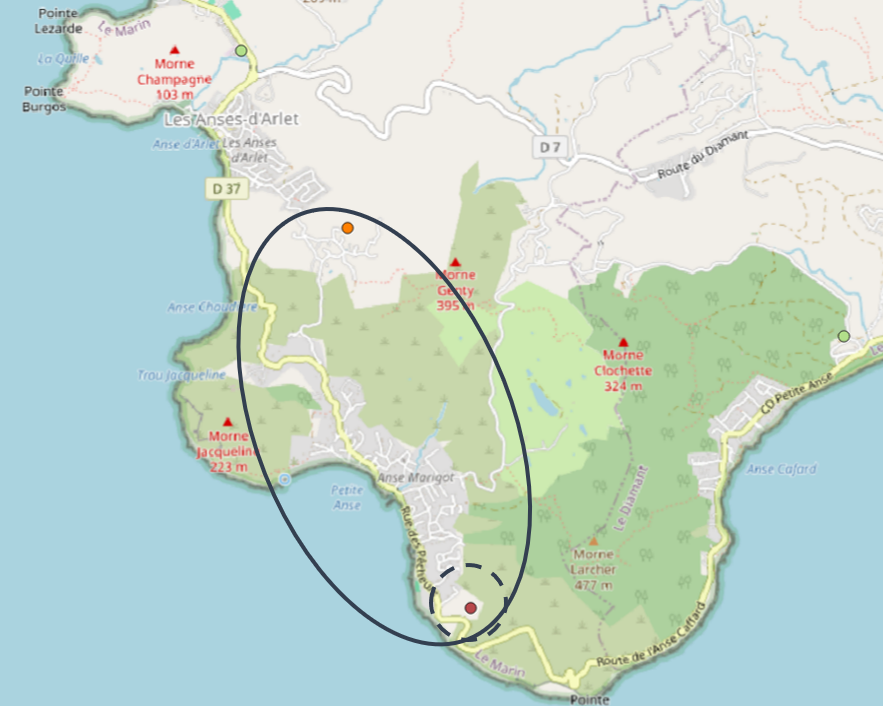

.. note::
    Pour reproduire ce pas à pas, vous pouvez : soit utiliser les données que vous avez préparé en suivant la rubrique précédente, soit télécharger les données :download:`ici <_static/layers_petite_anse.zip>`.

**1. Utilisation du module** ``Réseau``

* Sélectionner la station au Sud (bulles 1 à 3).

* Chercher ``ELAN`` dans la boîte à outils de traitements (bulle 4) et sélectionner ``Réseau`` (bulle 5).

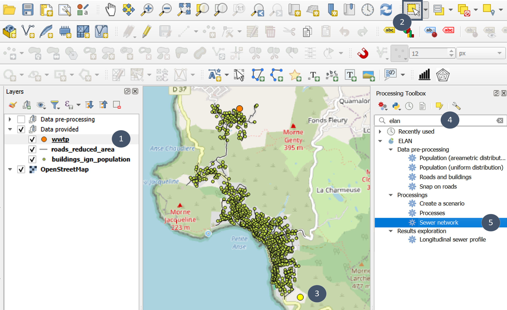

* Indiquer les 4 couches géographiques (bulles 1 à 4). **Bien cocher Entité(s) sélectionnée(s) uniquement pour considérer uniquement la STEU au Sud de la zone.**

* Si vous souhaitez travailler en considérant un nombre variable d'habitants par bâtiment, indiquer l'attribut correspondant à la population parmi les attributs de votre couche bâtiments (menu déroulant) pour *Nombre d'habitants*. Sinon laisser le champ vide.

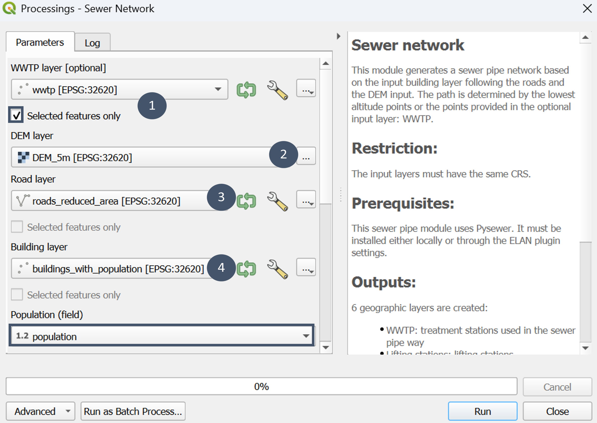

* Laisser les valeurs par défaut pour les différents paramètres techniques.

* Sélectionner les 6 premiers diamètres (0,1 à 0,4) parmi les options possibles pour les diamètres gravitaires (bulle 5).

* Sélectionner un nom et un emplacement pour le fichier (bulle 6).

* Exécuter (bulle 7).

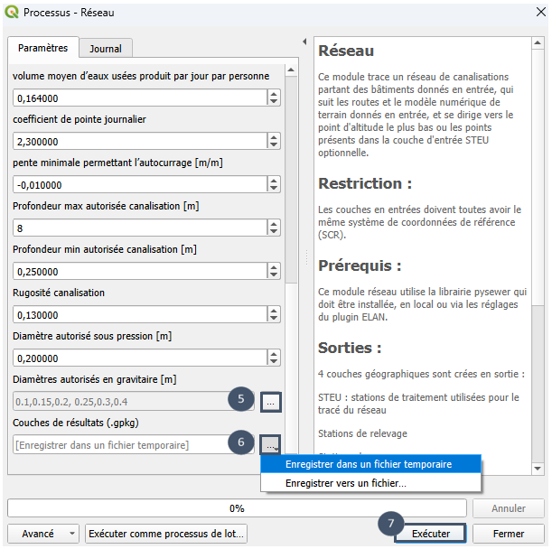

**2. Résultats en sortie de module** ``Réseau``

Après exécution, vous obtenez la vue suivante :

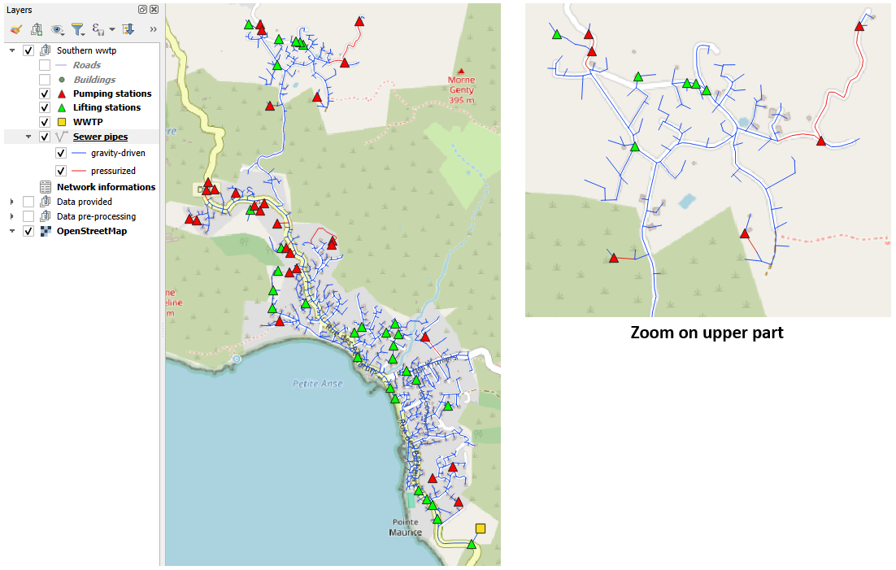

.. note::

    Les couches relatives aux routes et aux bâtiments n'apparaissent pas sur cette vue et les suivantes pour plus de lisibilité.

6 couches géométriques ont été chargées dans votre espace de travail, chacune avec une symbologie qui lui est propre :

    * carré jaune pour la STEU
    * lignes de couleur aléatoire pour les routes
    * points de couleur aléatoire pour les bâtiments
    * triangles verts pour les stations de relevage
    * triangles rouges pour les stations de pompage (privées et non privées)
    * lignes bleues pour les sections en gravitaire et lignes rouges pour les sections en refoulement

D'autres styles sont disponibles pour la couche ``Canalisations``. Pour y accéder :

**1.** Sélectionner la couche ``Canalisations`` et **cliquer droit**.

**2.** Aller dans *Styles*. 

**3.** Sélectionner le style de votre choix parmi les 5 autres proposés. 

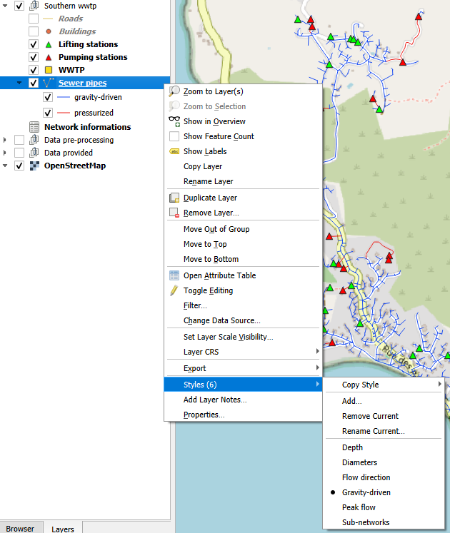

**Style diamètres**

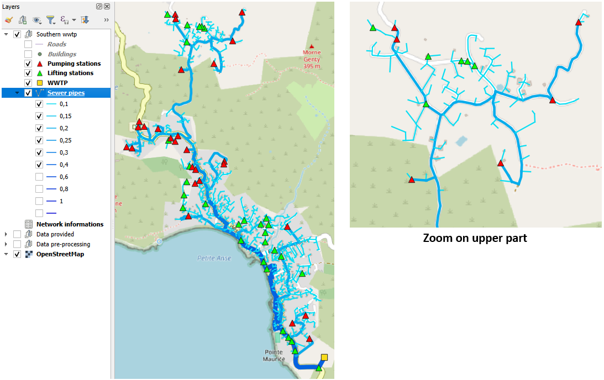

.. tip::
    Pour savoir exactement combien d'entités correspondent à chaque diamètre : cliquer droit sur la couche ``Canalisations`` et cocher ``Afficher le nombre d'entités``. 
    Vous obtiendrez quelque chose de ce type : 

                .. image:: _static/afficher_entites.png
                    :width: 157

    Cette astuce peut être appliquée à n'importe quelle couche vecteur.

**Style débit de pointe**

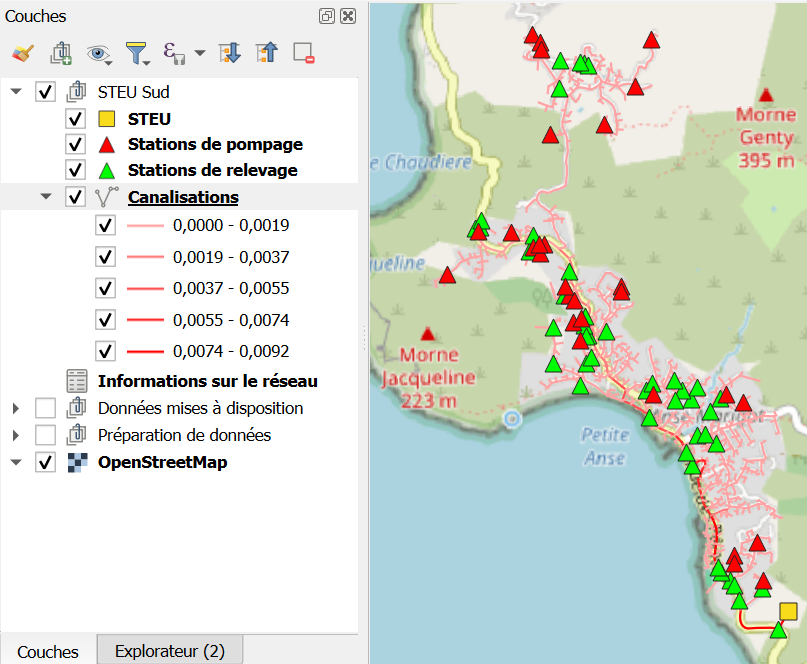

**Style profondeur**

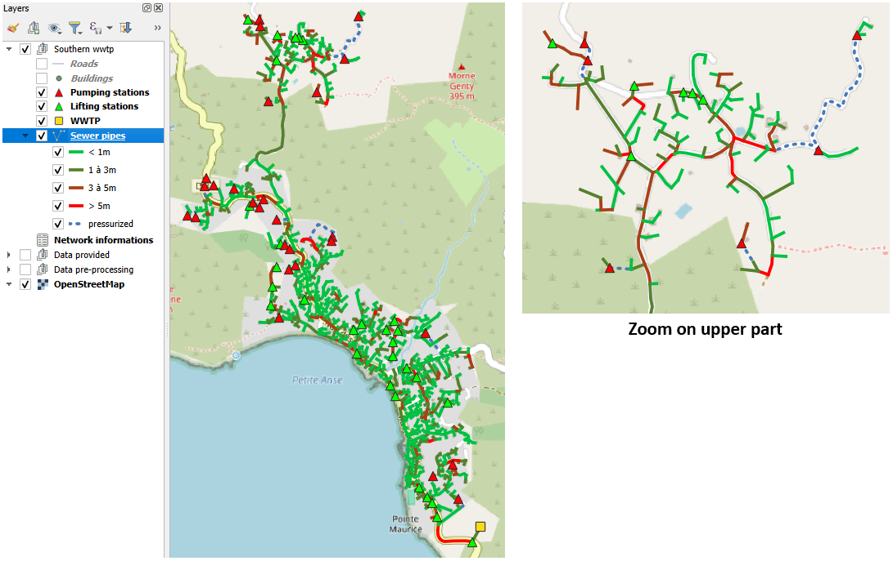

**Style sens d'écoulement**

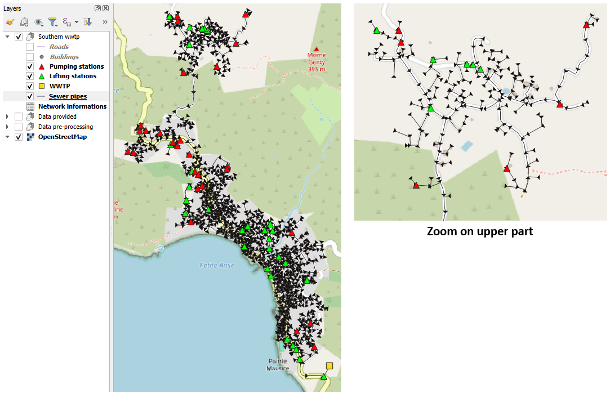

**Style sous-réseaux**

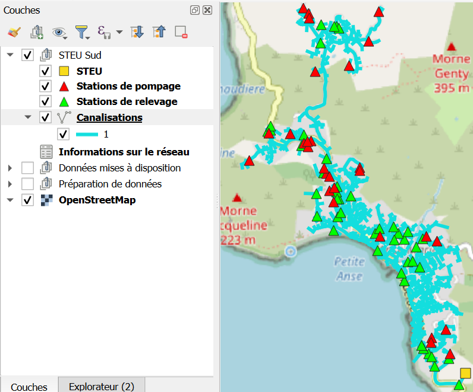

.. note::
    Le style *Sous-réseaux* est ici uniforme car ce scénario considère une seule station donc un seul réseau d'assainissement (pas de sous-réseaux).
    En considérant 2 stations possibles, une vue de ce type sera obtenue :

                .. image:: _static/vue_2_reseaux.png
                    :width: 200

.. tip::
    Pour organiser votre espace avec les différentes couches, vous pouvez créer des groupes (ici *Préparation de données*, *Données mises à disposition* et *STEU Sud*.)
    
    Pour cela, il vous suffit de cliquer sur l'icône *Ajouter un groupe* et d'y glisser les couches que vous souhaitez rassembler.

            .. image:: _static/ajout-groupe.png
                :width: 132

**3. Consultation de la couche** ``Informations sur le réseau`` **et des attributs des autres couches**

* Sélectionner la couche ``Informations sur le réseau`` (bulle 1).

* Cliquer que l'icône *Ouvrir la table attributaire* (bulle 2).

* Une fenêtre s'ouvre et vous permet d'accéder à l'ensemble des informations de la couche (bulle 3).

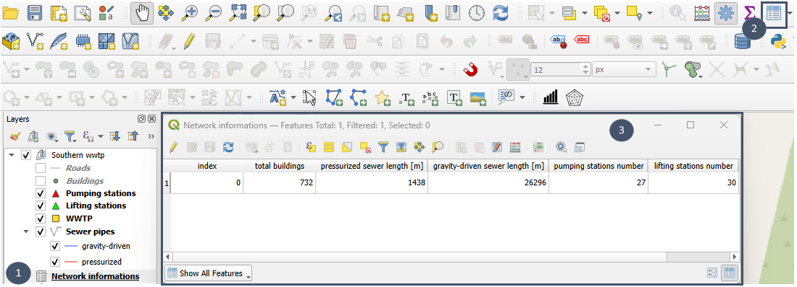

Pour consulter les attributs des 4 autres couches obtenues en sortie, procéder de même en sélectionnant la couche
dont vous souhaitez consulter les attributs. 

L'ensemble des attributs disponibles pour chaque couche est détaillé :ref:`ici <attributs-reseau>`.

.. tip::
    Si vous êtes amenés à charger le géopackage contenant les 7 couches dans un autre projet, vous pouvez l'ouvrir directement
    dans un groupe en suivant la démarche suivante (ouverture des 7 couches placées dans un groupe commun) :

    - Glisser le .gpkg depuis *Explorateur* dans la fenêtre avec la vue cartographique.
    - Dans la fenêtre qui s'ouvre, dérouler *Options* et cocher *Afficher des couches à un groupe* (bulle 1).
    - Cliquer sur *Ajouter une couche* (bulle 2).

                    .. image:: _static/ouverture_gpkg.png
                        :width: 542

Exploration des résultats (module ``Profils de canalisations``)
^^^^^^^^^^^^^^^^^^^^^^^^^^^^^^^^^^^^^^^^^^^^^^^^^^^^^^^^^^^^^^^^^^

Pour explorer le pré-dimensionnement proposé par le module ``Réseau``, vous pouvez visualiser le profil souterrain d'une succession de tuyaux grâce au module
``Profils de canalisations`` couplé à l'outil *Profil d'élévation* de QGIS. Un :ref:`exemple <visualisation-profils>` est donné dans la documentation générale.

Étape 2 : Pré-dimensionner la ou les STEU (module ``Procédés``)
^^^^^^^^^^^^^^^^^^^^^^^^^^^^^^^^^^^^^^^^^^^^^^^^^^^^^^^^^^^^^^^^^^

**1. Renseigner les contraintes de rejet dans la couche** ``STEU``

Les niveaux de rejet à respecter dans le cas d'une station au Sud de la zone sont les suivants :

    * MES : 35 mg/L 
    * DBO5 : 35 mg/L 
    * NTK : 20 mg/L 
    * DCO : 125 mg/L

* Sélectionner la couche ``STEU`` (bulle 1).

* Basculer en mode édition (bulle 2) puis ouvrir la table attributaire (bulle 3).

* Renseigner les valeurs numériques indiquées pour les niveaux de rejet en MES, DBO5, NTK et DCO (encart 4).

* Sortir du mode édition (bulle 5) et fermer la table attributaire (bulle 6).

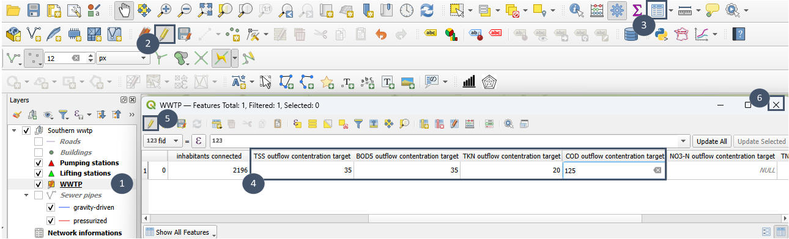

**2. Délimitation de la surface disponible** (facultatif)

* Créer une nouvelle couche (.gpkg ou .shp) de type *polygone*.

.. image:: _static/nouvelle-couche.png
     :width: 700

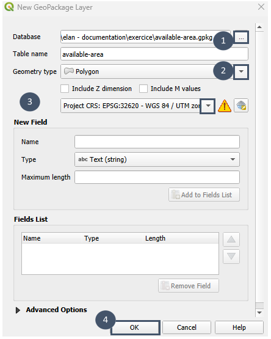

* L'éditer et délimiter la surface disponible.

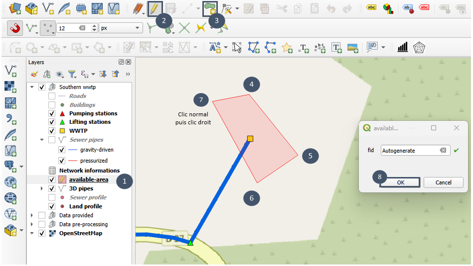

* Enregistrer et sortir du mode édition.

.. image:: _static/save.png
     :width: 196

**3. Utilisation du module** ``Procédés``

* Cherche ``ELAN`` dans la *Boîte à outils de traitements* et sélectionner ``Procédés`` (bulles 1 et 2).

* Choisir *Tropical* pour le climat (bulle 3).

* Indiquer la couche ``STEU`` dont vous avez renseigné les attributs (bulle 4) et la couche ``surface-dispo`` que vous venez de créer (bulle 5).

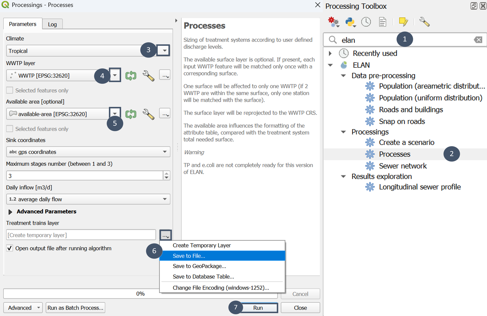

* Vérifier que les champs identifiés pour les niveaux de rejets et le débit journalier sont corrects.

* Indiquer un nom et un emplacement pour l'enregistrement du fichier de sortie (bulle 6), puis exécuter (bulle 7).

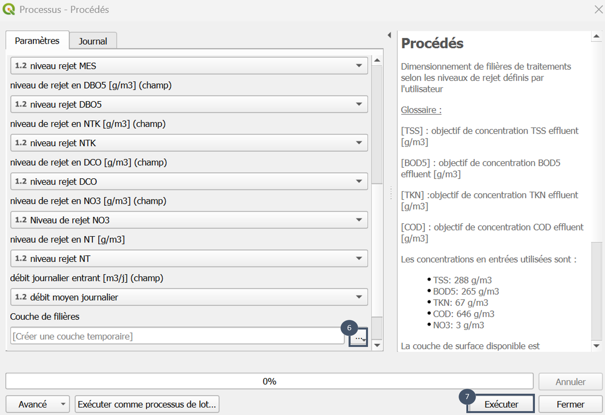

**4. Consultation des caractéristiques des filières de traitement pré-dimensionnées**

Après exécution du module, vous obtenez un visuel de ce type (couche *point*) :

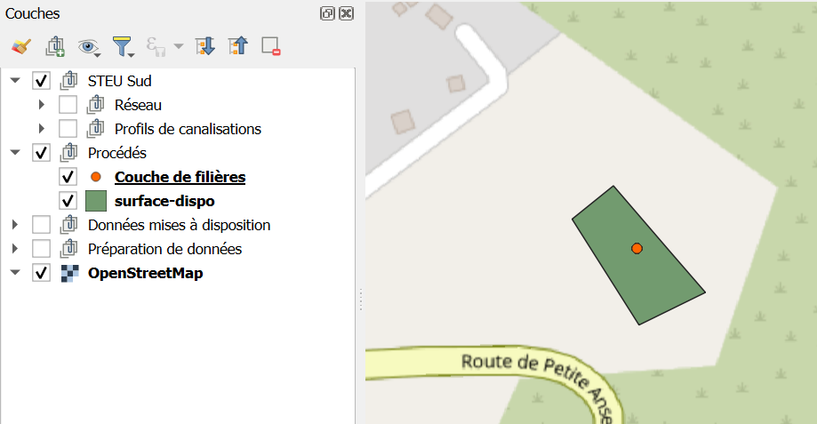

Pour consulter les attributs de cette couche : 

* Sélectionner la couche ``Couche de filières`` (bulle 1).

* Cliquer que l'icône Ouvrir la table attributaire (bulle 2).

* Une fenêtre s'ouvre et vous permet d'accéder à l'ensemble des informations de la couche (bulle 3).

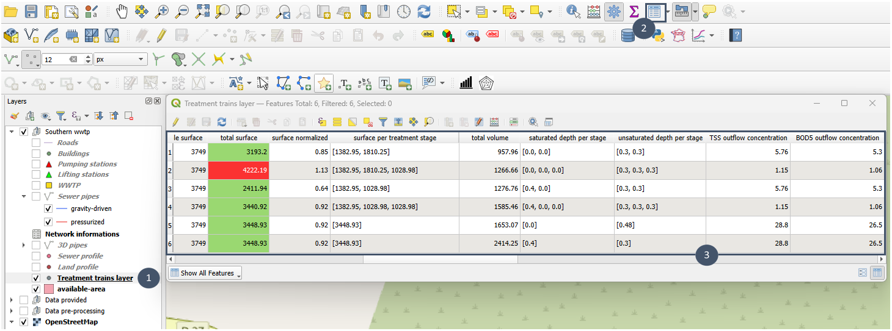

Étape 3 : Pré-sélectionner une filière par exutoire
^^^^^^^^^^^^^^^^^^^^^^^^^^^^^^^^^^^^^^^^^^^^^^^^^^^^

Ici, 6 filières permettent d'atteindre les niveaux de rejets imposés (déviations en vert) :
    
    * VdNS1-VdNS2
    * VdNS1-VdNS2-VdNS2
    * VdNSS-VdNS2
    * VdNSS-VdNS2-VdNS2
    * VdNS1
    * VdNSS

La surface totale apparaît en rouge pour la filière VdNS1-VdNS2-VdNS2 car elle est supérieure à la surface disponible.

Les filières à étage unique (VdNS1 et VdNSS) permettent ici d'atteindre les niveaux de rejets et sont généralement moins 
coûteuses que les filières multi-étages. Au vu des taux de charge en polluants et du taux de charge hydraulique, elles 
pourraient constituer deux filières de traitement intéressantes.

Un premier scénario pourrait donc être : le réseau d'assainissement obtenu à l'étape 1 couplé à une filière VdNS1. Le couplage avec une filière 
VdNSS pourrait constituer un second scénario.

Étape 4 : Créer un objet scénario (module ``Créer un scénario``)
^^^^^^^^^^^^^^^^^^^^^^^^^^^^^^^^^^^^^^^^^^^^^^^^^^^^^^^^^^^^^^^^^^^^

Une fois que le couplage réseau/filière constitutif d'un scénario est identifié, vous pouvez créer un objet scénario à l'aide du module ``Créer un scénario`` comme
:ref:`détaillé dans la documentation générale <creer-scenario>`. Cet objet permettra ensuite l'évaluation du scénario et sa comparaison à d'autres scénarios envisagés. 

.. _exercice:

Exercice : Création d'un second scénario pour :ref:`Petite Anse <petite-anse>`
^^^^^^^^^^^^^^^^^^^^^^^^^^^^^^^^^^^^^^^^^^^^^^^^^^^^^^^^^^^^^^^^^^^^^^^^^^^^^^^^

Pour mettre en pratique le contenu de cette page, vous pouvez essayez de suivre les différentes étapes décrites
mais cette fois-ci en considérant 2 emplacements possibles : celui au Sud de la zone et celui au Nord.

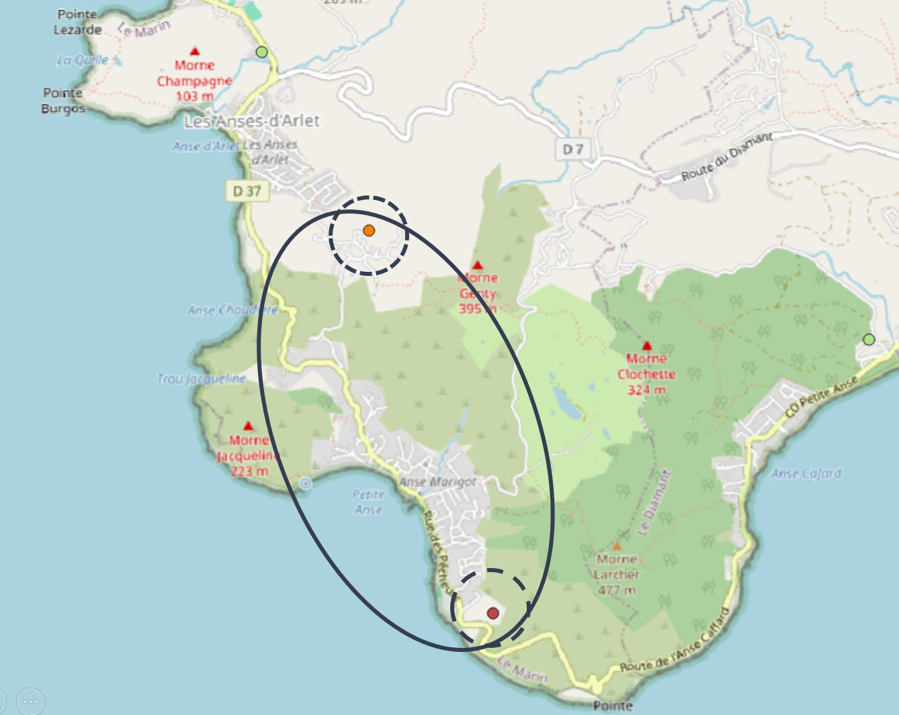

Les niveaux de rejet pour l'emplacement au Nord de la zone sont moins contraignants (pas de contrainte sur l'azote) :

    * MES : 35 mg/L 
    * DBO5 : 35 mg/L 
    * DCO : 125 mg/L

.. important::
    L'aspect itératif de la définition d'un scénario est brièvement mentionné mais n'est pas détaillé dans ce pas à pas. Il s'agit d'une pratique possible (voire inévitable).
    
    Par exemple : si vous jugez que certains bâtiments sont trop "coûteux" à raccorder (plus de 40 mètre linéaire pour un bâtiment), 
    vous pouvez éditer la couche bâtiment et supprimer ces bâtiments pour voir quel serait l'impact de leur maintien en assainissement 
    non collectif sur le pré-dimensionnement du réseau proposé. De même vous pouvez redéfinir les chemins empruntables en supprimant certains et/ou en en ajoutant d'autres.