.. _preparation:

Obtention et préparation des données géographiques
===================================================

Entrées du module ``Réseau``
-----------------------------

Pour pouvoir utiliser le module ``Réseau``, **4 couches géographiques** sont nécessaires :

* ``STEU`` : couche vecteur qui contient l'ensemble des **emplacements envisagés comme exutoires** (station de traitement des eaux usées existante ou projet possible), type : *point*.

* ``bâtiments`` : couche vecteur qui rassemble les **bâtiments à raccorder**, type : *point* (centroïdes des bâtiments). Si l'occupation est différente selon les bâtiments, le nombre d'habitants par bâtiment peut être indiqué via un attribut (*population* par exemple).

* ``routes`` : couche vecteur indiquant les **routes empruntables** pour le raccordement, type : *ligne*.

* ``MNT`` : couche raster (.tif, .asc, .vrt) du **modèle numérique de terrain** pour la zone d'intérêt.

.. note::
    Les couches vecteur peuvent être des .shp ou des .gpkg.

Si vous disposez de ces 4 couches, vous pouvez vous rendre directement à la page :ref:`Création d'un scénario pour la question du centralisé / décentralisé <prb1>`.
Sinon, poursuivez ici pour quelques astuces et explications sur l'obtention et la préparation des données géographiques requises.

**Pour la couche** ``STEU``, le plus simple est de ``Créer une nouvelle couche`` de type *point* et de l'éditer de sorte à indiquer tous les emplacements possibles comme exutoires (1 point = 1 exutoire possible).

**Pour les autres couches** : 

En contexte français (Hexagone et Outre-Mer)
^^^^^^^^^^^^^^^^^^^^^^^^^^^^^^^^^^^^^^^^^^^^

* ``MNT``: raster téléchargeable par département sur le site `Géoservices de l'IGN <https://geoservices.ign.fr/>`_ 
    * MNT à 25 m : `BD ALTI® 25M <https://geoservices.ign.fr/bdalti>`_
    * MNT à 5 m voire 1 m : `RGE ALTI® <https://geoservices.ign.fr/rgealti>`_

* ``routes`` et ``bâtiments``: couches téléchargeables par département sur le site Géoservices de l'IGN `BD TOPO® <https://geoservices.ign.fr/bdtopo>`_.

.. tip::
    Pour accéder aux routes et bâtiments à l'échelle de votre zone d'étude et non du département, vous pouvez installer et utiliser le plugin `BD TOPO® Extractor <https://plugins.qgis.org/plugins/bd_topo_extractor/>`_.
    
    Il vous suffit de :

        * Installer l'extension via le gestionnaire d'extensions.
        * Dessiner sur la carte la zone rectangulaire à extraire.
        * Choisir les couches ``Bâtiment`` et ``Tronçon de route``.

.. attention::
    La couche ``bâtiments`` obtenue est de type *polygone* et non *point*. Elle doit donc être transformée via le module :ref:`Population <population>` intégré à ELAN ou le module ``Centroïdes`` qui est natif de QGIS.

En contexte international
^^^^^^^^^^^^^^^^^^^^^^^^^^

* ``MNT`` : le MNT ou DEM en anglais (Digital Elevation Model), est *a priori* disponible sur l'ensemble des territoires du monde à une maille de 30 m via différentes plateformes.

.. note::
    Plus le MNT est précis, plus les sorties du module ``Réseau`` seront pertinentes. 
    **Nous vous recommandons donc de regarder si des données MNT à 10 m ou 5 m sont disponibles dans votre contexte national**. 
    A défaut, utilisez le MNT à 30 m, mais gardez en tête que la précision du MNT impacte les résultats du module ``Réseau`` (surestimation du nombre de stations de pompage). 

.. tip::
    Si vous ne disposez pas de données locales de MNT à une maille inférieure à 30 m, vous pouvez consulter le site ASF Data Search à l'adresse suivante : https://search.asf.alaska.edu/#/ et suivre les étapes indiquées pour essayer de trouver une tuile de MNT à rune maille de 12.5 m sur votre zone.

    * Sélectionner Geographic Search pour Search type (bulle 1).
    * Sélectionner ALOS PALSAR pour Data Set (bulle 2).
    * Indiquer votre zone sur la carte (bulle 3, carré jaune).
    * Cliquer sur SEARCH (bulle 4).
    * Regarder si parmi les tuiles proposées à gauche, il y en a une où un fichier High-Res Terrain Corrected est proposé au téléchargement (bulle 5).
    * Si oui, il vous faudra créer un compte (email et mot de passe) pour pouvoir télécharger le fichier.

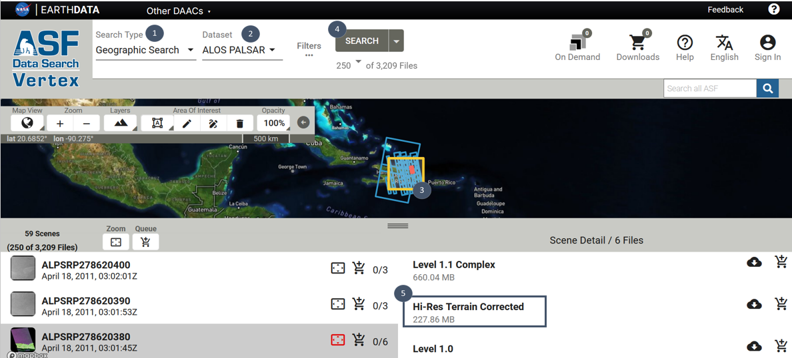

* ``routes`` et ``bâtiments``: le module :ref:`Routes et bâtiments <routes>` d'ELAN vous permet d'extraire les données Open Street Map sur une zone définie.

.. attention::
    La couche ``bâtiments`` obtenue sera de type *polygone* et non *point*. Elle devra donc être transformée via le module :ref:`Population <population>` intégré à ELAN ou le module ``Centroïdes`` qui est natif de QGIS.

.. note::
     Si votre zone d'étude est située dans l'hémisphère Sud, Open Buildings peut constituer une alternative intéressante à Open Street Map pour les bâtiments. Pour plus d'informations : https://sites.research.google/gr/open-buildings/.

Application à l'exemple de :ref:`Petite-Anse <petite-anse>`
^^^^^^^^^^^^^^^^^^^^^^^^^^^^^^^^^^^^^^^^^^^^^^^^^^^^^^^^^^^

**Fond de carte Open Street Map**

Pour identifier la zone, afficher le fond de carte `Open Street Map <https://www.openstreetmap.org>`_ : 

* Aller dans le panneau *Explorateur*.

.. tip::
     Si *Explorateur* n'est pas visible : activez-le via *Vue - Panneaux - Explorateur*.

          .. image:: _static/afficher-explorateur.png
               :width: 400

* Chercher la catégorie **Tuiles XYZ** (bulle 1).

* Dérouler et double-cliquer sur **OpenStreetMap** (bulle 2).

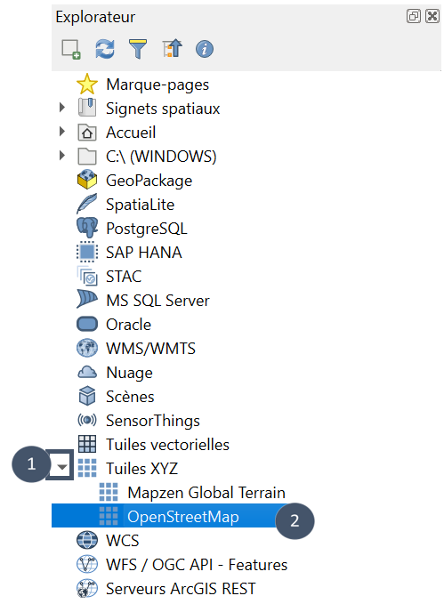

* Localiser la zone sur le fond Open Street Map qui s'est affiché dans votre vue cartographique.

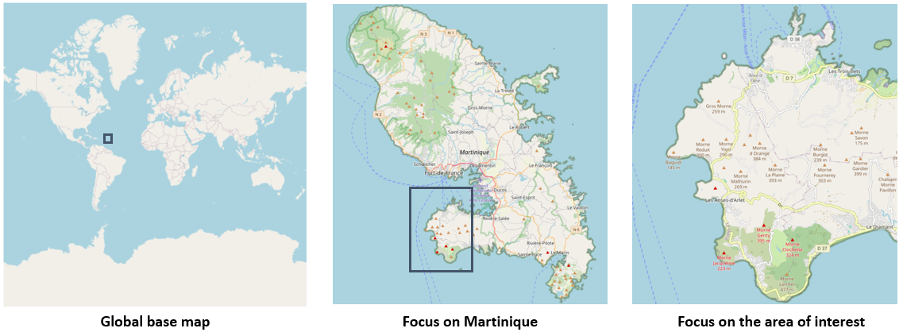

.. note::
     Pour aller plus loin sur le sujet des fonds de carte dans QGIS, nous vous conseillons ce :download:`tutoriel <_static/tutoqgis_03_recherche_donnees.pdf>` réalisé par `UMR 6554 LETG <https://letg.cnrs.fr/>`_ / `UMR 5319 Passages <https://www.passages.cnrs.fr/>`_ (CNRS). 
     Il s'agit d'un export PDF du chapitre 3 du tutoriel QGIS 3.22 'Białowieża' disponible à cette adresse : https://tutoqgis.cnrs.fr/.

**Modèle Numérique de Terrain (MNT)**

**1.** Télécharger le `MNT à 5 m de la Martinique <https://data.geopf.fr/telechargement/download/RGEALTI/RGEALTI_2-0_1M_ASC_WGS84UTM20-MART87_D972_2015-10-21/RGEALTI_2-0_1M_ASC_WGS84UTM20-MART87_D972_2015-10-21.7z>`_ sur RGE ALTI®.

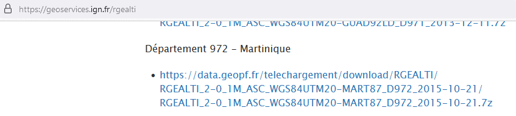

**2.** Identifier les dalles de MNT qui coïncident avec notre zone d'intérêt. Cette étape passe par le chargement des différentes dalles dans votre projet QGIS (via le panneau *Explorateur*). 

.. tip::
     Ici la grille associée aux dalles de MNT est disponible (dalles.shp dans 3_SUPPLEMENTS_LIVRAISON), chargez-la dans QGIS via le panneau *Explorateur* (bulle 1). Elle vous permettra une identification plus rapide des
     dalles concernées.

     Il vous suffit en effet de sélectionner les dalles coïncidant avec votre zone (bulles 2 et 3) puis de faire ``Ouvrir la table attributaire (entités sélectionnées uniquement)`` (bulle 4) pour accéder directement aux
     noms des dalles d'intérêt (attribut NOM DALLE).

          .. image:: _static/grille_mnt.png
               :width: 700

          .. image:: _static/4dalles_table.png
               :width: 455

Ici quatre dalles recouvrent la zone : RGEALTI_MTQ_0705_1600_MNT_WGS84UTM20_MART87, RGEALTI_MTQ_0710_1600_MNT_WGS84UTM20_MART87, RGEALTI_MTQ_0705_1605_MNT_WGS84UTM20_MART87 et RGEALTI_MTQ_0710_1605_MNT_WGS84UTM20_MART87.

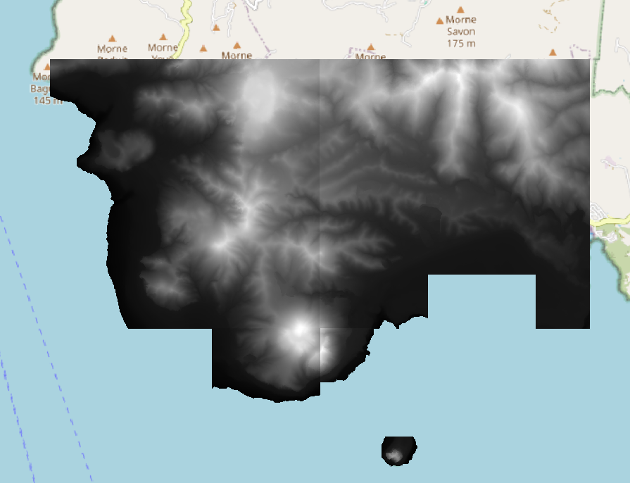

**3.** Identifier le SCR (système de coordonnées de référence) associé. Il est indiqué dans l'appellation des fichiers : ici WGS184UTM20, soit EPSG:32620- WGS 84/UTM zone 20N dans QGIS.

.. _set-SCR:

**4.** Géoréférencer les 4 dalles dans ce SCR (pas de détection automatique).

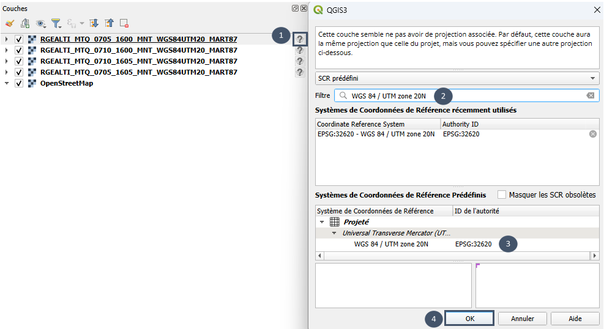

.. tip::
    Faire du SCR du MNT le SCR de votre projet : opter pour ce SCR lorsque vous créez de nouvelles couches, et reprojeter les couches vecteur que vous importez dans ce SCR avec l'outil natif de QGIS ``Reprojeter une couche``.

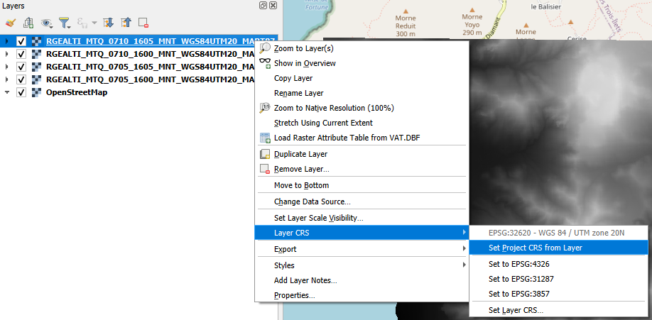

**5.** Pour fusionner les 4 dalles, utiliser l'outil ``Fusion`` de GDAL. 

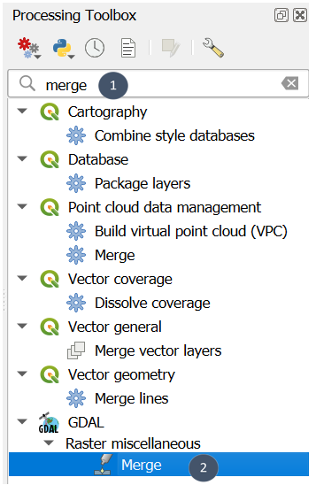

.. tip::
    Pour afficher le panneau ``Boîte à outils de traitements`` s'il n'apparaît pas dans votre espace de travail : *Vue - Panneaux - Boîte à outils de traitements*. 
    Ou plus simplement : cliquez sur l'icône engrenage à côté de l'icône sigma (en haut à droite *a priori*).

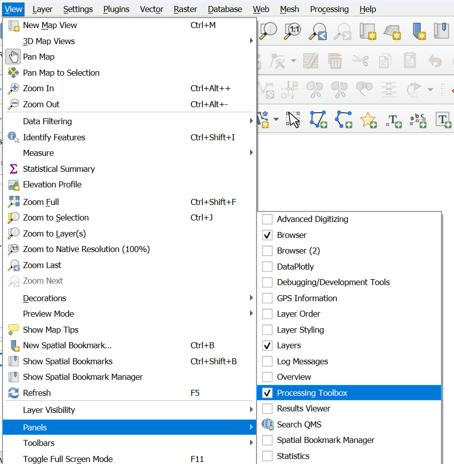

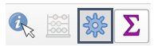
     
**6.** Renseigner les entrées (bulle 1) et enregistrer la sortie dans un fichier de type .tif (bulle 2) avant d'exécuter (bulle 3).

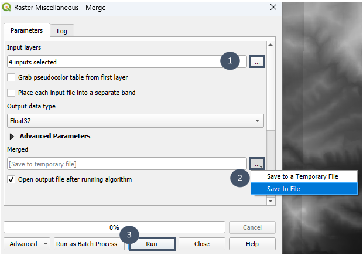

**7.** Ce processing vous permet d'obtenir une seule dalle de MNT en sortie.

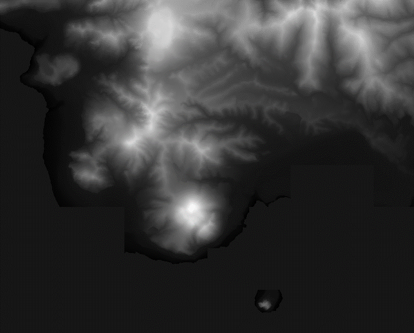

**8.** Cette dalle n'est pas géoréférencée. Pour lui assigner un SCR de manière durable :

* Chercher l'outil ``Assigner une projection`` de GDAL dans la boite à outils de traitements (bulles 1 et 2).

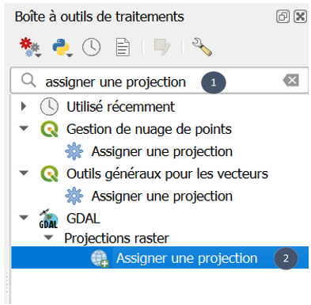

* Renseigner la couche (bulle 1) et le SCR de destination (bulle 2), puis Exécuter (bulle 3).

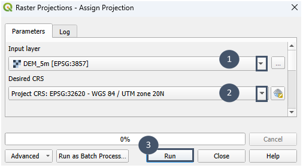

* Votre couche initiale est désormais géoréférencée (pas de nouvelle couche créée).

.. tip::
    Pour que l'échelle du MNT s'ajuste automatiquement lorsque vous zommez sur la carte :

    - Double cliquer sur votre couche raster dans le panneau *Couches*.

    - Choisir *Symbologie* dans la fenêtre qui s'ouvre (bulle 1).

    - Dans *Paramètres de valeurs Min/Max* (bulle 2), changer le paramètre *Statistiques de l'emprise* à *Emprise actualisée* au lieu de *Raster entier* par défaut (bulle 3).

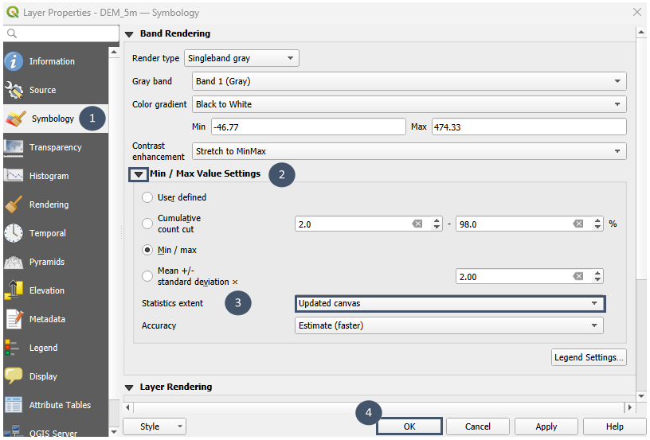

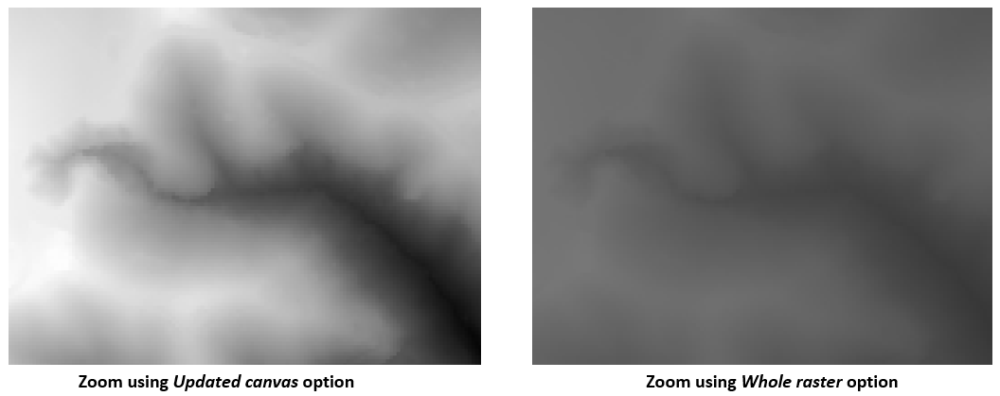

**Exutoires possibles (STEU)**

**1.** Créer une nouvelle couche (.shp ou .gpkg).

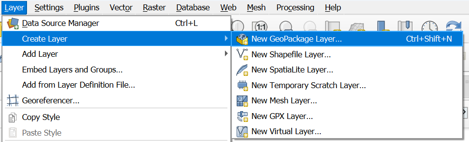

**2.** Choisir un emplacement de sauvegarde et un nom pour cette couche (bulle 1), puis renseigner son type : *Point* (bulle 2).

**3.** Pour le SCR, choisir le SCR du projet (ici EPSG:32620- WGS 84/UTM zone 20N) puis exécuter (bulles 3 et 4).

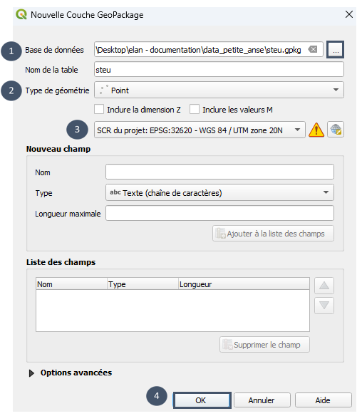

**4.** Ajouter les 4 emplacements possibles tour à tour en suivant les bulles 1 à 5 indiquées sur la capture.

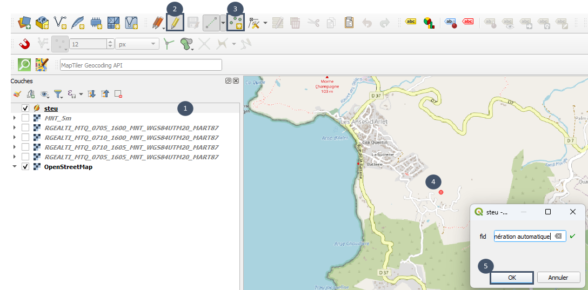

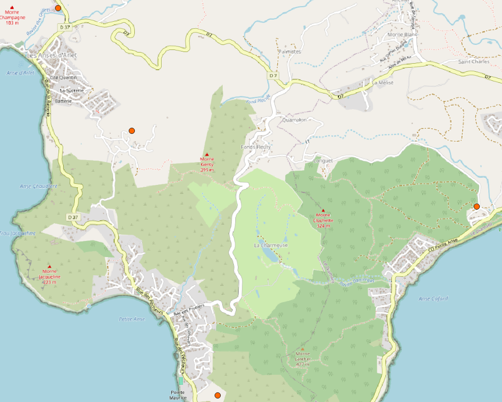

**5.** Bien enregistrer et désactiver le mode édition une fois les 4 emplacements ajoutés.

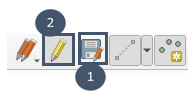

**Routes et bâtiments**

* **Préalable :** Installer l'extension `BD TOPO® Extractor <https://plugins.qgis.org/plugins/bd_topo_extractor/>`_ via le gestionnaire d'extensions QGIS.

.. note:: 
     Vous pouvez également télécharger manuellement les données sur le site Géoservices de l'IGN `BD TOPO® <https://geoservices.ign.fr/bdtopo>`_, mais vous devrez vraisemblablement les
     post-traiter pour les réduire à votre zone d'étude (données mises à disposition à l'échelle du département).

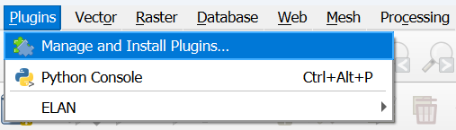

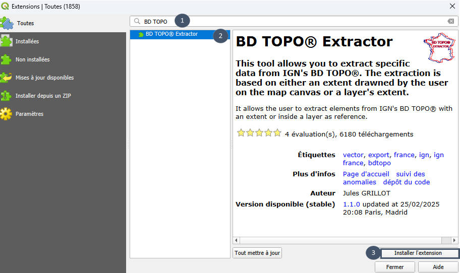

Pour les **bâtiments**, il nous faut **uniquement ceux de la zone à connecter**. Pour les **routes empruntables**, nous avons besoin de **celles de la zone**, mais également de **celles
qui permettent d'accéder aux deux stations existantes** (voir :ref:`introduction <petite-anse>`).

* **Récupération des bâtiments**

**1.** Créer une nouvelle couche de type *polygone* dans le SCR du projet.

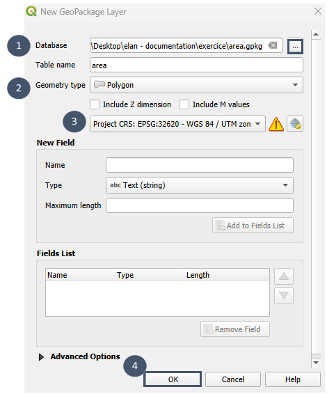

.. _zone:

**2.** L'éditer et délimiter la zone d'intérêt.

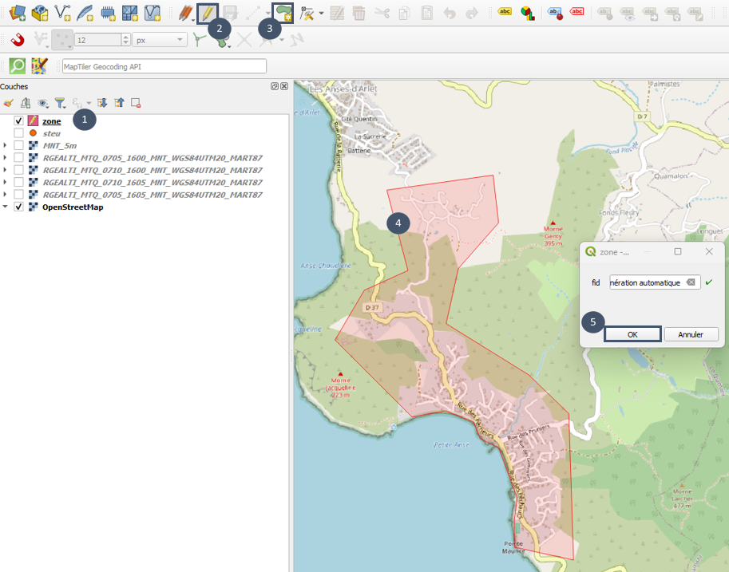

**3.** Enregistrer et sortir du mode édition.

**4.** Lancer le plugin.

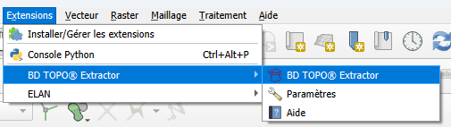

**5.** Indiquer la couche d'intérêt (bulle 1), cocher ``Batiment`` (bulle 2) et indiquer le dossier d'enregistrement (bulles 3 et 4) avant de cliquer sur ``OK`` (bulle 5).

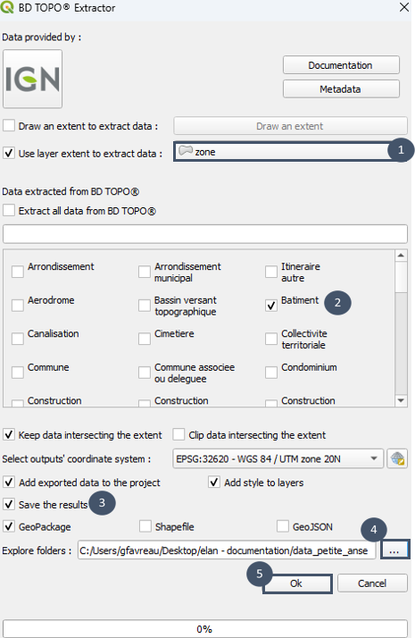

Vous obtenez une sortie de ce type : 

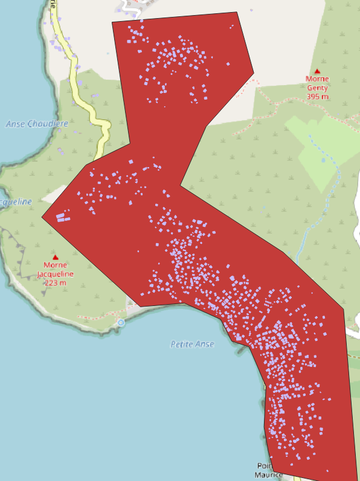

**6.** Editer la couche (icône crayon), sélectionner (bulles 1 puis 2) puis supprimer les quelques entités situées hors de la zone (bulle 3). Enregistrer avant de sortir du mode édition.

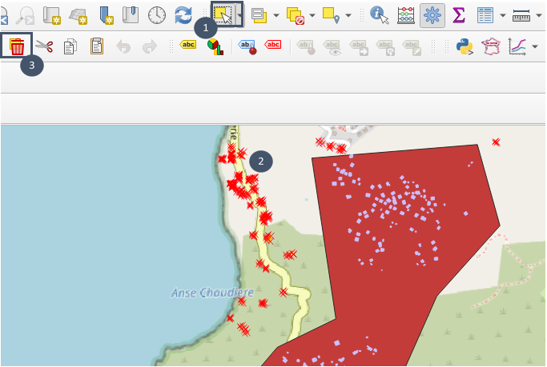

**7.** Pour obtenir des points à partir des polygones obtenus (contrainte liée module ``Réseau`` ), utiliser l'outil ``Centroïdes`` de QGIS.

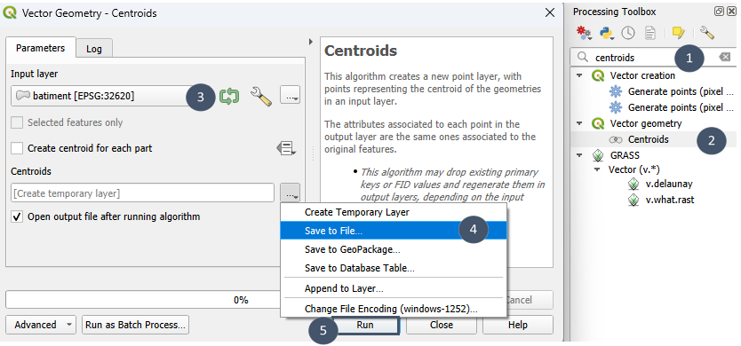

Vous obtenez une sortie de ce type : 

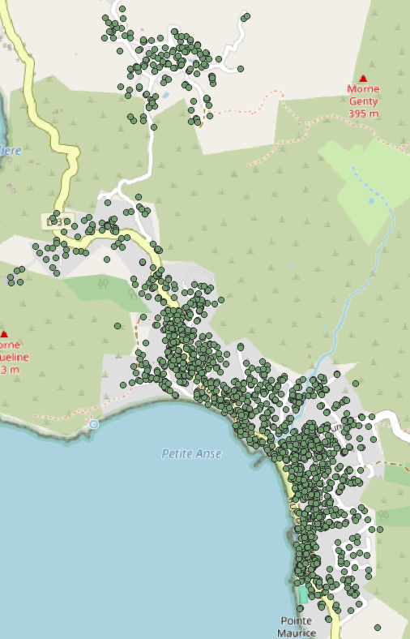

* **Récupération des routes**

**1.** Lancer le plugin BD TOPO® Extractor.

**2.** Délimiter la zone à extraire sur la carte (bulles 1 et 2), cocher ``Tronçon de route`` (bulle 3) et indiquer le dossier d'enregistrement (bulles 4 et 5) avant de cliquer sur ``OK`` (bulle 6).

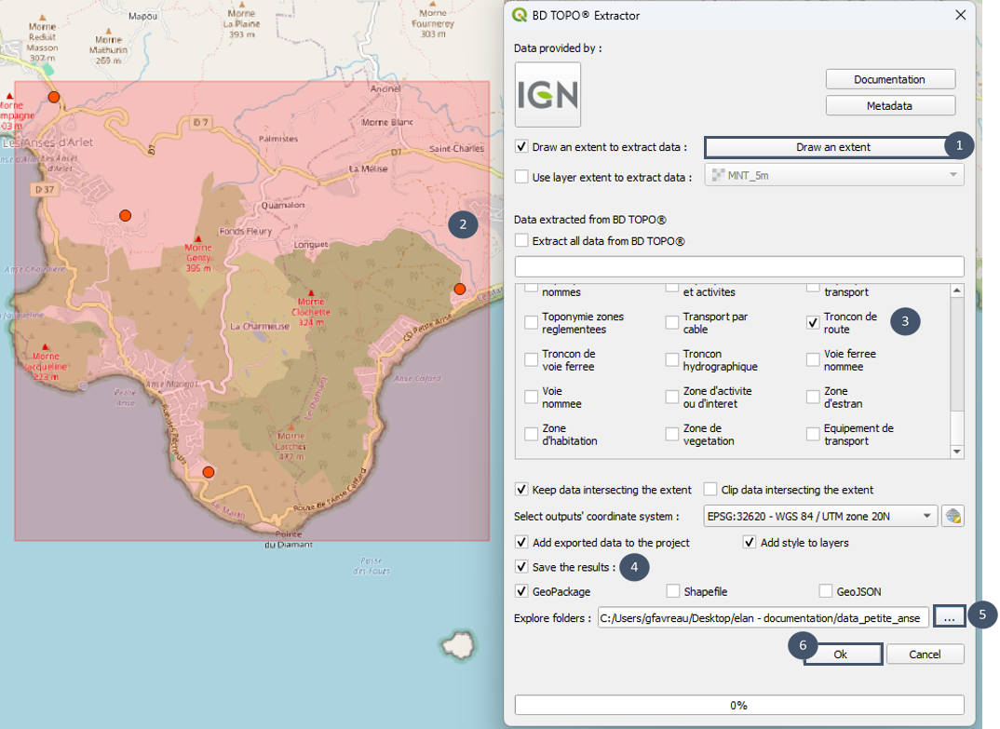

La sortie obtenue est de ce type :

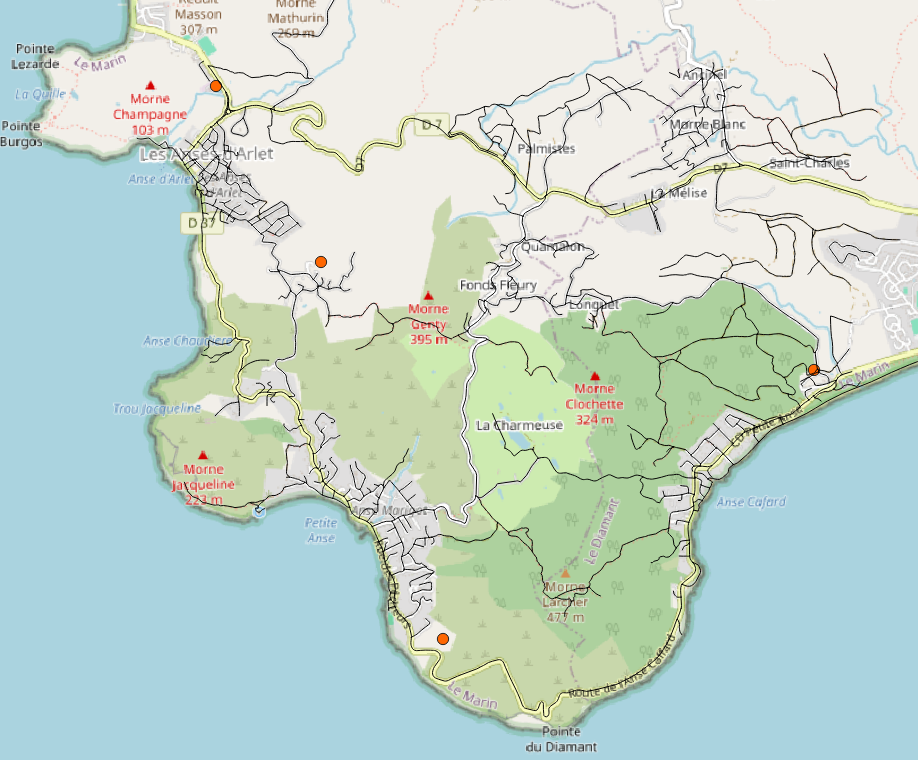

* **Post-traitement des couches**

Les couches peuvent ensuite être éditées au besoin. Par exemple ici, restreindre les routes empruntables en supprimant les sentiers.

**L'édition permet à l'utilisateur de retranscrire sa connaissance du terrain** (routes non empruntables ou au contraire, ajout de chemins envisageables, 
sélection fine des bâtiments à raccorder ou non) et **contribue donc à obtenir des résultats plus pertinents**.

Utilisation des modules ``Routes et bâtiments`` et ``Population``
------------------------------------------------------------------

.. _routes:

Module ``Routes et bâtiments``
^^^^^^^^^^^^^^^^^^^^^^^^^^^^^^^^

Le module ``Routes et bâtiments`` permet l'extraction des entités routes et bâtiments se trouvant dans une zone définie par l'utilisateur (couche de type *polygone*).
L'extraction se fait à partir `d'Open Street Map <https://www.openstreetmap.org>`_ qui rassemble des données cartographiques à l'échelle mondiale. 
Open Street Map est un outil ouvert et collaboratif.

.. note::
     La qualité des données Open Street Map est variable selon les zones du globe : elle peut être d'une qualité moindre par 
     rapport à des données nationales (moins de bâtiments reportés par exemple) comme de qualité équivalente. Dans 
     le dernier cas, l'utilisation du module ``Routes et bâtiments`` peut parfois s'avérer plus simple que l'usage des 
     données nationales (téléchargement, post-traitement).

     Bon à savoir : un très léger décalage en termes de georéférencement peut caractériser les données extraites à partir d'Open Street Map.

**Utilisation du module**

**1.** Chercher ``ELAN`` dans la boîte à outils de traitements et sélectionner ``Routes et bâtiments``.

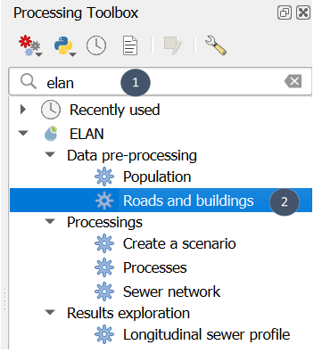

**2.** Indiquer la couche *polygone* qui délimite la zone à extraire (bulle 1), cocher *Reprojection des couches dans le SCR du projet* (bulle 2) puis exécuter (bulle 3).

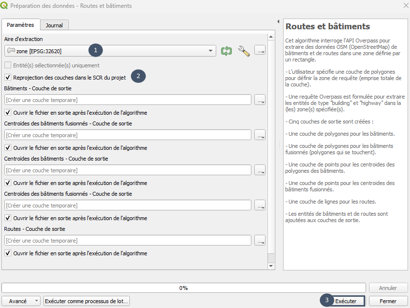

**3.** Après exécution du module, vous disposez de **cinq sorties** :

* ``Bâtiments`` : couche de type *polygone* avec les bâtiments tels que définis dans Open Street Map

* ``Bâtiments fusionnés`` : couche de type *polygone* obtenue après fusion des bâtiments adjacents

* ``Centroïdes des bâtiments`` : couche de type *point* qui contient les centroïdes de la couche ``Bâtiments`` 

* ``Centroïdes des bâtiments fusionnés`` : couche de type *point* qui contient les centroïdes de la couche ``Bâtiments fusionnés``

* ``Routes`` : couche de type *ligne* avec les routes telles que définies Open Street Map

Les couches **bâtiments** peuvent constituer des entrées pour le **module** ``Population``.

Les couches **centroïdes et routes** peuvent être utilisées en entrée du **module** ``Réseau``.

.. tip:: 
    Lorsque vous lancez le module, vous pouvez laisser l'option par défaut de *Créer une couche temporaire* pour les cinq sorties et n'enregistrer que celles dont vous
    avez besoin / celles qui vous donnent le plus satisfaction au regard de votre connaissance du terrain et de la problématique.

    Par exemple : 

          .. image:: _static/save-temp.png
               :width: 700

**Application à l'exemple de** :ref:`Petite-Anse <petite-anse>`

* **Récupération des bâtiments**

En appliquant ``Routes et bâtiments`` à la zone définie :ref:`plus haut <zone>`, voici les sorties obtenues pour les bâtiments :

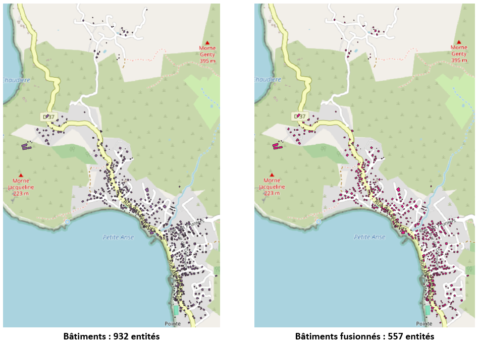
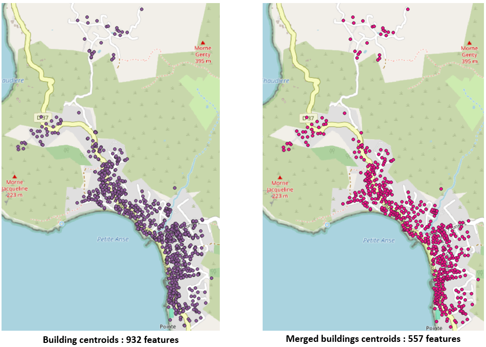

* **Récupération des routes**

En appliquant le module à une zone élargie pour inclure les possibles connexions aux stations existantes, vous obtiendrez une sortie de type : 

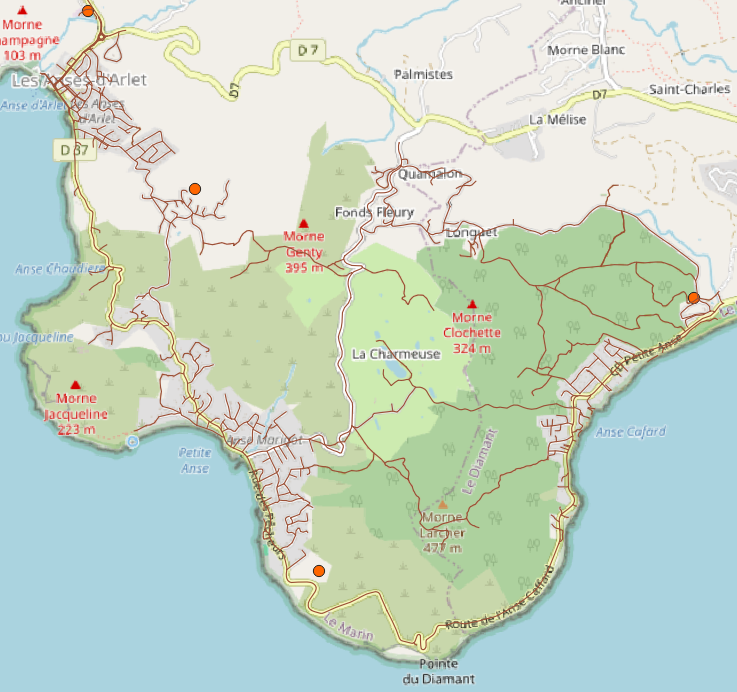

* **Post-traitement des couches**

Les couches peuvent ensuite être éditées ce qui vous permet de retranscrire votre connaissance du terrain (routes non empruntables ou au contraire, ajout de chemins envisageables,
sélection fine des bâtiments à raccorder ou non). Cette étape contribue à améliorer la pertinence des résultats obtenus en sortie de module ``Réseau``.

.. _population:

Module ``Population``
^^^^^^^^^^^^^^^^^^^^^^

Le module ``Population`` permet de **répartir un nombre connu d'individus au sein des bâtiments de la zone**. 
La répartition se fait **en appliquant la méthode surfacique** qui considère l'emprise des bâtiments : plus un 
bâtiment occupe une surface importante, plus le nombre d'individus associé sera lui aussi important.

Pour plus d'informations sur la méthode de répartition utilisée :

    *Lwin et al., (2009). A GIS Approach to Estimation of Building Population for Micro-spatial Analysis. Transactions in GIS, 13(4):401-414, doi: 10.1111/j.1467-9671.2009.01171.x*

.. note::
    Si vous souhaitez considérer un **nombre moyen d'individus par bâtiment** identique pour chacun d'entre eux, 
    **utilisez directement le module** ``Réseau`` où vous préciserez le nombre moyen d'individus par bâtiment qui est à
    considérer. 

**Utilisation du module**

.. _start-pop:

**1.** Chercher ``ELAN`` dans la boîte à outils de traitements et sélectionner ``Population``.

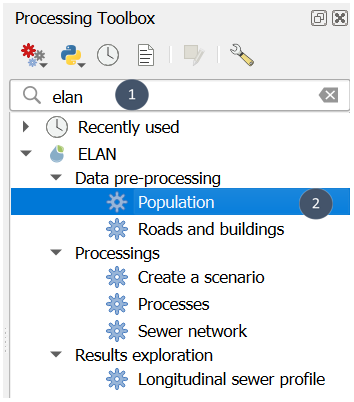

**2.** Indiquer une valeur de population (bulle 1), renseigner la couche de bâtiments (bulle 2), enregistrer dans
un fichier (bulle 3) puis exécuter (bulle 4).

.. attention::
    La couche de bâtiments doit être de type *polygone*.

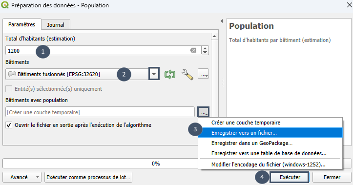

**3.** Après exécution du module, vous disposez **d'une couche de type point** avec les **centroïdes des bâtiments** de la zone.
A chaque centroïde est associé un nombre d'individus (**attribut population**) auquel vous pouvez accéder en ouvrant la table 
attributaire de la couche.

.. tip::
    Pour **répartir plus finement la population** (par exemple par quartiers), sélectionner les entités d'un quartier avant de lancer
    le module ``Population`` et après avoir indiqué la couche, cocher **Entités sélectionnés uniquement**. 
    
    Répéter autant de fois que de quartiers de la zone. Puis utiliser l'outil ``Fusionner des couches vecteur`` de QGIS pour obtenir une seule et unique 
    couche (entrée du module ``Réseau``).

**Application à l'exemple de** :ref:`Petite-Anse <petite-anse>`

La population de Petite-Anse est estimée à 1100 individus dont 150 sur la partie haute et 950 sur la partie basse.

**Préalable** : Une couche de type *polygone* avec les bâtiments à raccorder obtenue avec le module ``Routes et bâtiments``
et post-traitée (suppression/ajout de certains bâtiments selon la connaissance terrain de la zone).

* **Répartition de la population sur la zone haute**

**1.** Sélectionner les bâtiments de la zone haute (bulles 1 à 3).

**2.** Lancer le module ``Population`` comme expliqué :ref:`plus haut <start-pop>`.

**3.** Indiquer *150* pour le *Total d'habitants* de la zone (bulle 4), cocher *Entités sélectionnées* une fois la couche de bâtiments sélectionnée (bulle 5) puis *Exécuter* (bulle 6).

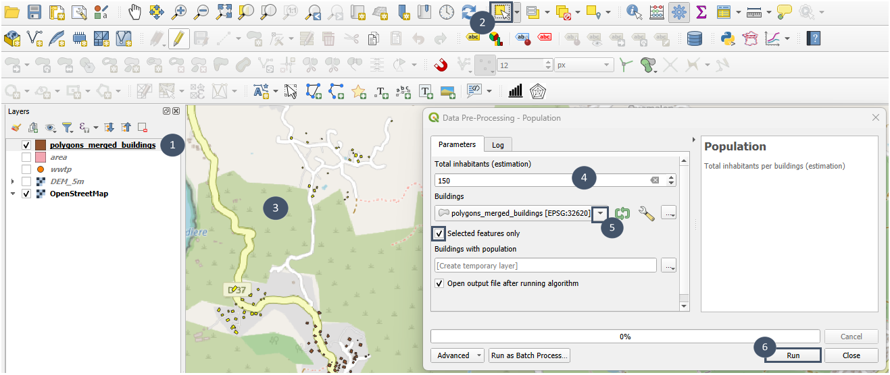

**4.** Vous obtenez la couche suivante.

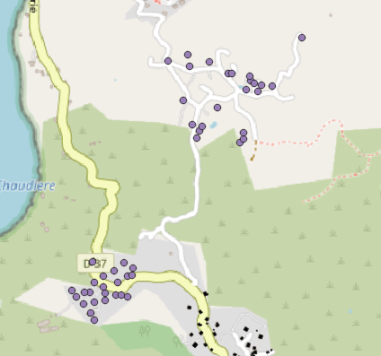

* **Répartition de la population sur la zone basse**

**1.** Répéter la même procédure en sélectionnant cette fois la zone basse et en indiquant *950* pour le *Total d'habitants* de la zone.

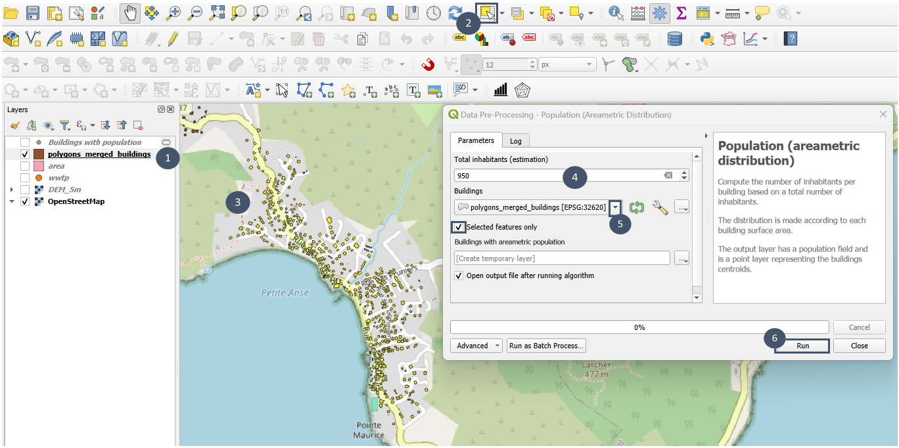

**2.** Vous obtenez la couche suivante.

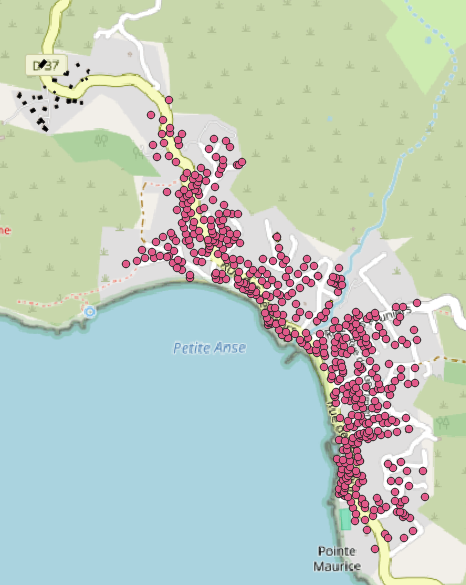

* **Fusion des deux couches obtenues**

**1.** Pour fusionner les 2 couches obtenues, chercher l'outil *Fusionner des couches vecteur* dans la boîte à outils de traitements QGIS.

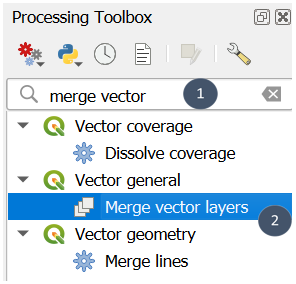

**2.** Sélectionner les deux couches (bulle 1), choisir pour SCR le SCR du projet (bulle 2) puis enregistrer le fichier (bulle 3) avant d'exécuter (bulle 4).

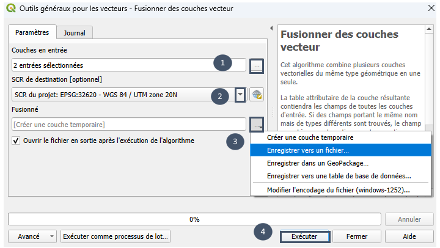

**Pour visualiser les attributs de la couche obtenue :**

Sélectionner la couche (bulle 1) et ouvrir la table attributaire (bulle 2). 

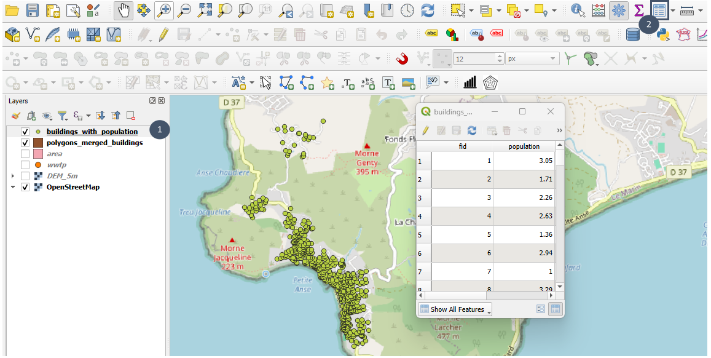

La couche obtenue contient bien les centroides des bâtiments de la zone haute et de la zone basse et pour chaque centroïde, l'attribut *population* est renseigné.
Cette couche peut être utilisée en entrée de module ``Réseau``.

.. _couches_prb1: 

.. note::
    Au sein de la couche *entrees_reseau.gpkg* mise à disposition à la page :ref:`Création d'un scénario pour la question du centralisé / décentralisé <prb1>`, vous trouverez plusieurs couches :
    
     - *batiments_osm_population* a été générée en suivant le processus suivant : module ``Routes et bâtiments``, post-traitement manuel (sélection plus fine des bâtiments à raccorder), module ``Population``;
     - *batiments_ign_population* a été obtenue en utilisant le plugin BD TOPO® Extractor suivi d'un post-traitement manuel puis d'une utilisation du module ``Population``;

     Les deux couches peuvent être utilisées en entrées du module ``Réseau``. La couche se basant sur les données IGN contient plus de 
     bâtiments (meilleure qualité de données) et fournira donc des résultats a priori plus pertinents.

     - *routes_zone_reduite* a été générée à l'aide du module ``Routes et bâtiments`` appliqué à la couche *zone _reduite* (dans *zones.gpkg*) suivi d'un post-traitement manuel (suppression de routes impraticables);
     - *routes_zone_elargie* a été obtenue à l'aide du module ``Routes et bâtiments`` appliqué à la couche *zone _elargie* (dans *zones.gpkg*) suivi d'un post-traitement manuel (suppression de routes non empruntables);
     - *steu* qui contient les 4 emplacements de envisageables pour des stations de traitement des eaux usées.

     Le geopackage *couches_intermediaires.gpkg* contient les couches intermédiaires qui ont été nécessaires à l'obtention de ces couches.
    

Entrées du module ``Hydraulique``
----------------------------------

.. hint::
   Cette section est en cours de construction.