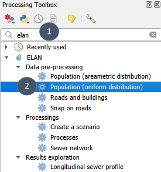
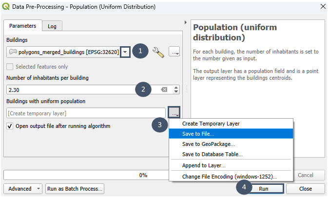
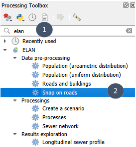
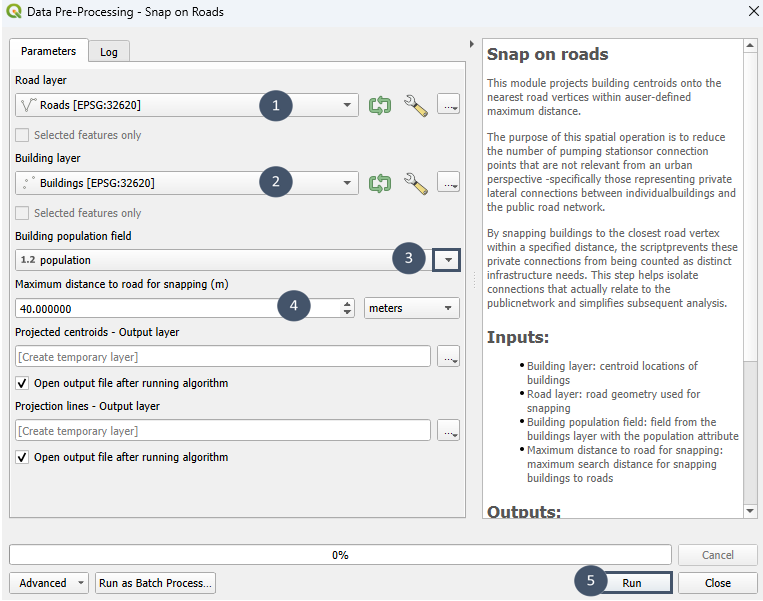

.. _preparation:

Obtention et préparation des données géographiques
==================================================

.. _entrees-reseau:

Entrées du module ``Réseau``
----------------------------

Pour pouvoir utiliser le module ``Réseau``, **4 couches géographiques** sont nécessaires :

* ``STEU`` : couche vecteur qui contient l'ensemble des **emplacements envisagés comme exutoires** (station de traitement des eaux usées existante ou projet possible), type : *point*.

* ``bâtiments`` : couche vecteur qui rassemble les **bâtiments à raccorder**, type : *point* (centroïdes des bâtiments). Le nombre d'habitants par bâtiment doit être renseigné dans un attribut *population*.

* ``routes`` : couche vecteur indiquant les **routes empruntables** pour le raccordement, type : *ligne*.

* ``MNT`` : couche raster (.tif, .asc, .vrt) du **modèle numérique de terrain** pour la zone d'intérêt.

.. note::
    Les couches vecteurs peuvent être des .shp ou des .gpkg.

Si vous disposez de ces 4 couches, vous pouvez vous rendre directement à la page :ref:`Création d'un scénario pour la question du centralisé / décentralisé <prb1>`.
Sinon, poursuivez ici pour quelques astuces et explications sur l'obtention et la préparation des données géographiques requises.

**Pour la couche** ``STEU``, le plus simple est de ``Créer une nouvelle couche`` de type *point* et de l'éditer de sorte à indiquer tous les emplacements possibles comme exutoires (1 point = 1 exutoire possible).

**Pour les autres couches** : 

En contexte français (Hexagone et Outre-Mer)
^^^^^^^^^^^^^^^^^^^^^^^^^^^^^^^^^^^^^^^^^^^^

.. _rge-alti:

* ``MNT``: raster téléchargeable par département sur le site `Géoservices de l'IGN <https://geoservices.ign.fr/>`_ 
    * MNT à 25 m : `BD ALTI® 25M <https://geoservices.ign.fr/bdalti>`_
    * MNT à 5 m voire 1 m : `RGE ALTI® <https://geoservices.ign.fr/rgealti>`_

.. _ign-topo:

* ``routes`` et ``bâtiments``: couches téléchargeables par département sur le site Géoservices de l'IGN `BD TOPO® <https://geoservices.ign.fr/bdtopo>`_.

.. tip::
    Pour accéder aux routes et bâtiments à l'échelle de votre zone d'étude et non du département, vous pouvez installer et utiliser le plugin `BD TOPO® Extractor <https://plugins.qgis.org/plugins/bd_topo_extractor/>`_.
    
    Il vous suffit de :

        * Installer l'extension via le gestionnaire d'extensions.
        * Dessiner sur la carte la zone rectangulaire à extraire.
        * Choisir les couches ``Bâtiment`` et ``Tronçon de route``.

.. attention::
    La couche ``bâtiments`` obtenue est de type *polygone* et non *point*. Elle doit donc être transformée via un des modules :ref:`Population <population>` intégré à Elan.

En contexte international
^^^^^^^^^^^^^^^^^^^^^^^^^

* ``MNT`` : le MNT ou DEM en anglais (Digital Elevation Model) est caractérisé par une maille d'acquisition (30 m, 12.5 m, 10 m, 5 m, 1 m sont les mailles les plus communes).
 
**Plus la maille est fine, plus le MNT est précis et plus les sorties du module** ``Réseau`` **seront pertinentes**. Idéalement, une maille de 5 m ou moins sera utilisée.

.. note::
    La disponibilité du MNT à des mailles inférieures à 30 m varie selon les territoires. **Nous vous recommandons de regarder si des données MNT à 10 m ou 5 m sont disponibles dans votre contexte national**. 
    A défaut, utilisez un MNT à 30 m (communément disponible), mais gardez en tête que la précision du MNT impacte les résultats du module ``Réseau`` (surestimation du nombre de stations de pompage). 

.. _alaska-edu:

.. tip::
    Si vous ne disposez pas de données locales de MNT à une maille inférieure à 30 m, vous pouvez consulter le site ASF Data Search à l'adresse suivante : https://search.asf.alaska.edu/#/ et suivre les étapes indiquées pour essayer de trouver une tuile de MNT à une maille de 12.5 m sur votre zone.

    * Sélectionner Geographic Search pour Search type (bulle 1).
    * Sélectionner ALOS PALSAR pour Data Set (bulle 2).
    * Indiquer votre zone sur la carte (bulle 3, carré jaune).
    * Cliquer sur SEARCH (bulle 4).
    * Regarder si parmi les tuiles proposées à gauche, il y en a une où un fichier High-Res Terrain Corrected est proposé au téléchargement (bulle 5).
    * Si oui, il vous faudra créer un compte (email et mot de passe) pour pouvoir télécharger le fichier.

.. image:: _static/alaska-edu.png
      :width: 700

* ``routes`` et ``bâtiments``: le module :ref:`Routes et bâtiments <routes>` d'Elan vous permet d'extraire les données de types routes et bâtiments d'OpenStreetMap sur une zone définie.

.. attention::
    La couche ``bâtiments`` obtenue est de type *polygone* et non *point* et est dépourvue d'attribut *population*. Elle devra donc être transformée via un des modules :ref:`Population <population>` intégré à Elan.

.. _open-buildings:

.. note::
     Si votre zone d'étude est située dans l'hémisphère Sud, Open Buildings peut constituer une alternative intéressante à OpenStreetMap pour les bâtiments. Pour plus d'informations : https://sites.research.google/gr/open-buildings/.

Utilisation des modules ``Routes et bâtiments``, ``Population`` et ``Projection sur routes`` 
--------------------------------------------------------------------------------------------

.. _routes:

Module ``Routes et bâtiments``
^^^^^^^^^^^^^^^^^^^^^^^^^^^^^^

Le module ``Routes et bâtiments`` permet l'extraction des entités routes et bâtiments se trouvant dans une zone définie par l'utilisateur (couche de type *polygone*).
L'extraction se fait à partir `d'OpenStreetMap <https://www.openstreetmap.org>`_ qui rassemble des données cartographiques à l'échelle mondiale. 
OpenStreetMap est un outil ouvert et collaboratif.

.. note::
     La qualité des données OpenStreetMap est variable selon les zones du globe : elle peut être d'une qualité moindre par 
     rapport à des données nationales (moins de bâtiments reportés par exemple) comme de qualité équivalente. Dans 
     le dernier cas, l'utilisation du module ``Routes et bâtiments`` peut parfois s'avérer plus simple que l'usage des 
     données nationales (téléchargement, post-traitement).

     Bon à savoir : un très léger décalage en termes de georéférencement peut caractériser les données extraites à partir d'OpenStreetMap.

**Utilisation du module**

**1.** Chercher ``elan`` dans la boîte à outils de traitements et sélectionner ``Routes et bâtiments``.

.. image:: _static/start-r+b.png
      :width: 352

**2.** Indiquer la couche *polygone* qui délimite la zone à extraire (bulle 1), cocher *Reprojection des couches dans le SCR du projet* (bulle 2) puis exécuter (bulle 3).

.. image:: _static/r+b.png
      :width: 592

**3.** Après exécution du module, vous disposez de **trois sorties** :

* ``Bâtiments`` : couche de type *polygone* avec les bâtiments tels que définis dans OpenStreetMap

* ``Bâtiments fusionnés`` : couche de type *polygone* obtenue après fusion des bâtiments adjacents

* ``Routes`` : couche de type *ligne* avec les routes telles que définies OpenStreetMap

Les couches **bâtiments** peuvent constituer des entrées pour les **modules** ``Population``.

La couche **routes** peuvent être utilisée en entrée du **module** ``Réseau``.

.. _save-temp:

.. tip:: 
    Lorsque vous lancez le module, vous pouvez laisser l'option par défaut de *Créer une couche temporaire* pour les trois sorties et n'enregistrer que celles dont vous
    avez besoin / celles qui vous donnent le plus satisfaction au regard de votre connaissance du terrain et de la problématique.

    Par exemple : 

          .. image:: _static/save-temp.png
               :width: 657

.. _population:

Modules ``Population`` : ``Population (répartition uniforme)`` et ``Population (répartition surfacique)``
^^^^^^^^^^^^^^^^^^^^^^^^^^^^^^^^^^^^^^^^^^^^^^^^^^^^^^^^^^^^^^^^^^^^^^^^^^^^^^^^^^^^^^^^^^^^^^^^^^^^^^^^^

Les modules ``Population`` permettent d'assigner à chaque bâtiment (polygone) un nombre d'habitants via un attribut *population* et de réduire chaque bâtiment en un point (son centroïde).
Ils se distinguent l'un de l'autre dans la modalité de répartition (nombre fixe ou variable d'habitants par bâtiment). Selon votre besoin, vous pouvez utiliser soit l'un, soit l'autre des modules ``Population``.

Module ``Population (répartition uniforme)``
""""""""""""""""""""""""""""""""""""""""""""

Le module ``Population (répartition uniforme)`` permet de **d'associer à chaque bâtiment le même nombre d'habitants** (nombre moyen d'habitants par bâtiment). 

**Utilisation du module**

**1.** Chercher ``elan`` dans la boîte à outils de traitements et sélectionner ``Population (répartition uniforme)``.

**2.** Renseigner la couche de bâtiments (bulle 1), indiquer un nombre moyen d'habitants par bâtiment (bulle 2), enregistrer dans un fichier (bulle 3) puis exécuter (bulle 4).

.. attention::
    La couche de bâtiments doit être de type *polygone*.

**3.** Après exécution du module, vous disposez **d'une couche de type point** avec les **centroïdes des bâtiments** de la zone.
A chaque centroïde est associé un nombre identique d'individus (**attribut population**) qui correspond au nombre moyen d'habitants par bâtiment renseigné.
A ce stade, vous pouvez éditer la couche et ajuster manuellement ce nombre pour certains bâtiments si vous le souhaitez (immeuble par exemple).

Module ``Population (répartition surfacique)``
""""""""""""""""""""""""""""""""""""""""""""""

Le module ``Population (répartition surfacique)`` permet de **répartir un nombre connu d'individus au sein des bâtiments de la zone**. 
La répartition se fait **en appliquant la méthode surfacique** qui considère l'emprise des bâtiments : plus un 
bâtiment occupe une surface importante, plus le nombre d'individus associé sera lui aussi important.

Pour plus d'informations sur la méthode de répartition utilisée :

    *Lwin et al., (2009). A GIS Approach to Estimation of Building Population for Micro-spatial Analysis. Transactions in GIS, 13(4):401-414, doi: 10.1111/j.1467-9671.2009.01171.x*

**Utilisation du module**

.. _start-pop:

**1.** Chercher ``elan`` dans la boîte à outils de traitements et sélectionner ``Population (répartition surfacique)``.

.. image:: _static/start-pop.png
    :width: 274

**2.** Indiquer une valeur de population (bulle 1), renseigner la couche de bâtiments (bulle 2), enregistrer dans
un fichier (bulle 3) puis exécuter (bulle 4).

.. attention::
    La couche de bâtiments doit être de type *polygone*.

.. image:: _static/use-pop.png
    :width: 675

**3.** Après exécution du module, vous disposez **d'une couche de type point** avec les **centroïdes des bâtiments** de la zone.
A chaque centroïde est associé un nombre d'individus (**attribut population**) auquel vous pouvez accéder en ouvrant la table 
attributaire de la couche.

.. tip::
    Pour **répartir plus finement la population** (par exemple par quartiers), sélectionner les entités d'un quartier avant de lancer
    l'un des modules ``Population`` et après avoir indiqué la couche, cocher **Entités sélectionnés uniquement**. 
    
    Répéter autant de fois que de quartiers de la zone. Puis utiliser l'outil ``Fusionner des couches vecteur`` de QGIS pour obtenir une seule et unique 
    couche (entrée du module ``Réseau``).

.. _projection:

Module ``Projection sur routes``
^^^^^^^^^^^^^^^^^^^^^^^^^^^^^^^^

Le module ``Projection sur routes`` permet de **projeter les centroïdes des bâtiments à connecter sur la route la plus proche** (au niveau d'un noeud) dans la limite d'une distance fixée par l'utilisateur
(40 m par défaut). 

Cette étape facultative présente **3 avantages majeurs** :

* **réduire le nombre de centroïdes** à considérer lors du prédimensionnement du réseau puisque les centroïdes projetés à un même noeud sont fusionnés entre eux, ce qui implique une **réduction du temps de calcul**

* **tracer uniquement les artères principales** du réseau lors du prédimensionnement 

* **centrer le prédimensionnement sur ce qui relève du domaine public** (canalisations et stations de pompage / relèvement)

**Utilisation du module**

**1.** Chercher ``elan`` dans la boîte à outils de traitements et sélectionner ``Projection sur routes``.

**2.** Renseigner la couche de routes (bulle 1) et celle de bâtiments (bulle 2), indiquer le champ correspondant à la population (bulle 3), si besoin ajuster la valeur par défaut
de la distance maximale à la route autorisée (bulle 4) puis exécuter (bulle 5).

**3.** Après exécution du module, vous disposez de **deux sorties** temporaires que vous pouvez ensuite enregistrer comme expliqué :ref:`plus haut <save-temp>`

* ``Centroïdes projetés`` : couche de type *point* avec les centroïdes projetés sur les routes (pour ceux où la condition de distance à la route est respectée). Chaque centroïde est caractérisé par 2 attributs :
    - *count* le nombre de bâtiments représentés par ce centroïde,
    - *population* le nombre total d'habitants au niveau de ce centroïde.

* ``Lignes de projection`` : couche de type *ligne* avec les lignes de projection entre les centroïdes initiaux et ceux obtenus après projection

La couche de **centroïdes** peut être utilisée en entrée du module ``Réseau``. 

La couche de **lignes** est uniquement disponible pour servir la compréhension de l'utilisateur et lui permettre d'envisager des ajustements (ajout de tronçons de routes, suppression de bâtiments, modification de la distance maximale à la route autorisée par exemple).

Entrées du module ``Hydraulique``
---------------------------------

.. hint::
   Cette section est en cours de construction.