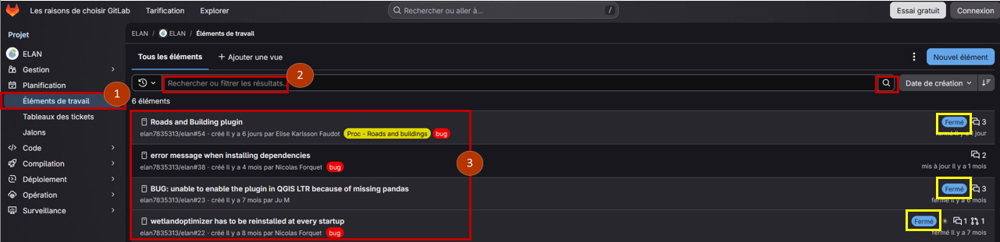
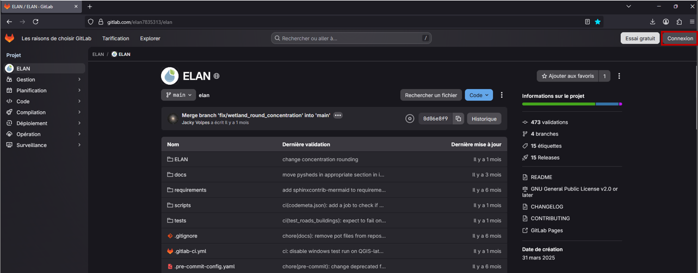
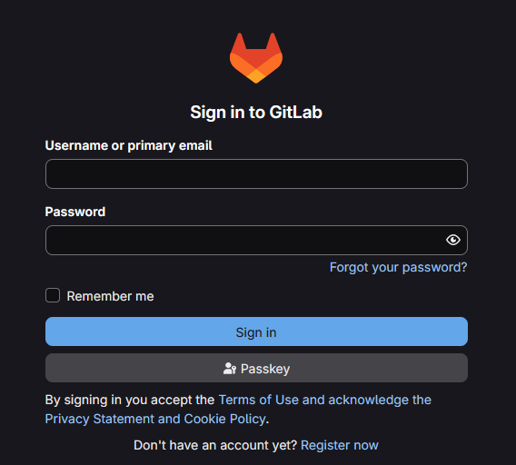
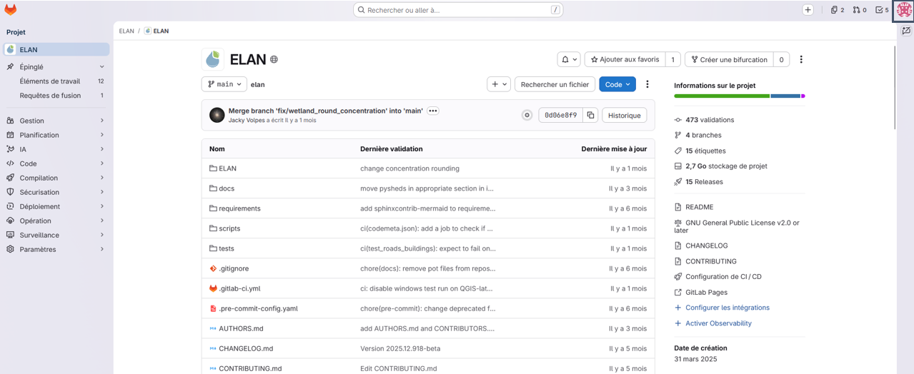
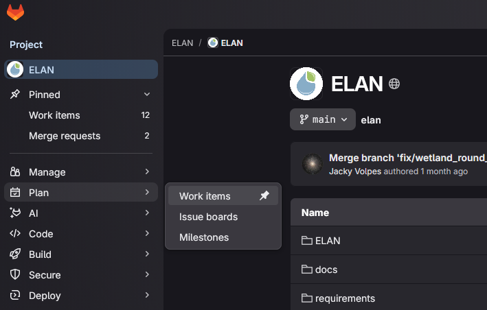
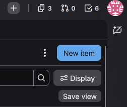
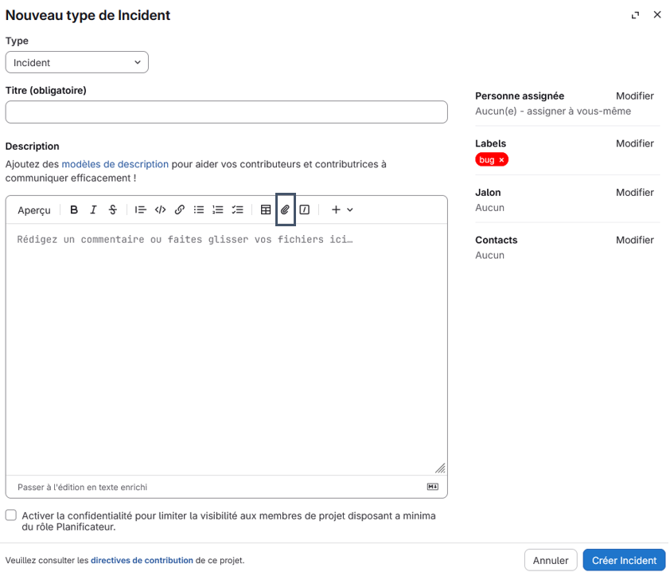
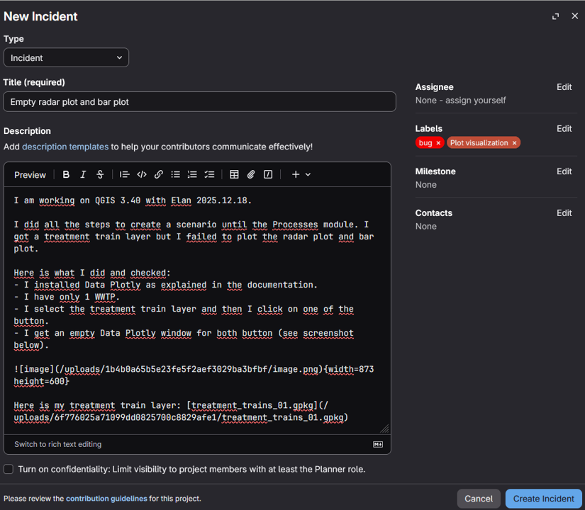
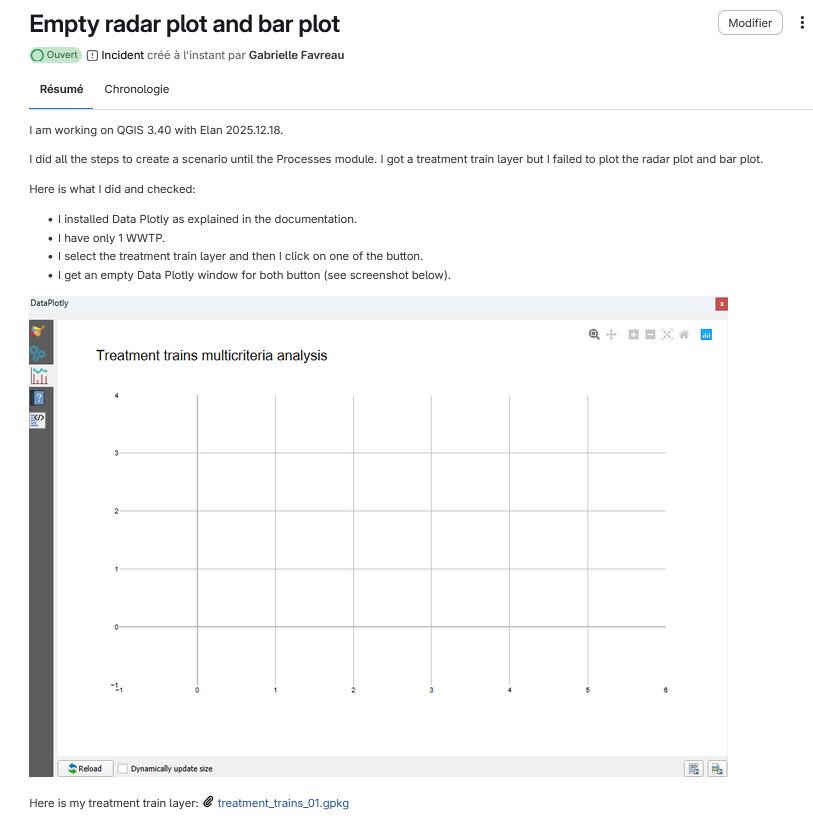

Comment faire ?
===============

Le plus simple est de le signaler sur la page GitLab du projet Elan : https://gitlab.com/elan7835313/elan

GitLab est un logiciel libre de forge, i.e. une plateforme web de travail collaboratif destinée à développer et partager des applications informatiques, basé sur Git, un logiciel qui permet le versioning. C'est sur cette plateforme que nous développons Elan et via laquelle vous pouvez accéder au code source du plugin si vous le souhaitez.

Consulter les bugs déjà signalés
--------------------------------

D'autres utilisateurs ont peut-être déjà rencontré le même bug : consultez les tickets sur le GitLab du projet Elan (ouverts et fermés car le bug a peut-être déjà été résolu).

Pour cela :

* Aller dans *Planification* - *Eléments de travail* à gauche de l'interface (bulle 1).

* Enlever les filtres dans la barre de recherche s'il y en a et appuyer sur la loupe à l'extrémité de la barre (bulle 2).

* Consulter la liste des bugs reportés (bulle 3).

Plusieurs cas possibles :

1. **Le bug a été reporté et résolu** (ticket fermé, statut mis en évidence avec les encarts jaunes dans l'image précédente), vous n'avez plus qu'à appliquer la solution indiquée dans le ticket. 
2. **Il est en cours de résolution** (ticket ouvert), vous pouvez apporter de nouveaux éléments et nous aider à mieux le comprendre. 
3. **C'est un nouveau bug**. Il faut donc lui créer un ticket dédié.

Signaler un nouveau bug
-----------------------

Créer un compte GitLab et se connecter
^^^^^^^^^^^^^^^^^^^^^^^^^^^^^^^^^^^^^^

Pour créer un compte GitLab : https://gitlab.com/users/sign_up (requis si vous êtes dans le cas 2 ou 3).

Une fois votre compte créé, vous pouvez vous connecter depuis la page du projet Elan (un code de sécurité vous sera envoyé par mail après que vous ayez entré votre mot de passe).

Une fois connecté, votre avatar apparaît en haut à droite à la place du bouton "Se connecter".

Ouvrir un nouveau ticket
^^^^^^^^^^^^^^^^^^^^^^^^

Pour signaler un nouveau bug, vous allez créer un ticket. Pour cela :

**1.** Aller dans *Planification* - *Eléments de travail* 

**2.** Créer un nouvel élément (en haut à droite de l'écran). 

**3.** Remplir le ticket **en anglais** avec :

* Type : Incident
* Label : bug
* Un titre explicite
* Une description précise de la démarche qui vous a conduit au bug (préciser la version de QGIS sur laquelle vous travaillez et la version d'Elan que vous utilisez)
* Avec des captures d'écrans (copier coller les images dans la description)
* Et les données SIG que vous avez utilisé (ajout de pièces jointes avec l'icône trombone)

.. important::
   Le ticket doit être rempli en anglais pour profiter à l'ensemble de la communauté.

Voici un exemple de ticket qui nous permettra de vous aider :

**4.** Créer l'incident.

Votre ticket apparait dans la liste des éléments de travail. Vous pouvez le consulter en cliquant dessus.

Vous aurez très prochainement un retour de notre part dans les commentaires du ticket.

.. important::
   Une fois le bug résolu, n'oubliez pas de fermer le ticket !

.. note::
   Si vous ne souhaitez pas créer de compte Gitlab, vous pouvez nous signaler le bug par mail : elan.support@listes.inrae.fr avec l'ensemble des éléments listés dans le point 3. Mais c'est dommage de ne pas en faire profiter d'autres utilisateurs ! 