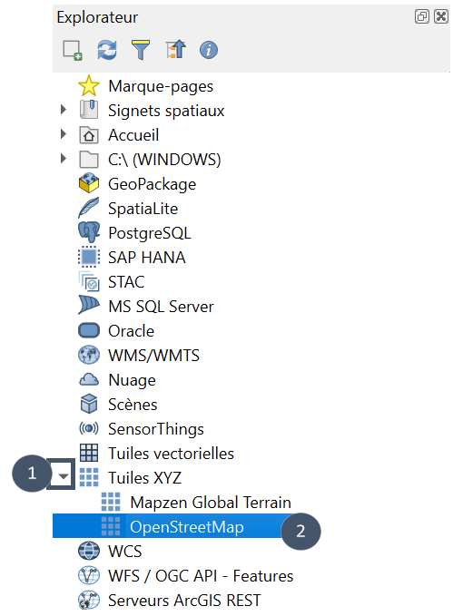
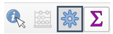
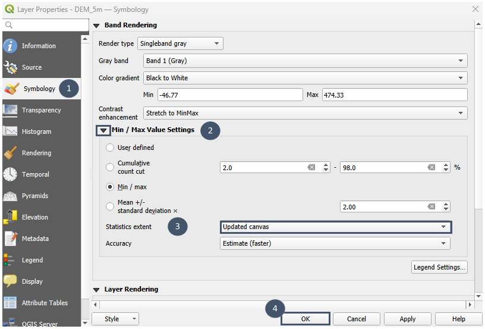
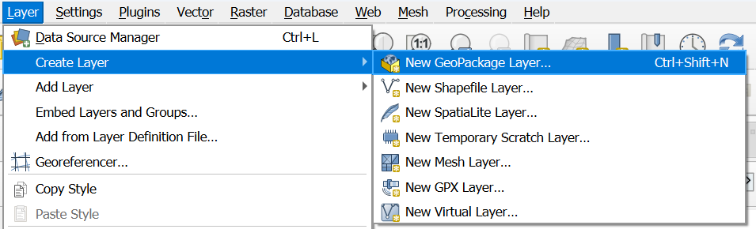
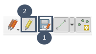

Rührsdorf (Autriche)
====================

Rührsdorf est un village situé en Basse-Autriche sur les bords du Danube. Il a été choisi comme exemple pour ce tutoriel en contexte international car il fait partie des zones testées lors de la première phase du beta-programme Elan. 

Le cas de Rührsdorf a été beta-testé par BOKU de l'Université de Vienne dans le cadre du projet D_CLEAN de l'INTERREG Danube Region (Improving Water Quality in the Danube River Basin: Nature-Based Solutions for Sustainable Wastewater and Stormwater Management in Small Settlements; Project Number DRP0300962; duration 04/2025-03/2028).

Rührsdorf est actuellement connecté au village voisin de Rossatz où les eaux sont traitées avant rejet dans le Danube. Le réseau d'assainissement qui les relie est vieillissant et doit être renouvelé. Cette opportunité vient questionner le choix historique du centralisé. Plusieurs scénarios sont envisagés :
- maintien de la situation actuelle,
- création d'une station de traitement avec des procédés de type solutions fondées sur la nature sur place (2 emplacements possibles).

Obtention et préparation des données géographiques
--------------------------------------------------

Préalable : Afficher un fond de carte (ici OpenStreetMap)
^^^^^^^^^^^^^^^^^^^^^^^^^^^^^^^^^^^^^^^^^^^^^^^^^^^^^^^^^

Pour afficher le fond de carte `OpenStreetMap <https://www.openstreetmap.org>`_ : 

* Aller dans le panneau *Explorateur*.

.. tip::
     Si *Explorateur* n'est pas visible : activez-le via *Vue - Panneaux - Explorateur*.

          .. image:: _static/afficher-explorateur.png
               :width: 700

* Chercher la catégorie **Tuiles XYZ** (bulle 1).

* Dérouler et double-cliquer sur **OpenStreetMap** (bulle 2).

* Localiser la zone sur le fond OpenStreetMap qui s'est affiché dans votre vue cartographique.

.. .. image:: _static/localiser-zone.png
..       :width: 700

.. note::
     Pour aller plus loin sur le sujet des fonds de carte dans QGIS, nous vous conseillons ce :download:`tutoriel <_static/fr/tutoqgis_03_recherche_donnees.pdf>` réalisé par `UMR 6554 LETG <https://letg.cnrs.fr/>`_ / `UMR 5319 Passages <https://www.passages.cnrs.fr/>`_ (CNRS). 
     Il s'agit d'un export PDF du chapitre 3 du tutoriel QGIS 3.22 'Białowieża' disponible à cette adresse : https://tutoqgis.cnrs.fr/.

Étape 1 : Se procurer le Modèle Numérique de Terrain (MNT)
^^^^^^^^^^^^^^^^^^^^^^^^^^^^^^^^^^^^^^^^^^^^^^^^^^^^^^^^^^

.. tip::
    Pour afficher le panneau ``Boîte à outils de traitements`` s'il n'apparaît pas dans votre espace de travail : *Vue - Panneaux - Boîte à outils de traitements*. 
    Ou plus simplement : cliquez sur l'icône engrenage à côté de l'icône sigma (en haut à droite *a priori*).

.. tip::
    Pour que l'échelle du MNT s'ajuste automatiquement lorsque vous zommez sur la carte :

    - Double cliquer sur votre couche raster dans le panneau *Couches*.

    - Choisir *Symbologie* dans la fenêtre qui s'ouvre (bulle 1).

    - Dans *Paramètres de valeurs Min/Max* (bulle 2), changer le paramètre *Statistiques de l'emprise* à *Emprise actualisée* au lieu de *Raster entier* par défaut (bulle 3).

.. .. image:: _static/zoom-mnt.png
..      :width: 620

Étape 2 : Formaliser les exutoires possibles (STEU)
^^^^^^^^^^^^^^^^^^^^^^^^^^^^^^^^^^^^^^^^^^^^^^^^^^^

**1.** Créer une nouvelle couche (.shp ou .gpkg).

**2.** Choisir un emplacement de sauvegarde et un nom pour cette couche (bulle 1), puis renseigner son type : *Point* (bulle 2).

**3.** Pour le SCR, choisir le SCR du projet (ici EPSG:32620- WGS 84/UTM zone 20N) puis cliquer sur OK (bulles 3 et 4).

.. .. image:: _static/couche-steu.png
..       :width: 467

**4.** Ajouter les emplacements possibles tour à tour en suivant les bulles 1 à 5 indiquées sur la capture.

.. .. image:: _static/add-steu.png
..       :width: 700

.. .. image:: _static/4steu.png
..      :width: 550

**5.** Bien enregistrer et désactiver le mode édition une fois les emplacements ajoutés.

Étape 3 : Récupérer les routes et bâtiments
^^^^^^^^^^^^^^^^^^^^^^^^^^^^^^^^^^^^^^^^^^^

**Récupération des bâtiments**

**Récupération des routes**

**Post-traitement des couches**

Les couches peuvent ensuite être éditées ce qui vous permet de retranscrire votre connaissance du terrain (routes non empruntables ou au contraire, ajout de chemins envisageables, sélection fine des bâtiments à raccorder ou non). Cette étape contribue à améliorer la pertinence des résultats obtenus en sortie de module ``Réseau``.

Étape 4 : Répartir la population au sein des bâtiments et réduire les polygones à leurs centroïdes
^^^^^^^^^^^^^^^^^^^^^^^^^^^^^^^^^^^^^^^^^^^^^^^^^^^^^^^^^^^^^^^^^^^^^^^^^^^^^^^^^^^^^^^^^^^^^^^^^^

**Préalable** : Une couche de type *polygone* avec les bâtiments à raccorder obtenue avec le module ``Routes et bâtiments``
et post-traitée (suppression/ajout de certains bâtiments selon la connaissance terrain de la zone).

Création d'un scénario
----------------------

Étape 1 : Tracer le réseau d'assainissement (module ``Réseau``)
^^^^^^^^^^^^^^^^^^^^^^^^^^^^^^^^^^^^^^^^^^^^^^^^^^^^^^^^^^^^^^^

**1. Utilisation du module** ``Réseau``

**2. Résultats en sortie de module** ``Réseau``

Après exécution, vous obtenez la vue suivante :

.. .. image:: _static/vue-gravitaire.png
..     :width: 700

.. note::

    Les couches relatives aux routes et aux bâtiments n'apparaissent pas sur cette vue et les suivantes pour plus de lisibilité.

6 couches géométriques ont été chargées dans votre espace de travail, chacune avec une symbologie qui lui est propre :

    * carré jaune pour la STEU
    * lignes de couleur aléatoire pour les routes
    * points de couleur aléatoire pour les bâtiments
    * triangles verts pour les stations de relevage
    * triangles rouges pour les stations de pompage (privées et non privées)
    * lignes bleues pour les sections en gravitaire et lignes rouges pour les sections en refoulement

.. _select-styles:

D'autres styles sont disponibles pour la couche ``Canalisations``. Pour y accéder :

**1.** Sélectionner la couche ``Canalisations`` et **cliquer droit**.

**2.** Aller dans *Styles*. 

**3.** Sélectionner le style de votre choix parmi les 5 autres proposés. 

.. .. image:: _static/reseau-styles.png
..     :width: 630

**Style diamètres**

.. .. image:: _static/vue-diametres.png
..     :width: 700

.. tip::
    Pour savoir exactement combien d'entités correspondent à chaque diamètre : cliquer droit sur la couche ``Canalisations`` et cocher ``Afficher le nombre d'entités``. 
    Vous obtiendrez quelque chose de ce type : 

                .. image:: _static/afficher_entites.png
                    :width: 157

    Cette astuce peut être appliquée à n'importe quelle couche vecteur.

**Style débit de pointe**

.. .. image:: _static/vue-debit.png
..     :width: 601

**Style profondeur**

.. .. image:: _static/vue-profondeur.png
..     :width: 700

**Style sens d'écoulement**

.. .. image:: _static/vue-ecoulement.png
..     :width: 700

**Style sous-réseaux**

.. .. image:: _static/vue-sous-reseau.png
..     :width: 599

.. tip::
..     Pour organiser votre espace avec les différentes couches, vous pouvez créer des groupes (ici *Préparation de données*, *Données mises à disposition* et *STEU Sud*.)
    
    Pour cela, il vous suffit de cliquer sur l'icône *Ajouter un groupe* et d'y glisser les couches que vous souhaitez rassembler.

          ..   .. image:: _static/ajout-groupe.png
          ..       :width: 132

**3. Consultation de la couche** ``Informations sur le réseau`` **et des attributs des autres couches**

* Sélectionner la couche ``Informations sur le réseau`` (bulle 1).

* Cliquer que l'icône *Ouvrir la table attributaire* (bulle 2).

* Une fenêtre s'ouvre et vous permet d'accéder à l'ensemble des informations de la couche (bulle 3).

.. .. image:: _static/informations-table.png
..     :width: 700

Pour consulter les attributs des 4 autres couches obtenues en sortie, procéder de même en sélectionnant la couche
dont vous souhaitez consulter les attributs. 

L'ensemble des attributs disponibles pour chaque couche est détaillé :ref:`ici <attributs-reseau>`.

.. tip::
    Si vous êtes amenés à charger le géopackage contenant les 7 couches dans un autre projet, vous pouvez l'ouvrir directement
    dans un groupe en suivant la démarche suivante (ouverture des 7 couches placées dans un groupe commun) :

    - Glisser le .gpkg depuis *Explorateur* dans la fenêtre avec la vue cartographique.
    - Dans la fenêtre qui s'ouvre, dérouler *Options* et cocher *Afficher des couches à un groupe* (bulle 1).
    - Cliquer sur *Ajouter une couche* (bulle 2).

                    .. image:: _static/ouverture_gpkg.png
                        :width: 542

Exploration des résultats (module ``Profils de canalisations``)
^^^^^^^^^^^^^^^^^^^^^^^^^^^^^^^^^^^^^^^^^^^^^^^^^^^^^^^^^^^^^^^

Pour explorer le pré-dimensionnement proposé par le module ``Réseau``, vous pouvez visualiser le profil souterrain d'une succession de tuyaux grâce au module
``Profils de canalisations`` couplé à l'outil *Profil d'élévation* de QGIS. Un :ref:`exemple <visualisation-profils>` est donné dans la documentation générale.

Étape 2 : Pré-dimensionner la ou les STEU (module ``Procédés``)
^^^^^^^^^^^^^^^^^^^^^^^^^^^^^^^^^^^^^^^^^^^^^^^^^^^^^^^^^^^^^^^

**1. Ajuster les concentrations en entrée de STEU dans la couche** ``STEU``

**2. Renseigner les contraintes de rejet dans la couche** ``STEU``

Les niveaux de rejet à respecter sont les suivants :

..     * MES : 35 mg/L 
..     * DBO₅ : 35 mg/L 
..     * NTK : 20 mg/L 
..     * DCO : 125 mg/L

* Sélectionner la couche ``STEU`` (bulle 1).

* Basculer en mode édition (bulle 2) puis ouvrir la table attributaire (bulle 3).

* Renseigner les valeurs numériques indiquées pour les niveaux de rejet en MES, DBO₅, NTK et DCO (encart 4).

* Sortir du mode édition (bulle 5) et fermer la table attributaire (bulle 6).

.. .. image:: _static/edit-attributs-steu.png
..     :width: 700

**3. Délimitation de la surface disponible** (facultatif)

* Créer une nouvelle couche (.gpkg ou .shp) de type *polygone*.

* L'éditer et délimiter la surface disponible.

.. .. image:: _static/delimitation-surface.png
..      :width: 700

* Enregistrer et sortir du mode édition.

**4. Utilisation du module** ``Procédés``

* Chercher ``elan`` dans la *Boîte à outils de traitements* et sélectionner ``Procédés`` (bulles 1 et 2).

* Choisir *Tempéré* pour le climat (bulle 3).

* Indiquer la couche ``STEU`` dont vous avez renseigné les attributs (bulle 4) et la couche ``surface-dispo`` que vous venez de créer (bulle 5).

* Vérifier que les champs identifiés pour les coordonnées GPS et le débit journalier sont corrects. 

.. note::
     Vous pouvez aussi vérifier pour les champs de types concentration d'entrée et niveau de rejet en dépliant *Paramètres avancés*.

* Indiquer un nom et un emplacement pour l'enregistrement du fichier de sortie (bulle 6), puis exécuter (bulle 7).

.. .. image:: _static/ex-procedes.png
..      :width: 700

**5. Consultation des caractéristiques des filières de traitement pré-dimensionnées**

Après exécution du module, vous obtenez un visuel de ce type (couche *point*) :

.. .. image:: _static/sortie-procedes-ex.png
..      :width: 700

Pour consulter les attributs de cette couche : 

* Sélectionner la couche ``Couche de filières`` (bulle 1).

* Cliquer que l'icône Ouvrir la table attributaire (bulle 2).

* Une fenêtre s'ouvre et vous permet d'accéder à l'ensemble des informations de la couche (bulle 3).

.. .. image:: _static/attributs-procedes-ex.png
..      :width: 700

Étape 3 : Pré-sélectionner une filière pour l'exutoire
^^^^^^^^^^^^^^^^^^^^^^^^^^^^^^^^^^^^^^^^^^^^^^^^^^^^^^

Pour vous aider à pré-sélectionner une filière, vous pouvez afficher le radar plot et le bar plot où figurent
l'ensemble des filières possibles pour cet exutoire (voir :ref:`ici <selection>` pour plus de détails). 

**Radar plot**

.. .. image:: _static/pa_radarplot.png
..      :width: 700

**Bar plot**

.. .. image:: _static/pa_barplot.png
..      :width: 700

Étape 4 : Créer un objet scénario (module ``Créer un scénario``)
^^^^^^^^^^^^^^^^^^^^^^^^^^^^^^^^^^^^^^^^^^^^^^^^^^^^^^^^^^^^^^^^

Une fois que le couplage réseau/filière constitutif d'un scénario est identifié, vous pouvez créer un objet scénario à l'aide du module ``Créer un scénario`` comme
:ref:`détaillé dans la documentation générale <creer-scenario>`. Cet objet permettra ensuite l'évaluation du scénario et sa comparaison à d'autres scénarios envisagés. 