.. _prb1:

Création d'un scénario pour la question du centralisé / décentralisé
====================================================================

La création d'un scénario pour la question du centralisé / décentralisé implique quatre temps :

**1. Tracer un réseau d'assainissement.**

**2. Pré-dimensionner les filières de traitement pour les stations.**

**3. Pré-sélectionner une filière pour chaque station**

**4. Créer un objet scénario.**

Pour une même zone, vous pouvez créer successivement autant de scénarios que vous le souhaitez.

.. _reseau:

Étape 1 : Tracer le réseau d'assainissement (module ``Réseau``)
---------------------------------------------------------------

Préalable
^^^^^^^^^

**1.** Avoir installé **la librairie pysewer** comme expliqué dans :ref:`Installation des dépendances <dependances>`.

**2.** Disposer de **4 couches géographiques** :

* ``STEU`` : couche vecteur qui contient l'ensemble des **emplacements envisagés comme exutoires** (station de traitement des eaux usées existante ou projet possible), type : *point*.

* ``bâtiments`` : couche vecteur qui rassemble les **bâtiments à raccorder**, type : *point* (centroïdes des bâtiments). 

* ``routes`` : couche vecteur indiquant les **routes empruntables** pour le raccordement, type : *ligne*.

* ``MNT`` : couche raster (.tif, .asc, .vrt) du **modèle numérique de terrain** de la zone d'intérêt.

.. attention::
   **Les 4 couches doivent être dans le même SCR (système de coordonnées de référence).**

Si vous ne disposez pas de ces couches pour votre zone d'étude, vous pouvez vous rendre à la page :ref:`Obtention et préparation des données géographiques <preparation>`
pour quelques astuces et explications.

Utilisation du module
^^^^^^^^^^^^^^^^^^^^^
.. _start-reseau:

**1.** Chercher ``elan`` dans la boîte à outils de traitements et sélectionner ``Réseau``.

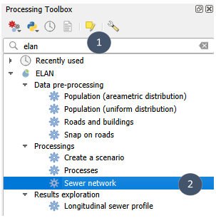

.. tip::
    Pour afficher le panneau ``Boîte à outils de traitements`` s'il n'apparaît pas dans votre espace de travail : *Vue* - *Panneaux* - *Boîte à outils de traitements*.
    Ou plus simplement : cliquez sur l'icône engrenage à côté de l'icône sigma (en haut à droite *a priori*).

.. image:: _static/boite-outils.png
     :width: 700

.. image:: _static/boite-outils-icone.png
     :width: 193

**2.** **Renseigner les 4 couches géographiques**. 

.. tip::
    Pour les exutoires, vous pouvez sélectionner au préalable celui ou ceux que vous souhaitez considérer parmi l'ensemble des possibilités envisagées puis cocher *Entités sélectionnées uniquement* dans le module.
    Cette option est également proposée pour les routes et les bâtiments à considérer.

Si le nombre d'individus par bâtiment est connu et renseigné dans un attribut (*population* par exemple), 
l'indiquer dans l'encart mis en évidence. Sinon, un nombre moyen d'individus par bâtiment sera considéré 
(valeur ajustable selon votre contexte).

.. note::
    Si vous avez eu recours au module ``Population`` pour préparer vos données géographiques, l'attribut à indiquer est *population*.

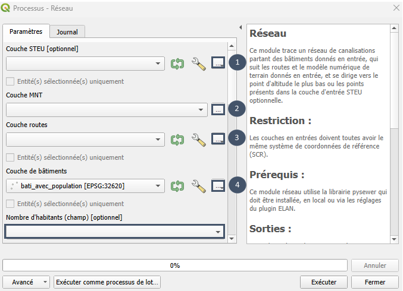

**3.** Faire coulisser l'ascenseur à l'aide de la souris (et non de la molette, cela risque de changer les valeurs des paramètres à votre insu) et **ajuster les différents paramètres** (encart 5) afin que le pré-dimensionnement du réseau soit le plus adapté à votre contexte : 

* ``nombre moyen de personnes par foyer`` : à renseigner dans le cas où la population n'est pas discrétisée à l'échelle du bâtiment.

* ``volume moyen d'eaux usées produit par jour par personne`` : [m³].

* ``coefficient de pointe journalier`` : [m³/j].

* ``pente minimale permettant l'autocurrage`` : [m/m].

* ``profondeur max autorisée de canalisation`` : [m], dépend du contexte géologique.

* ``profondeur min autorisée de canalisation`` : [m], généralement conditionnée par le risque de gel.

* ``rugosité canalisation`` : [μm], dépend du matériau utilisé pour les canalisations.

* ``diamètre autorisé sous pression`` : [m], un seul diamètre autorisé.

* ``diamètres autorisés en gravitaire`` : [m], à choisir parmi les options proposées (0.1, 0.15, 0.2, 0.25, 0.3, 0.4, 0.6, 0.8 ou 1.0). Les 9 options peuvent être considérées ou seulement une partie d'entre elles.

.. attention::
    Il a été constaté que **les modifications des profondeurs max et min autorisées ne sont actuellement pas prises 
    en compte** (valeurs bloquées aux valeurs par défaut 0.25 m et 8 m). Le bug doit d'abord être corrigé sur pysewer
    avant que la correction puisse être intégrée à Elan.

**4.** Indiquer un emplacement et un nom pour la couche .gpkg en sortie (bulle 6) puis exécuter (bulle 7).

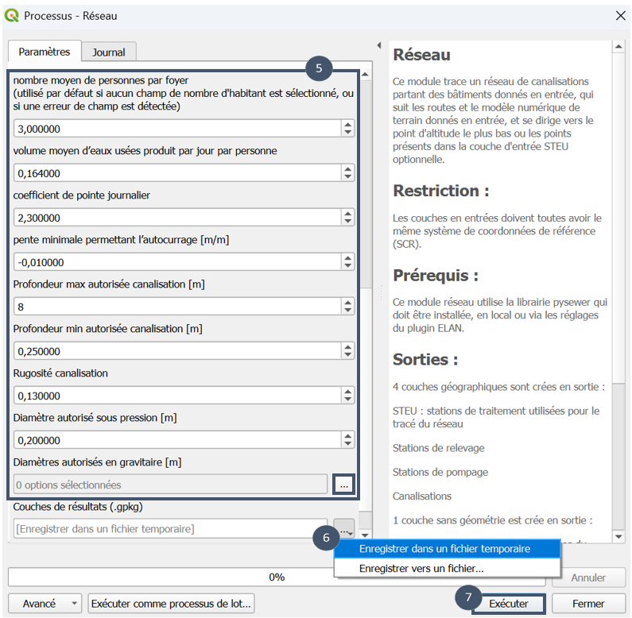

.. _sorties-reseau:

**5.** Après exécution du module, vous disposez de **1 fichier au format .gpkg qui contient 7 couches** :

* ``STEU`` (carré jaune) : couche de type *point* avec le ou les exutoires considérés pour la simulation. 

* ``Bâtiments`` : couche de type *point* avec les bâtiments pris en compte pour la simulation.

* ``Routes`` : couche de type *ligne* avec les routes considérées comme empruntables lors de la simulation.

* ``Stations de relevage`` (triangle vert) : couche de type *point* qui contient les stations de relevage du réseau d'assainissement pré-dimensionné.

* ``Stations de pompage`` (triangle rouge) : couche de type *point* qui contient les stations de pompage du réseau d'assainissement pré-dimensionné (stations privées et non privées).

* ``Canalisations`` : couche de type *ligne* qui contient les canalisations pré-dimensionnées.

* ``Informations sur le réseau`` : couche non géométrique qui regroupe différentes métriques sous forme d'attributs.

.. note::

    Les couches ``STEU``, ``Bâtiments`` et ``Routes`` permettent de garder trace des éléments fournis en entrée de simulation. Cela s'avère
    particulièrement utile si vous avez recours à l'option *Entités sélectionnées uniquement*, mais également pour ne pas perdre le fil dans la démarche
    itérative qu'implique l'exploration de différents scénarios (affinage des bâtiments à raccorder, redéfinition des routes
    empruntables par suppression et/ou ajout).

.. _attributs-reseau:

**Chaque couche vecteur est caractérisée par des attributs.**

.. _set-concentrations:

* ``STEU`` : *altitude terrain* [m], *coordonnées gps* (identifiant unique pour chaque exutoire), *débit de pointe* [m³/j], *débit moyen journalier* [m³/j], *habitants raccordés* [nb], *profondeur tranchée* [m], *profondeur canas entrantes* [m], *diamètres entrants* [m].

.. note::
    En sortie de module ``Réseau``, la couche STEU compte aussi des attributs non renseignés : *niveau rejet MES* [mg/L], *niveau rejet DBO5* [mg/L], *niveau rejet NTK* [mg/L], *niveau rejet DCO* [mg/L], *niveau rejet N-NO3* [mg/L], *niveau rejet NT* [mg/L], *niveau rejet PT* [mg/L], *niveau rejet e.coli* [UFC/100mL]. Ces attributs sont à renseigner manuellement 
    pour chaque exutoire selon vos contraintes de rejet. Ils servent d'entrées pour le module ``Procédés``. Certains peuvent être renseignés à *NULL*.

* ``Stations de relevage`` : *altitude terrain* [m], *débit de pointe* [m³/s], *débit moyen journalier* [m³/j], *habitants raccordés* [nb], *profondeur canas entrantes* [m], *charge hydrostatique* [m].

* ``Stations de pompage`` : *altitude terrain* [m], *débit de pointe* [m³/s], *débit moyen journalier* [m³/j], *habitants raccordés* [nb], *profondeur canas entrantes* [m], *charge hydrostatique* [m].

.. note::
    ``Stations de pompage`` peut indiquer des charges hydrostatiques négatives pour certaines des stations pré-dimensionnées. Il ne s'agit pas d'une erreur :
    cela signifie que, pour ces stations, le point d'arrivée du tronçon en refoulement se situe plus bas que le point de départ. En d'autres termes : la station
    de pompage se comporte comme un siphon.

    Par exemple, la station de pompage est ici caractérisée par une charge hydrostatique de -19,25 m.
            
            .. image:: _static/siphon.png
                :width: 700

* ``Canalisations`` : *longueur* [m], *profil de terrain* [liste de points échantillonnés tous les 10 m], *avec pompe* [booléen], *sous pression* [booléen], *profils de canalisations* [liste de points échantillonnés tous les 10 m], *profondeur moyenne tranchée* [m], *diamètre* [m], *débit de pointe* [m³/s], *coordonnées STEU* [identifiant STEU exutoire].

* ``Informations sur le réseau`` : *nombre bâtiments* [nb], *longueur réseau sous pression* [mètre linéaire], *longueur réseau gravitaire* [mètre linéaire], *nombre stations pompage* [nb], *nombre stations relevage* [nb], *date simulation* [datetime].

**Plusieurs styles sont proposés pour la couche** ``Canalisations``.

* **Diamètres** : symbologie catégorisée sur l'attribut *diamètre* pour visualiser la répartition des diamètres au sein du réseau.

* **Débit de pointe** : symbologie catégorisée sur l'attribut *débit de pointe* pour visionner la variation du débit de pointe selon les tronçons réseau.

* **Gravitaire** : symbologie catégorisée sur l'attribut *sous pression* pour distinguer facilement les sections gravitaires des sections pressurisées. Il s'agit du style par défault en sortie de module ``Réseau``.

* **Profondeur** : symbologie catégorisée sur l'attribut *profondeur moyenne tranchée* pour mieux visualiser les variations de profondeur au sein du réseau.

* **Sens d'écoulement** : symbologie avec flèches pour mieux appréhender le sens d'écoulement à l'intérieur du réseau.

* **Sous-réseaux** : symbologie catégorisée sur l'attribut *coordonnées STEU* pour bien identifier les différents réseaux dans le cas de figure où la zone est raccordée à plusieurs stations (gestion décentralisée).

.. attention::
    Si, pour enregistrer les sorties de simulation, vous passez par un couche temporaire que vous enregistrez ensuite, les mises en forme proposées (symbologies, styles, noms des couches) ne seront pas conservées.
    Seul le passage par *Enregistrer un fichier* lors du lancement du module et l'enregistrement dans votre projet QGIS permet de les conserver.

.. _visualisation-profils:

Exploration des résultats (module ``Profils de canalisations``)
---------------------------------------------------------------

Pour explorer le pré-dimensionnement proposé par le module ``Réseau``, en plus des différents styles proposés pour la couche ``Canalisations``, le module ``Profils de canalisations`` et la visualisation
de ses sorties par l'outil *Profil d'élévation* de QGIS vous permet de visualiser le profil souterrain d'une succession de tuyaux.

Préalable
^^^^^^^^^

Disposer d'une couche ``Canalisations`` issue du module ``Réseau``.

Utilisation du module
^^^^^^^^^^^^^^^^^^^^^

**1.** Chercher ``elan`` dans la boîte à outils de traitements et sélectionner ``Profils de canalisations``.

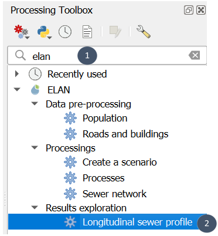

**2.** Renseigner la couche de canalisations (bulle 1), choisir un emplacement et un nom pour le fichier de sortie (bulle 2) avant d'exécuter (bulle 3).

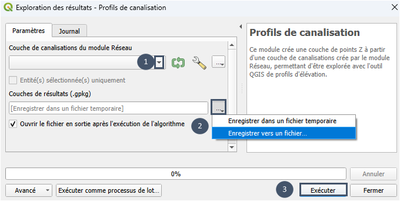

**3.** En sortie de module, vous obtenez **1 fichier .gpkg qui contient 3 couches** :

* ``Profil de terrain`` : couche de type *point* qui contient un échantillonnage des valeurs du MNT (altitude du profil de terrain) le long des canalisations.

* ``Profil de canalisations`` : couche de type *point* dont les points se supperposent à ceux de ``Profil de terrain`` dans le plan xy, mais qui correspondent à l'altitude des canalisations.

* ``Canalisations 3D`` : couche de type *ligne Z* créée à partir d'un échantillonnage de la couche ``Canalisations`` (conservation des styles et des attributs).

Visualisation 
^^^^^^^^^^^^^

**1.** Pour afficher un profil de canalisations dans un plan xz, commencer par ouvrir l'outil **Profil d'élévation** : *Vue* - *Profil d'élévation*.

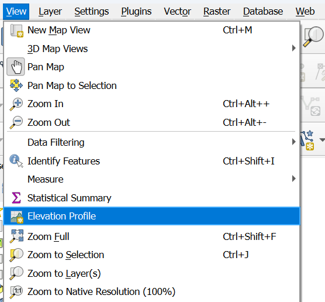

**2.** Dans la fenêtre *Profil d'élévation*, cocher les couches que vous souhaitez voir apparaître sur votre coupe. Par exemple : ``Stations de relevage``, ``Stations de pompage``, ``Profil de terrain``, ``Profil de canalisations`` et ``Canalisation 3D`` (bulle 1).

**3.** Sélectionner les canalisations dont vous souhaitez afficher le profil souterrain. Pour cela :

* Sélectionner la couche ``Canalisations 3D`` (bulle 2). 

* Activer l'accrochage (bulle 3a) sur la couche active (bulle 3b).

.. tip::
     Si *Accrochage* n'est pas visible : activez-le via *Vue - Barres d'outils - Accrochage*.

* Activer le tracé (bulle 4).

* Dans la fenêtre *Profil d'élévation*, cliquer sur l'icône *Dessiner une courbe* (bulle 5).

* Cliquer sur le premier point (bulle 6).

* Cliquer sur le dernier point (bulle 7).

* Puis cliquer droit pour activer le tracé entre ces deux points (bulle 7).

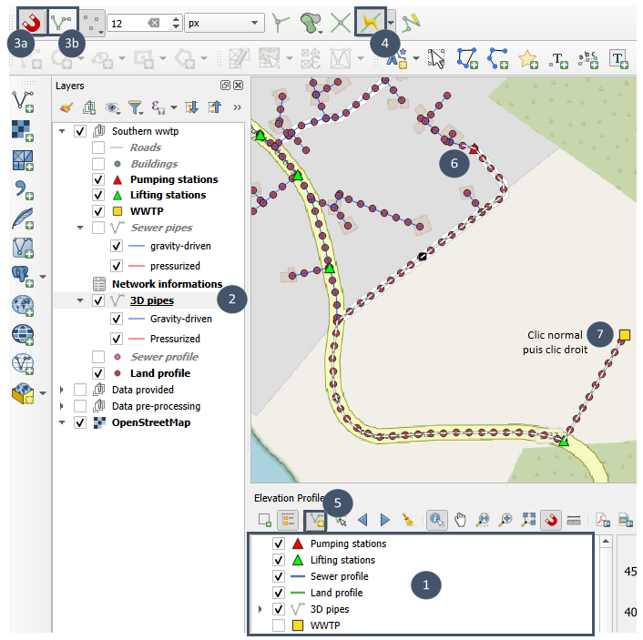

**4.** Votre profil s'affiche dans la fenêtre profil d'élévation.

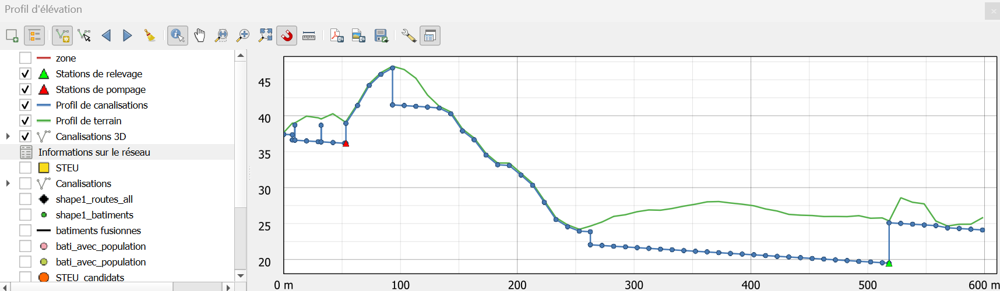

Cette vue montre le relief du terrain et le profil de canalisations échantillonnées. Elle permet de bien
visualiser les chutes au niveau des regards. En revanche, elle ne permet pas de distinguer clairement les portions en gravitaire
de celles en refoulement, ni d'omettre les points qui arrivent d'autres plans au niveau des regards.

**5.** En décochant ``Canalisations 3D``, vous obtenez cette vue.

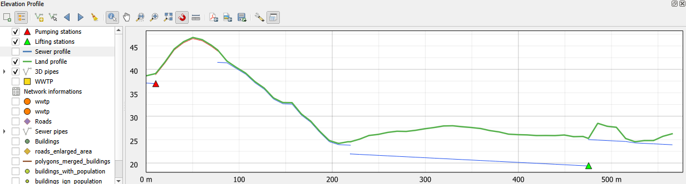

Ici les chutes au niveaux des regards ne sont pas représentées (discontinutés dans le tracé). En revanche, les sections
en refoulement (en rouge) se distinguent clairement de celles en gravitaire (en bleu) et les points arrivant d'autres plans ne viennent pas 
perturber l'interprétation du profil.

**6.** Vous pouvez également obtenir une vue en fonction des diamètres.

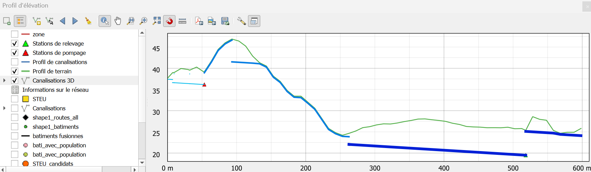

Pour cela :

* Cliquer droit sur ``Canalisations 3D`` dans la fenêtre *Profil d'élévation* puis cliquer sur *Propriétés*.

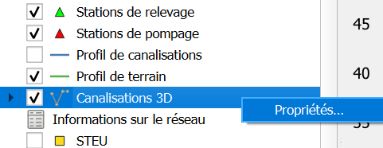

* Dans la fenêtre qui s'ouvre, cliquer sur *Style* (en bas) et sélectionner *Diamètres*.

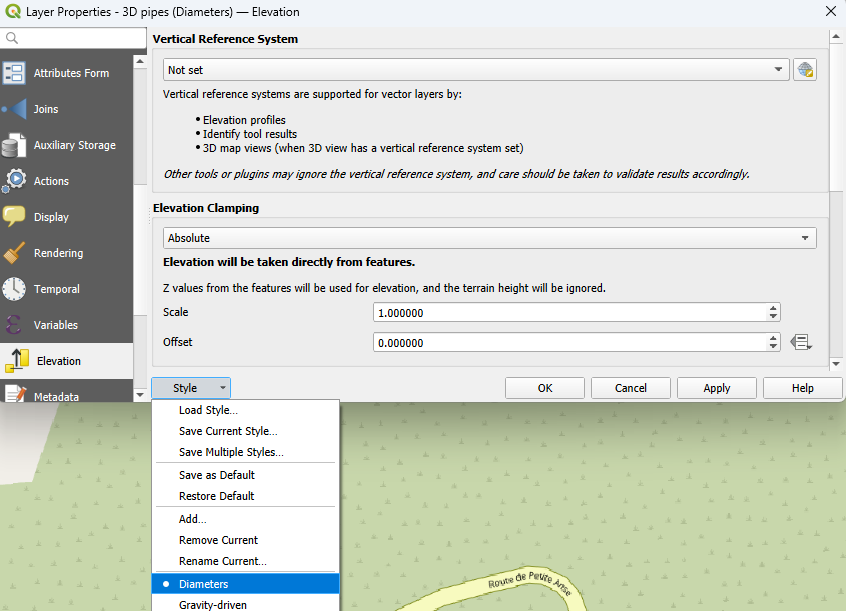

.. tip::
    Vous pouvez également obtenir cette vue en fonction des diamètres en passant par le panneau *Couches* :
    
        * Cliquer droit sur ``Canalisations 3D``.
        * *Styles*.
        * Choisir *Diamètres*.
        * Décocher puis recocher la couche ``Canalisations 3D`` dans la fenêtre *Profil d'élévation* pour que le nouveau style s'applique.

.. _procedes:

Étape 2 : Pré-dimensionner la ou les STEU (module ``Procédés``)
---------------------------------------------------------------

Pour compléter votre scénario, il reste à pré-dimensionner la ou les stations qui constituent les points exutoires de votre réseau d'assainissement.

Le module ``Procédés`` permet, pour chaque station, de **tester et pré-dimensionner différentes filières de traitement de filtres plantés de végétaux (FPV)**.

Les filières peuvent être constituées de **1 à n étages de traitement** (au maximum, n = 3) et impliquer **différents procédés** : :download:`filtre à écoulement vertical (système français)<_static/fr/CARIBSAN_Fiche01_V1-FR.pdf>` (VdNS1), 
:download:`filtre à écoulement vertical avec sable <_static/fr/CARIBSAN_Fiche02_V1-FR.pdf>` (VdNS2) et :download:`filtre à écoulement vertical avec couche saturée <_static/fr/CARIBSAN_Fiche03_V1-FR.pdf>` (VdNSS).

Préalable 
^^^^^^^^^

**1.** Avoir installé **la librairie wetlandoptimizer** comme expliqué dans :ref:`Installation des dépendances <dependances>`.

**2.** Disposer **d'une couche de type point avec le ou les emplacements de stations envisagés**.

Cette couche doit contenir **10 attributs** : *coordonnées gps*, *niveau rejet MES* [mg/L], *niveau rejet DBO5* [mg/L], *niveau rejet NTK* [mg/L], *niveau rejet DCO* [mg/L], *niveau rejet N-NO3* [mg/L], *niveau rejet NT* [mg/L], *niveau rejet PT* [mg/L], *niveau rejet e.coli* [UFC/100mL], *débit journalier* [m3/j]. 

Pour les **niveaux de rejet**, **3 doivent obligatoirement être renseignés** avec une valeur numérique strictement supérieure à 0 : **niveau rejet MES** [mg/L], **niveau rejet DBO5** [mg/L], **niveau rejet DCO** [mg/L]. 
Les autres peuvent être renseignés à *NULL* selon votre contexte (tout ou partie d'entre eux).

.. attention::
    Les niveaux de rejets relatifs au phosphore total (PT) et aux pathogènes (e.coli) ne sont actuellement pas pris en compte dans l'optimisation réalisée par *wetlandoptimizer* (valeurs par défaut considérées : *NULL*).
    Leur prise en compte sera intégrée dans une version future. 

Cette couche peut-être obtenue en **sortie de module** ``Réseau``. Le débit journalier et les coordonnées GPS sont alors renseignés. 
Les attributs relatifs aux niveaux de rejet sont présents mais à renseigner manuellement selon votre contexte.

**3.** Avoir délimité et enregistré les **surfaces disponibles pour chaque station** au sein d'une couche de type *polygone*. 

Ce point est **facultatif** et n'intervient pas dans le pré-dimensionnement :
il permet de vous aider à identifier quelles filières, parmi celles qui permettent d'atteindre vos contraintes de rejet, coïncident avec vos contraintes en termes de surface.

.. _start-procedes:

Utilisation du module
^^^^^^^^^^^^^^^^^^^^^

**1.** Chercher ``elan`` dans la boîte à outils de traitements et sélectionner ``Procédés``.

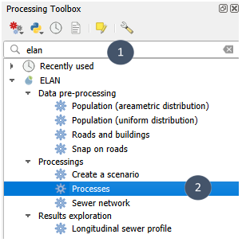

**2.** Indiquer si votre zone se situe en climat *Tempéré* ou *Tropical* (bulle 1). Ce choix impacte le pré-dimensionnement des filières en termes de surface et de volume (surface et volume réduits en climat tropical).

.. note::
    Choisissez *Tropical* si la température minimale est supérieure ou égale à 18°C toute l'année.

Pour plus d'informations sur la bonne prise en compte du climat tropical lors du dimensionnement de filtres plantés de végétaux :

    *Lombard-Latune et Molle (2017). Les filtres plantés de végétaux pour le traitement des eaux usées domestiques en milieu tropical : Guide de dimensionnement de la filière tropicalisée. Guides et protocoles. 72 pages. Agence française de la biodiversité.*

**3.** Renseigner la couche STEU (bulle 2) et éventuellement la couche de surfaces disponibles (bulle 3).

**4.** Assurez vous que les champs détectés pour les 10 attributs sont bien corrects : coordonnées GPS, niveaux de rejet et débit journalier (encart 4). 

**5.** Pour le nombre d'étages maximum, nous vous conseillons de laisser la valeur 3 qui est la valeur par défaut.

**6.** Choisir un emplacement et un nom pour le fichier de sortie (bulle 5) avant d'exécuter (bulle 6).

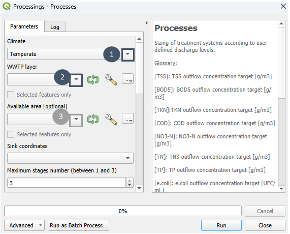

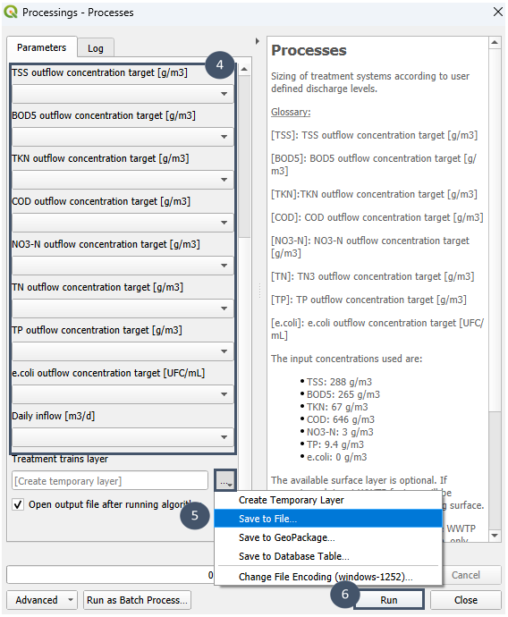

.. _sortie-procedes:

**7.** Après exécution du module, vous obtenez une couche nommée ``Couche de filières`` (couche de type *point*).

Cette couche contient toutes les filières de traitement testées lors de l'optimisation (une entité = une filière de traitement).
Chaque entité possède de nombreux attributs :

    * **id filière** : identifiant numérique de la filière pré-dimensionnée.
    * **description filière** : détails de la filière pré-dimensionnée (procédé étage 1 - ... - procédé étage n). 
    * **coordonnées gps** : identifiant STEU pour laquelle la filière a été pré-dimensionnée.
    * **taux de charge MES par étape de traitement** [%] : taux de charge en MES par étage [taux étage 1,..., taux étage n].
    * **taux de charge DBO5 par étape de traitement** [%] : taux de charge en DBO₅ par étage [taux étage 1,..., taux étage n].
    * **taux de charge NTK par étape de traitement** [%] : taux de charge en NTK par étage [taux étage 1,..., taux étage n].
    * **taux de charge DCO par étape de traitement** [%] : taux de charge en DCO par étage [taux étage 1,..., taux étage n].
    * **taux de charge hydraulique par étape de traitement** [%] : taux de charge hydraulique par étage [taux étage 1,..., taux étage n].
    * **surface disponible** [m²] : calculée à partir de la couche *polygone* indiquée lors du lancement du module (couche optionnelle).
    * **surface totale** [m²] : surface de l'ensemble de la filière (somme des surfaces des étages 1 à n). 

    La valeur de la surface totale conditionne sa mise en forme : si elle est **inférieure ou égale à la surface disponible**, la case est **verte** ; **sinon**, elle apparaît **rouge**.

    * **surface par étage de traitement** [m²] : détail des surfaces pour chaque étage [surface étage 1,..., surface étage n].
    * **volume total** [m3] : volume de l'ensemble de la filière (somme des volumes des étages 1 à n). 
    * **profondeur saturée par étage** [m] : détail de la profondeur saturée pour chaque étage [profondeur saturée étage 1,..., profondeur saturée étage n]. 
    
    Cette profondeur est nulle pour les procédés VdNS1 et VdNS2 qui sont dépourvus de couche saturée.

    * **profondeur non saturée par étage** [m] : détail de la profondeur non saturée pour chaque étage [profondeur non saturée étage 1,..., profondeur non saturée étage n]. 
    * **concentration MES effluent** [mg/L] : concentration en MES en sortie de filière de traitement.
    * **concentration DBO5 effluent** [mg/L] : concentration en DBO₅ en sortie de filière de traitement.
    * **concentration NTK effluent** [mg/L] : concentration en NTK en sortie de filière de traitement.
    * **concentration DCO effluent** [mg/L] : concentration en DCO en sortie de filière de traitement.
    * **concentration NT effluent** [mg/L] : concentration en NT en sortie de filière de traitement.
    * **concentration N-NO3 effluent** [mg/L] : concentration en N-NO₃ en sortie de filière de traitement.
    * **concentration PT effluent** [mg/L] : concentration en PT en sortie de filière de traitement.
    * **concentration e.coli** [UFC/100mL] : concentration en e.coli en sortie de filière de traitement.
    * **déviation MES** [mg/L] : déviation de la concentration en MES dans l'effluent par rapport au niveau de rejet.
    * **déviation DBO5** [mg/L] : déviation de la concentration en DBO₅ dans l'effluent par rapport au niveau de rejet.
    * **déviation NTK** [mg/L] : déviation de la concentration en NTK dans l'effluent par rapport au niveau de rejet.
    * **déviation DCO** [mg/L] : déviation de la concentration en DCO dans l'effluent par rapport au niveau de rejet.
    * **déviation NT** [mg/L] : déviation de la concentration en NT dans l'effluent par rapport au niveau de rejet.
    * **déviation N-NO3** [mg/L] : déviation de la concentration en N-NO₃ dans l'effluent par rapport au niveau de rejet.
    * **déviation PT** [mg/L] : déviation de la concentration en PT dans l'effluent par rapport au niveau de rejet.
    * **déviation e.coli** [mg/L] : déviation de la concentration en e.coli dans l'effluent par rapport au niveau de rejet.

    Les déviations sont mises en formes : en vert si inférieures ou égales à 0, en rouge si supérieures à 0. Elles renseignent sur la 
    conformité de la filière par rapport aux niveaux de rejets renseignés en entrée de module : vert = conforme, rouge = non conforme.

    * **MES normalisé** [-] : valeur normalisée de la concentration en MES dans l'effluent par rapport au niveau de rejet exigé.
    * **DBO5 normalisé** [-] : valeur normalisée de la concentration en DBO₅ dans l'effluent par rapport au niveau de rejet exigé.
    * **NTK normalisé** [-] : valeur normalisée de la concentration en NTK dans l'effluent par rapport au niveau de rejet exigé.
    * **DCO normalisé** [-] : valeur normalisée de la concentration en DCO dans l'effluent par rapport au niveau de rejet exigé.
    * **NT normalisé** [-] : valeur normalisée de la concentration en NT dans l'effluent par rapport au niveau de rejet exigé.
    * **N-NO3 normalisé** [-] : valeur normalisée de la concentration en N-NO₃ dans l'effluent par rapport au niveau de rejet exigé.
    * **PT normalisé** [-] : valeur normalisée de la concentration en PT dans l'effluent par rapport au niveau de rejet exigé.
    * **e.coli normalisé** [-] : valeur normalisée de la concentration en e.coli dans l'effluent par rapport au niveau de rejet exigé.
    * **surface normalisée** [-] : valeur normalisée de la surface totale de la filière par rapport à la surface disponible.

    Si la valeur normalisée est inférieure ou égale à 1, alors elle respecte la contrainte indiquée (niveau de rejet ou surface disponible). Sinon, elle l'excède.

.. note::
    Pour les paramètres facultatifs (niveau de rejet de certains polluants, surface disponible), s'ils ne sont pas renseignés, leurs déviation et 
    valeur normalisée ne sont pas calculées (*NULL*).

.. important::

    Parmi les entités de la couche ``Couche de filières``, seules les filières de traitement affichant des déviations "vertes" permettent d'atteindre les niveaux de rejet indiqués en entrée de module.

La **succession de procédés** (*descriptif filière*) varie d'une filière de traitement à une autre. 

Pour chaque filière de traitement, en plus des **concentrations de sortie atteintes** dans l'effluent, des **caractéristiques géométriques** sont indiquées 
(*surface totale*, *surface par étage de traitement*, *volume total*, *profondeur saturée*, *profondeur désaturée*), des **caractéristiques de 
fonctionnement** (*taux de charge par étape de traitement* pour les différents polluants et *taux de charge hydraulique par étape de traitement*) ainsi que
des **indicateurs de conformité** par rapport aux contraintes énoncées (*déviations*, *valeurs normalisées*).

Les taux de charge par étage de traitement peuvent constituer des indicateurs intéressants selon les projections futures faites pour la zone et ainsi orienter
votre choix de filière. Par exemple, si une forte augmentation de population est planifiée sur la zone, il sera préférable d'opter pour une filière de traitement qui 
n'est pas au maximum de sa charge en termes de polluants dans la configuration actuelle.

.. _selection:

Étape 3 : Pré-sélectionner une filière par exutoire
---------------------------------------------------

Parmi les filières proposées, certaines permettent d'atteindre les niveaux de rejets imposés (déviations en vert), d'autres non (déviations en rouge), avec des contraintes
de surface qui leur sont propres et qui peuvent excéder la surface disponible (surface totale en rouge si une surface disponible a été renseignée).

Des représentations graphiques ont été intégrées à Elan pour mieux visualiser les attributs des différentes filières et ainsi identifier plus facilement leurs points forts 
et leurs points faibles respectifs. 

Pour afficher ces représentations graphiques, il faut au préalable :
- Avoir installé **l'extension Data Plotly** comme expliqué dans :ref:`Installation des extensions QGIS tierces <extensions-tierces>`.
- Disposer d'une couche ``Couche de filières`` (sortie du module ``Procédés``).
- Si votre couche ``Couche de filières`` contient plusieurs exutoires, avoir sélectionné l'un d'entre eux.

.. important::
    Le radar plot et le bar plot visent à **comparer les différentes filières possibles pour un exutoire**. Si votre couche ``Couche de filières`` contient plusieurs exutoires
    et que vous oubliez d'un sélectionner un, un message d'erreur apparaitra lorsque vous essayerez d'afficher un des deux graphiques.

.. _plots:

Radar plot
^^^^^^^^^^

Le respect des niveaux de rejet imposés et de la surface disponible sont deux critères assez évidents qui vous permettront de pré-sélectionner une filière par exutoire.
Le radar plot intégré à Elan permet de visualiser graphiquement les différentes filières sur la base de ces critères et ainsi faciliter leur comparaison.

Pour l'afficher :

**1.** Cliquer sur votre couche ``Couche de filières`` dans l'onglet *Couches* (bulle 1).

**2.** Appuyer sur le bouton en forme de radar plot (bulle 2).

**3.** Une fenêtre *DataPlotly* s'ouvre en bas à droite de votre écran (sous *Boîte à outils de traitements*, bulle 3).

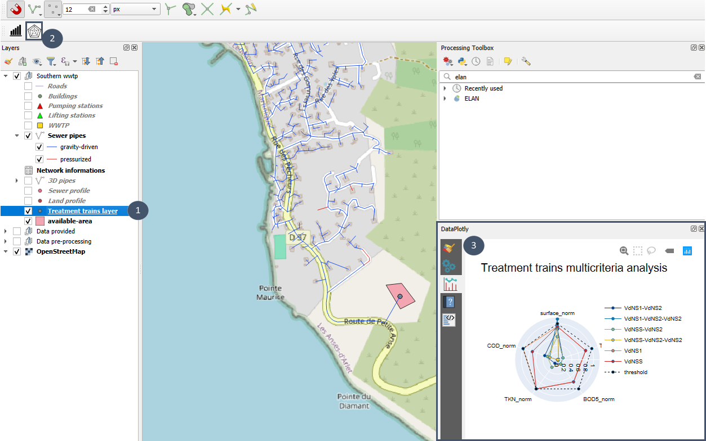

**4.** Vous pouvez la déplacer ou l'agrandir pour mieux voir le graphique.

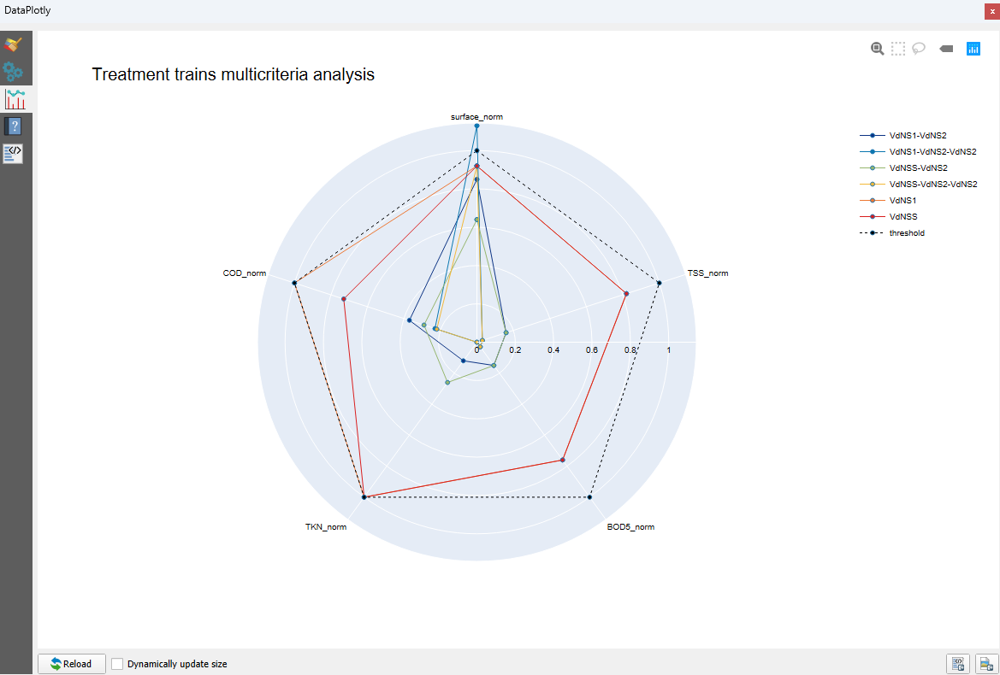

Les axes du radar plot coïncident avec les contraintes renseignées par l'utilisateur dans la couche ``STEU`` éditée en sortie de module ``Réseau``. Dans cet exemple, 
l'utilisateur a indiqué des contraintes (niveaux de rejet) sur 4 polluants (MES, DCO, DBO₅ et NTK) et une contrainte de surface avec une couche polygone en entrée de 
module ``Procédés``.

Le seuil en pointillés représente les contraintes : un point sous le seuil indique que la contrainte sur cet axe est respectée, tandis qu'un point au-dessus du seuil traduit
une non conformité de la filière sur ce critère.

Par défaut, toutes les filières proposées pour l'exutoire apparaissent sur le radar plot. Si vous souhaitez en voir uniquement certaines, il vous suffit de les sélectionner
dans la table attributaire puis de cliquer de nouveau sur le bouton radar plot.

Bar plot
^^^^^^^^

Les taux de charge en polluants et le taux de charge hydraulique peuvent également vous aider dans le choix des filières pré-sélectionnées. C'est le bar plot intégré à Elan 
qui vous permettra de visualiser de manière graphique ces attributs.

Pour l'afficher :

**1.** Cliquer sur votre couche ``Couche de filières`` dans l'onglet *Couches* (bulle 1).

**2.** Appuyer sur le bouton en forme de bar plot (bulle 2).

**3.** Une fenêtre *DataPlotly* s'ouvre en bas à droite de votre écran (sous *Boîte à outils de traitements*, bulle 3).

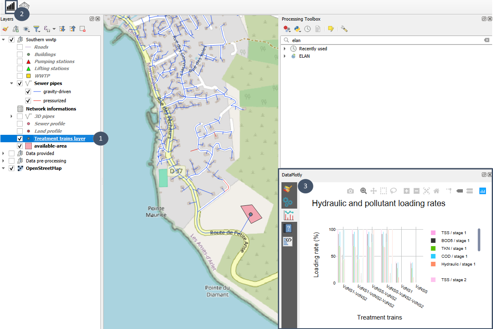

**4.**  Vous pouvez la déplacer ou l'agrandir pour mieux voir le graphique.

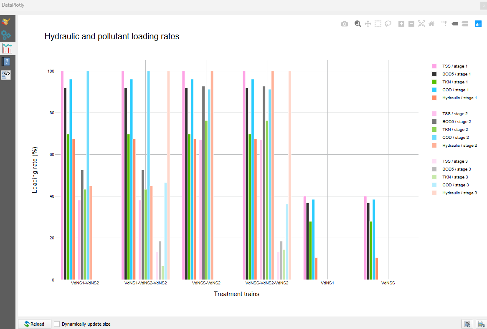

Pour chaque filière, le graphique permet de voir par étage les taux de charge en MES, DBO₅, NTK et DCO ainsi que le taux de charge hydraulique. Une filière 1 étage apparait avec
un seul "bloc" avec l'ensemble des taux de charge "stage 1" (couleurs d'intensité maximale), tandis qu'une filière 3 étages contient 3 "blocs" avec les taux de charge "stage 1", "stage 2" 
et "stage 3" (intensité de couleur décroissante : maximale pour "stage 1" et minimale pour "stage 3").

Le bar plot vous permet d'identifier le ou les éléments qui ont été limitants dans l'optimisation de la filière (taux à 100 %) et d'avoir une appréciation rapide de la marge
de manoeuvre (ou non marge de manoeuvre) possible pour une filière en cas de changement de contexte (augmentation de la population par exemple).

Par défaut, toutes les filières proposées pour l'exutoire apparaissent sur le bar plot. Si vous souhaitez en voir uniquement certaines, il vous suffit de les sélectionner
dans la table attributaire puis de cliquer de nouveau sur le bouton bar plot.

.. _creer-scenario:

Étape 4 : Créer un objet scénario (module ``Créer un scénario``)
----------------------------------------------------------------

Le module ``Créer un scénario`` vous permet de créer un objet scénario contenant à la fois le pré-dimensionnement d'un réseau et celui des filières associées (1 par exutoire).

Il prend la forme d'un géopackage. C'est sur la base de ce géopackage que le scénario pourra ensuite être évalué par le module ``Evaluation``.

Préalable 
^^^^^^^^^

**1.** Disposer d'une couche ``Canalisations`` issue du module ``Réseau``.

**2.** Avoir pré-dimensionné des filières pour chacun des exutoires de cette couche ``Canalisations`` avec le module ``Procédés`` (couche ``Couche de filières``).

**3.** Avoir choisi une possibilité de filière pour chaque exutoire parmi toutes celles pré-dimensionnées.

Utilisation du module
^^^^^^^^^^^^^^^^^^^^^

**1.** Ouvrir la table attributaire de votre ``Couche de filières`` et sélectionner une filière par exutoire. Par exemple ici, la filière VdNS1 (1 seule filière car 1 seul exutoire dans ce scénario).

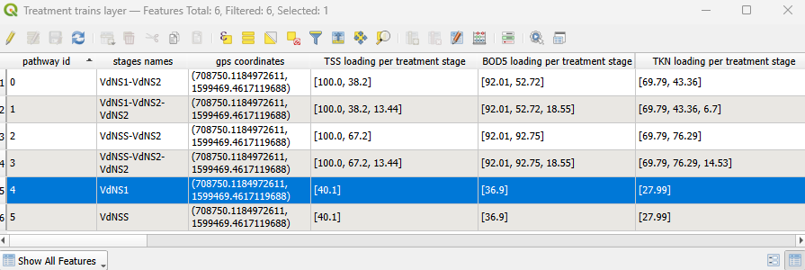

**2.** Chercher ``elan`` dans la boîte à outils de traitements et sélectionner ``Créer un scénario``.

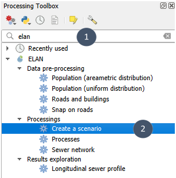

**3.** Nommer votre scénario (bulle 1), indiquer la couche ``Canalisations`` à considérer (bulle 2), renseigner la couche ``Couche de filières`` et 
**cocher impérativement** ``Entités sélectionnées uniquement`` (bulle 3) afin que seules les filières que vous avez pré-sélectionnées soient prises en compte.

**4.** Indiquer un nom et un emplacement pour le fichier de sortie (bulle 4) puis exécuter (bulle 5).

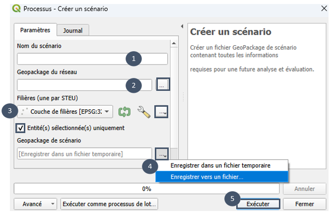

**5.** En sortie de module, vous obtenez **1 fichier.gpkg qui contient 9 couches** : 

- 7 couches issues du module ``Réseau``.
- 1 couche ``Couche de filières`` avec les filières retenues.
- 1 couche sans géométrie ``metadata`` qui contient un identifiant unique pour la comparaison postérieure à d'autres scénarios.

.. important::
    **Le géopackage de sortie ne s'ouvre pas dans le projet**. Il est juste enregistré à l'emplacement indiqué, prêt à être chargé dans un nouveau projet à des fins d'évaluation puis de comparaison.

